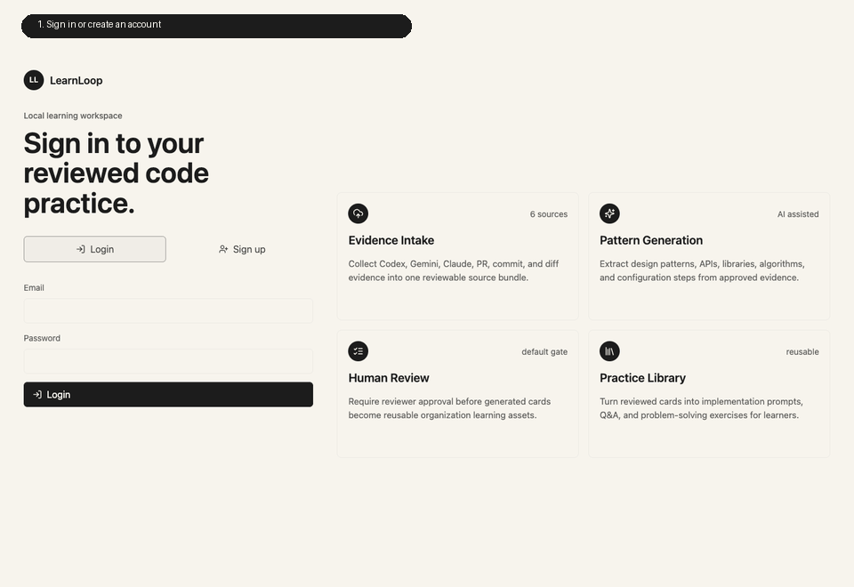

<p align="center">
  
</p>

# LearnLoop

[한국어](README.ko.md)

LearnLoop is a single-user local installed learning tool for developers who use AI coding tools such as Codex, Gemini, and Claude. It turns approved local code evidence into personal learning cards and practice exercises.

## Key Screens and Features

<p align="center">
  
</p>

The demo shows the core flow: open the local app, configure local AI, run the evidence-to-practice workflow, and inspect the generated learning card.

## Purpose

AI-generated code can improve short-term delivery speed, but developers often lose the chance to learn which patterns, libraries, APIs, and implementation choices keep repeating. LearnLoop turns that activity into a personal learning loop.

- Collect approved local code snippets, conversation logs, commits, and diffs generated with AI assistance.
- Analyze design patterns, libraries, algorithms, API usage, and configuration practices.
- Convert the analysis into implementation exercises, Q&A, and practice cards.
- Let the local owner curate, edit, delete, or practice generated learning assets.
- Keep user AI API keys and OAuth settings in the local browser only, without sending them to the server.

## Recommended Users

- Developers who use AI coding tools often and want to turn generated code into durable learning material
- Developers who want a local personal library of recurring implementation patterns
- Developers who want practice exercises generated from their own code history

## Usage

### Installable App

The easiest way to run LearnLoop is the Docker Compose installer. It builds the Spring Boot API, builds the React app, starts PostgreSQL, stores data in a Docker volume, and exposes one browser URL.

Requirements:

- Docker Desktop or Docker Engine with Compose v2

Install and start:

```sh
./scripts/install.sh
```

Open:

```text
http://localhost:8080
```

The installer creates `.env` with generated local credentials. The installed product path is a single local owner workspace rather than a role-switching demo.

Common installed-app commands:

```sh
./scripts/start.sh
./scripts/status.sh
./scripts/stop.sh
./scripts/local-ai-companion.sh
./scripts/local-ai-shim.sh codex install
```

The Codex shim manager installs only into a LearnLoop-managed shim directory and prints PATH guidance. It records the original `codex` path and hash, and `./scripts/local-ai-shim.sh codex status` reports repair or PATH precedence issues without modifying the real Codex binary.

The local AI companion listens only on loopback. Mutating companion endpoints use a random local API token stored outside repository directories with owner-only permissions. Browser OAuth uses a short-lived OAuth-start token scoped to the installed app origin.

To change the browser port, edit `AI_CODE_WEB_PORT` in `.env`, then restart:

```sh
./scripts/start.sh
```

Data is stored in the `learnloop_install-postgres-data` Docker volume. `./scripts/stop.sh` stops containers without deleting data.

### Local Product Boundary

The MVP is a personal local app:

- one local owner
- approved local repositories
- local AI provider setup
- collected evidence
- generated learning cards
- practice exercises

Non-goals for this MVP:

- hosted multi-user deployment
- admin dashboards
- reviewer queues
- organization membership
- team permissions
- remote collector pairing or sync

### Practice Workbench and Sandbox Runs

The practice workbench supports a VS Code-style editor experience for TypeScript, Java, and Kotlin exercises. Learners can browse a practice, edit files, save drafts, submit answers, inspect feedback, and compare answer diffs even when local code execution is unavailable.

Sandbox execution is optional and fail-closed. The Run action requires the backend runtime to have access to a Docker CLI, a reachable Docker daemon, and local language runner images. If those prerequisites are missing, the app reports `runner_unavailable` while preserving read, edit, local save, draft sync, and submit flows.

Runner limitations for the current version:

- Supported languages: TypeScript, Java, Kotlin
- No network access during code execution
- No package installation during a run; dependencies must be baked into runner images
- Fixed harness commands selected by the backend, not by the browser
- Bounded wall-clock timeout, CPU, memory, process count, and stdout/stderr excerpts

Useful runner checks from source:

```sh
./scripts/build-runner-images.sh
./scripts/runner-typescript-smoke.sh
./scripts/runner-java-smoke.sh
./scripts/runner-kotlin-smoke.sh
./scripts/status.sh
```

The installed app now enables local sandbox execution by default. It installs Docker CLI support in the backend image, mounts the host Docker socket, builds the TypeScript/Java/Kotlin runner images, and uses `.local-runner-workspaces/` as the shared host/container workspace. This is powerful local-only functionality: users who do not want the backend container to access the host Docker daemon should set `APP_RUNNER_ENABLED=false` before starting the app.

### Attempts and Sync

Editor state is local-first. The browser keeps unsent edits locally, then syncs drafts and submitted answers as per-user attempt records. Canonical learning assets such as pattern cards, practice files, hints, and answer references are not mutated when a learner submits an attempt.

Server sync is idempotent by `(user, problem, clientAttemptId)`, so retries update the learner's own draft/submission instead of creating conflicting records. Local AI provider credentials remain in the user's browser and are not sent to the server.

### First User Flow

1. Open the local app.
2. Configure an AI provider now or skip it until generation is needed.
3. Approve one or more local Git repositories for collection.
4. Use Codex CLI as the first automatic collection path.
5. Keep using Gemini and Claude through manual/local-session evidence until their adapters are added after MVP.
6. Curate collected evidence in the local app.
7. Generate pattern cards and practice exercises.

## Release Bundle

Build a distributable package for the current machine architecture:

```sh
./scripts/package-release.sh
```

The archive is written to `dist/release/` and contains:

- runtime `docker-compose.yml`
- `install.sh`, `start.sh`, `status.sh`, `stop.sh`
- release metadata
- backend, web, and PostgreSQL Docker image archives
- macOS `LearnLoop.app`

Install from the release bundle:

```sh
tar -xzf dist/release/learnloop-0.1.0-*.tar.gz
cd learnloop-0.1.0-*
./install.sh
```

Release-bundle installation does not build from source. It loads the packaged Docker images, including the language runner images, and starts the local stack.

The release bundle includes the application, database, and TypeScript/Java/Kotlin runner images. Runner execution still requires local Docker daemon access through the mounted Docker socket. When runner prerequisites are not available or `APP_RUNNER_ENABLED=false`, the release app still supports browsing, editing, saving, submitting, and inspecting practice attempts.

## CI/CD

LearnLoop uses GitHub Actions for the main quality and release gates.

- `CI` runs on pull requests and pushes to `main`: changed-file validation, tests, builds, dependency checks, secret scanning, filesystem scanning, and container image scanning.
- `CodeQL` runs on pull requests, pushes to `main`, and a weekly schedule for Kotlin and TypeScript static analysis.
- `Release` runs on version tags such as `v0.1.0` or manual dispatch: tests, build, security scan, release bundle packaging, and GitHub Release publishing.

## Development

The scripts in this repository use the bundled Codex Node runtime automatically.

```sh
./scripts/test.sh
./scripts/dev.sh
./scripts/smoke.sh
```

Default development URL:

```text
http://localhost:4173
```

To run the Spring Boot and React services separately:

```sh
./scripts/db-up.sh
./scripts/backend-dev.sh
./scripts/frontend-dev.sh
```

Default split-stack URLs:

```text
Backend API: http://localhost:8080
Frontend: http://127.0.0.1:5173
Health: http://localhost:8080/api/health
```

Run the current split-stack verification:

```sh
./scripts/check-split.sh
./scripts/npm.sh --prefix frontend audit
```

Build and verify sandbox runner images:

```sh
./scripts/runner-typescript-smoke.sh
./scripts/runner-java-smoke.sh
./scripts/runner-kotlin-smoke.sh
```

To add another runner language later, add a runner image under `runner/`, register a fixed harness in `backend/src/main/kotlin/com/aicodelearning/runner/RunnerRegistry.kt`, extend the practice contract tests, and add a smoke script that proves both passing and failing exercises without network access.

## Local Owner Session

The installed app should present one local owner path. Existing internal seed data can remain for compatibility while the product moves away from role switching, but the primary local workflow should not ask the user to choose a role.

## AI Provider Setup

The installable app runs the Kotlin/Spring Boot backend, React frontend, PostgreSQL persistence, and local-first AI setup surfaces. The Node MVP remains as an internal compatibility oracle and supports both deterministic local generation and real OpenAI-compatible provider calls.

Node MVP provider modes:

- `provider-local-mock` keeps deterministic generation for demos, stable tests, and parity checks.
- Non-mock providers call an OpenAI-compatible Responses API endpoint at `POST /v1/responses` with structured JSON schema output.

For `provider: "openai"`, `baseUrl` defaults to `https://api.openai.com`. Custom `baseUrl` values must use HTTPS. Loopback HTTP is allowed only for local fake-provider tests when `APP_ALLOW_INSECURE_PROVIDER_BASE_URL=1`.

Node MVP provider credentials are encrypted in the local JSON store and redacted from API responses. Set `APP_CREDENTIAL_ENCRYPTION_KEY` outside local development; production mode requires it.

## License

GNU Affero General Public License v3.0. See [LICENSE](LICENSE) and [NOTICE](NOTICE).
