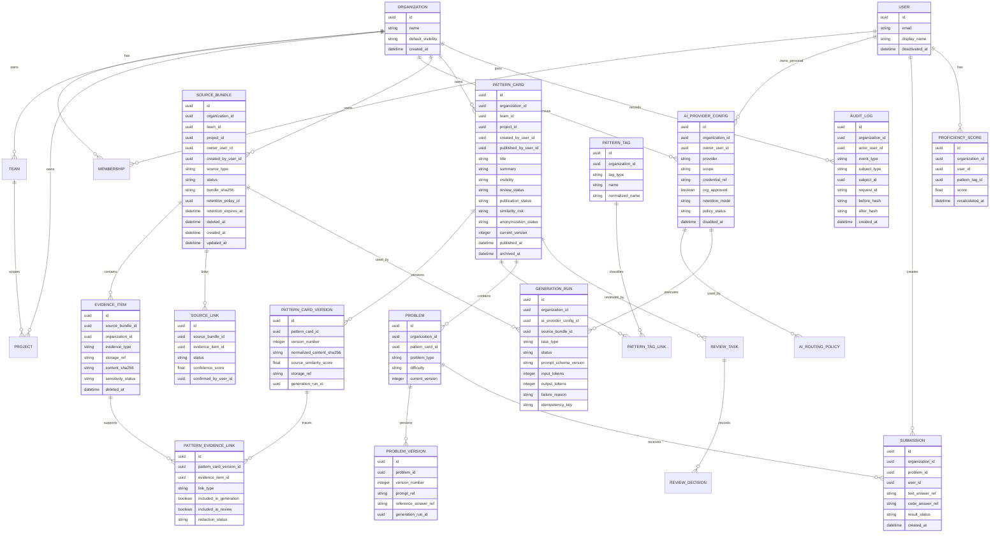

# feat: Build AI Generated Code Learning Platform MVP

## Enhancement Summary

Deepened on: 2026-05-17

Research and review inputs:

- `architecture-strategist`: aggregate boundaries, module dependency direction, state transitions, revisioning, MVP boundaries.
- `data-integrity-guardian`: evidence-to-asset lineage, retention/deletion rules, audit integrity, transactional boundaries.
- `performance-oracle`: queue design, ingestion/generation throughput, rate limits, indexes, SLOs, observability.
- `spec-flow-analyzer`: permission permutations, review assignment, resubmission, duplicate handling, learner answer visibility, lifecycle gaps.
- Manual security research: OWASP LLM risks, OWASP secrets guidance, OAuth BCP, NIST AI RMF, provider data-retention documentation.

Key improvements:

1. Added explicit lineage from raw evidence to reviewed learning assets.
2. Split review state, publication state, generation state, and source-ingestion state.
3. Added immutable asset revisions so reviewed content cannot change silently after approval.
4. Added queue, idempotency, rate-limit, and observability requirements for ingestion and AI generation.
5. Added permission, self-review, promotion, archiving, deletion, and retention defaults.
6. Added LLM-specific controls for prompt injection, sensitive information disclosure, output validation, overreliance, and cost/DoS risk.
7. Split implementation into 17 smaller phases, including dedicated validation/security review and release-readiness phases.

## Overview

Build an organization-internal learning platform that turns AI-assisted coding activity into reusable learning assets. The MVP collects manual code/diff uploads and `codex-obsidian-sync` conversation exports, links related source material, extracts static code and technical usage patterns, generates draft pattern cards with problem sets, sends them through a review workflow, and publishes approved assets to a team/project-scoped learning library.

The product should remain programming-language agnostic. The platform's own implementation stack is not fixed by this plan; if starting from an empty repository, a pragmatic default would be a TypeScript web app, relational database, background worker, object storage, and a managed secrets vault.

## Problem Statement

Teams increasingly use Codex, Gemini, Claude, and similar tools to generate production code, but the resulting knowledge is scattered across chat logs, local notes, and commits. Useful implementation patterns are lost after the immediate task is finished, and teams have no consistent way to convert repeated AI-assisted patterns into reusable training material.

The platform should close that loop:

- Capture source evidence from AI conversations and code changes.
- Convert recurring technical patterns into learning assets.
- Protect proprietary source code through evidence/asset separation and anonymization.
- Let humans review AI-generated learning material before organization publication.
- Track developer progress by problem and pattern.

## Research Findings

### Local Context

- Relevant brainstorm: [2026-05-17-ai-generated-code-learning-platform-brainstorm.md](/Users/heeung/Documents/Codex/2026-05-17/workflows-brainstorm-ai-ai-codex-gemini/docs/brainstorms/2026-05-17-ai-generated-code-learning-platform-brainstorm.md)
- No application code, architecture docs, issue templates, or `docs/solutions/` knowledge base exist yet in this workspace.
- AGENTS guidance emphasizes explicit assumptions, simple scope, surgical changes, and verifiable success criteria.

### External Security Context

- OpenAI API data is not used for model training by default unless the customer opts in, but abuse monitoring logs may retain customer content for a limited period unless eligible controls are enabled.
- Anthropic Claude API supports data handling arrangements such as Zero Data Retention, with exceptions for law and misuse handling.
- Google Vertex AI/Gemini data governance includes provider-specific prompt logging and retention behavior depending on account and feature usage.
- OWASP secrets guidance supports storing API keys in a secrets-management system with least-privilege access, rotation, and auditability.
- OAuth integrations should follow current OAuth 2.0 security best current practices, including using secure authorization-code flows and PKCE where applicable.
- OWASP LLM guidance highlights prompt injection, insecure output handling, model denial of service, sensitive information disclosure, excessive agency, and overreliance as relevant risks for this product.
- NIST AI RMF is relevant because this platform operationalizes AI-generated content for workplace learning and needs governance, measurement, and risk-management hooks from the first version.

## Goals

- Create a usable MVP for organization-internal learning asset creation.
- Support both organization AI providers and personal BYOK/OAuth providers.
- Keep original source evidence separate from reusable learning assets.
- Enable reviewable AI-generated pattern cards and problem sets.
- Provide learner-facing pattern discovery, problem solving, submissions, and proficiency tracking.
- Leave clear extension points for Git provider ingestion, auto-grading, AI-assisted review, dashboards, public assets, and debugging labs.

## Non-Goals

- Do not implement public asset publishing in the first version.
- Do not implement LeetCode-style automatic grading in the first version.
- Do not implement setup/debugging labs in the first version.
- Do not implement billing or credit management for personal AI usage in the first version.
- Do not require a specific programming language for generated learning problems.

## User Roles

- Organization admin: Manages workspace settings, teams/projects, approved AI providers, review policies, and publication rules.
- Reviewer: Reviews draft pattern cards and problem sets for correctness, security, difficulty, duplication, and sharing scope.
- Contributor: Uploads source material, links evidence, and creates or requests AI-generated learning assets.
- Learner: Browses pattern cards, solves problems, submits answers, and tracks proficiency.
- Future individual user: Uses private assets outside an organization workspace.

## Core User Flows

### Flow 1: Organization Setup

1. Admin creates or joins an organization workspace.
2. Admin configures teams and projects.
3. Admin registers organization-approved AI providers.
4. Admin chooses review policies and visibility defaults.
5. Organization members can start creating private or organization-scoped draft assets.

### Flow 2: Personal AI Provider Setup

1. User registers a personal AI provider through BYOK or OAuth.
2. Platform stores only encrypted credential references or OAuth token references.
3. Platform records provider, scope, retention metadata, and usage/audit settings.
4. User can use the provider for private assets unless organization policy blocks promotion to organization assets.

### Flow 3: Source Ingestion

1. Contributor uploads code snippets, diffs, or supporting context manually.
2. Contributor imports conversation logs from `codex-obsidian-sync` exports.
3. Platform scans source material for secrets and sensitive identifiers.
4. Platform stores original evidence in the internal evidence store.
5. Platform creates source bundles ready for linking and pattern extraction.

### Flow 4: Source Linking

1. Platform suggests links between conversation logs and uploaded code/diffs using time, repository, file path, branch, title, and semantic similarity.
2. Contributor confirms, edits, or rejects suggested links.
3. Confirmed links become the evidence set for pattern extraction.

### Flow 5: Pattern Card Generation

1. Contributor selects one or more linked source bundles.
2. Platform routes the task to a configured AI provider.
3. AI extracts pattern candidates, technical tags, and problem drafts.
4. Platform validates that each draft includes minimum review-entry data.
5. Draft pattern cards enter review.

### Flow 6: Review And Publication

1. Reviewer opens a draft pattern card.
2. Platform displays source evidence, anonymization notes, similarity risk, generated problems, answers, and tags.
3. Reviewer approves, requests changes, rejects, or marks as duplicate.
4. Approved assets are published to `private` or `organization` visibility.
5. Public visibility remains modeled but disabled in the MVP UI.

### Flow 7: Learner Practice

1. Learner browses pattern cards by language, library, API, algorithm, pattern, team, project, difficulty, and status.
2. Learner opens a pattern card and chooses a Q&A, short implementation, or code-reading problem.
3. Learner submits text, code, or both depending on problem type.
4. Platform stores the submission and updates problem completion and pattern proficiency.
5. Platform recommends next problems based on tags and proficiency.

## Flow Permutations And Edge Cases

| Area | Happy Path | Edge Cases To Handle |
| --- | --- | --- |
| AI provider setup | Valid organization or personal provider is registered | Invalid key, expired OAuth token, provider disabled by admin, provider retention mode missing |
| Source ingestion | Upload/import succeeds and evidence is stored | Unsupported file, huge input, detected secret, duplicate upload, malformed `codex-obsidian-sync` export |
| Source linking | Platform proposes correct matches | No matches, multiple ambiguous matches, user rejects all, source belongs to unauthorized project |
| Pattern extraction | AI returns valid structured pattern drafts | AI output invalid, provider timeout, quota exceeded, safety refusal, empty pattern result |
| Review | Reviewer approves safe draft | Sensitive content found, source similarity too high, wrong answer, duplicate asset, missing minimum data |
| Publication | Asset becomes visible to allowed learners | Reviewer lacks permission, team/project scope conflict, public visibility attempted while disabled |
| Learning | Learner submits answer and progress updates | Empty answer, unsupported code language metadata, resubmission, deleted problem, permission revoked |

## Data Model

## Technical Approach

### Logical Modules

- `modules/workspaces`: organization, team, project, membership, and permissions.
- `modules/ai-providers`: organization and personal provider registration, credential references, routing policies, usage logging.
- `modules/ingestion`: manual upload, `codex-obsidian-sync` import, file normalization, secret scanning, evidence storage.
- `modules/source-linking`: candidate matching, confidence scoring, user confirmation.
- `modules/pattern-analysis`: structured AI extraction for static code and technical usage patterns.
- `modules/learning-assets`: pattern cards, tags, problem sets, visibility, publication state.
- `modules/review`: review policy, review tasks, decisions, duplicate checks, similarity checks.
- `modules/learning`: learner browsing, submissions, progress, proficiency scoring, recommendations.
- `modules/audit`: security-sensitive activity logs and usage records.

### Aggregate Boundaries And Dependencies

Aggregate ownership:

- `SourceBundle` owns `EvidenceItem` and `SourceLink`.
- `GenerationRun` records AI execution metadata and links provider, model, prompt schema, source bundle, output status, token usage, and failure reason.
- `PatternCard` owns publication state, current revision pointer, and its `Problem` children.
- `PatternCardVersion` and `ProblemVersion` are immutable review/publication snapshots.
- `ReviewTask` owns review workflow and review decisions, but not pattern content.
- `Submission` belongs to a `Problem` and `User`; `ProficiencyScore` is derived asynchronously from submission and asset events.

Dependency direction:

- `ingestion` may depend on `workspaces`, evidence storage, audit, and background jobs.
- `source-linking` reads evidence metadata and writes link suggestions/confirmations; it must not mutate raw evidence content.
- `pattern-analysis` reads confirmed source links and writes `GenerationRun` plus draft asset versions through an application service.
- `review` transitions review state and publication readiness; it must not bypass versioning.
- `learning` reads only published learning assets and learner-owned submissions; it must not read raw evidence directly.
- `audit` observes domain events and should not contain raw evidence, full prompts, API keys, or code submission bodies.

### State Transitions

| Entity | States | Notes |
| --- | --- | --- |
| `SourceBundle` | `uploading`, `scan_pending`, `scan_failed`, `blocked_sensitive`, `ready`, `linked`, `generation_failed`, `retention_expired`, `deleted` | Raw uploads remain quarantined until scan and normalization pass. |
| `SourceLink` | `suggested`, `confirmed`, `rejected` | Only confirmed links can be used for generation. |
| `GenerationRun` | `queued`, `running`, `retrying`, `failed`, `cancelled`, `completed` | Partial results are stored only as draft artifacts until all required schema checks pass. |
| `PatternCard.review_status` | `draft`, `in_review`, `changes_requested`, `approved`, `rejected` | Editing after approval creates a new version and requires re-review. |
| `PatternCard.publication_status` | `unpublished`, `published`, `archived` | Publication is separate from review approval. |
| `ReviewTask` | `open`, `changes_requested`, `approved`, `rejected`, `duplicate` | Duplicate decisions link to a canonical pattern card when available. |
| `Submission.result_status` | `submitted`, `self_marked_complete`, `review_requested`, `reviewed_correct`, `reviewed_incorrect` | MVP has no automatic grading, so correctness is self-marked or reviewer-confirmed. |

### Permission Matrix

| Capability | Admin | Reviewer | Contributor | Learner |
| --- | --- | --- | --- | --- |
| Manage organization providers | Yes | No | No | No |
| Manage personal provider | Own only | Own only | Own only | Own only |
| Upload evidence | Yes | Scoped | Scoped | No |
| View raw evidence | Scoped with audit | Assigned scope only | Own/scoped evidence | No |
| Link evidence | Yes | Scoped | Own/scoped evidence | No |
| Generate draft | Yes | Scoped | Scoped | No |
| Edit draft | Yes | Assigned/changes-requested scope | Own draft before approval | No |
| Review draft | Yes, except self-review by default | Assigned scope | No self-review | No |
| Publish asset | Yes | If policy grants | No | No |
| Archive asset | Yes | If policy grants | No | No |
| View learner submissions | Scoped | Scoped if review/feedback role grants | No | Own only |

Defaults:

- Roles are organization-level with team/project scoped grants.
- Contributors cannot approve or publish their own drafts.
- Admin bypasses should be disabled by default; if enabled later, every bypass is a distinct audit event.
- Reviewer assignment must validate access to every evidence item linked to the draft.
- Learners must not infer private or pending assets through search result counts.

### Evidence And Asset Separation

Use two logical stores:

- Evidence store: original logs, snippets, diffs, source bundle metadata, and source links. Access is restricted to contributors, reviewers, and admins with the relevant project/team permission.
- Learning asset store: anonymized pattern cards, problems, tags, answers, difficulty, and visibility. This is what learners browse and solve.

Do not expose raw evidence in learner flows unless the user has reviewer/contributor permissions for the source project.

Content lifecycle rules:

- Evidence deletion must not silently delete published learning assets.
- If evidence linked to an unpublished draft is deleted or quarantined, block generation and review until the draft is regenerated or relinked.
- If evidence linked to a published anonymized asset expires, keep the published asset only if the reviewed version and lineage metadata remain sufficient for audit.
- Pattern cards with learner submissions should be archived instead of hard deleted.
- A published asset must point to the exact `PatternCardVersion` and `ProblemVersion` that passed review.
- A `changes_requested` edit creates a new version; prior comments and decisions remain attached to the previous version.

Object-storage consistency:

- Write raw uploads to a temporary object key first.
- Scan and normalize the temporary object before creating durable evidence rows.
- Create durable metadata and object references in an atomic application transaction.
- Promote the object to a durable key only after validation succeeds.
- Run scheduled cleanup for orphaned temporary objects.

Deletion and retention:

- Personal provider credentials are deleted immediately when disconnected.
- User deletion anonymizes retained organization audit history and creator attribution where required.
- Private drafts and private evidence owned only by a deleted user should be deleted or transferred by admin policy.
- Organization-published assets remain available unless archived by policy.
- Audit logs are append-only and retained according to organization policy; they must not contain raw evidence, prompts, API keys, or code bodies.

### AI Provider And Routing

Support two provider scopes:

- Organization provider: configured by admins, eligible for organization asset generation.
- Personal provider: configured by users through BYOK or OAuth, eligible for private generation unless admin policy permits promotion.

Support two routing modes:

- Single-AI mode: one configured provider handles analysis, generation, tagging, and review assistance.
- Task-specific routing: separate providers/models for pattern extraction, problem generation, answer generation, tagging, and review assistance.

Provider metadata should include:

- Provider name and model.
- Scope: `organization` or `personal`.
- Credential reference, never raw key display.
- Retention mode and policy notes.
- Whether the provider is organization-approved.
- Usage logging status.

Provider policy rules:

- Organization publication uses organization-approved providers by default.
- Private assets generated with a personal provider can be promoted only if organization policy allows it. The safer default is regeneration with an organization-approved provider before organization publication.
- Provider provenance is visible during review.
- If provider retention metadata changes, mark the provider as `policy_review_required` and block new organization publication until an admin re-approves it.
- Routing fallback is explicit. If fallback would change provider scope, retention mode, or security class, require confirmation instead of silently switching providers.
- OAuth token expiration, revocation, refresh failure, user disconnect, and provider deletion while jobs are queued all produce recoverable job states and audit events.

LLM-specific controls:

- Treat all uploaded source material and conversation logs as untrusted model input.
- Use structured output schemas and reject invalid model output.
- Validate model output before it affects publication, permissions, file paths, code execution, or reviewer-visible safety decisions.
- Bound token budgets and chunk oversized evidence to reduce cost and denial-of-service risk.
- Do not grant the model direct authority to publish, change permissions, or access evidence outside the confirmed source bundle.
- Store full prompts/responses only behind retention-controlled object references when explicitly needed; regular logs store metadata, token counts, model/provider, task type, and redacted previews only.

### Ingestion Contract

Initial ingestion should accept:

- Manual code snippet uploads.
- Manual diff uploads.
- Supporting context text.
- `codex-obsidian-sync` exported conversations, initially through markdown or JSON import.

Each source bundle should capture:

- Source type.
- Origin label.
- Optional repository, branch, file path, commit, PR, or note path.
- Time range.
- Owner.
- Team/project scope.
- Sensitivity scan result.
- Evidence item references.

MVP import behavior:

- Re-importing the same `codex-obsidian-sync` export should deduplicate by content hash and source metadata.
- Partial import failure creates a failed job with retriable item-level errors instead of discarding the whole bundle silently.
- Unsupported export schema versions are rejected with a clear compatibility error.
- Missing timestamps, repository, branch, or file-path metadata lower link confidence; they should not block manual linking.
- Contributor-edited provenance is labeled as user-supplied, not verified.

Initial limits should be configurable:

- Maximum upload size.
- Maximum files per source bundle.
- Maximum evidence items per generation request.
- Maximum diff line count.
- Maximum conversation length or token estimate.
- Maximum generation token budget per pattern card.

### Pattern Card Minimum Data

A pattern card can enter review only if it has:

- Pattern name.
- Pattern summary.
- Technical tags.
- At least one evidence source reference.
- At least one generated problem.
- Answer or reference explanation.

### Problem Types

MVP problem types:

- Q&A: text answer and reference explanation.
- Short implementation: code answer plus optional explanation.
- Code reading: text answer with optional code citation.

Post-MVP problem types:

- Auto-graded coding problem with test cases and execution result.
- Setup/debugging lab with reproducible environment.

Answer visibility:

- MVP reference answers become visible after the learner submits an answer or explicitly marks the problem complete.
- Review-requested answers remain visible to the learner, but reviewer feedback is separate from the reference answer.
- For implementation exercises, submitted code and explanation are retained as separate object references.

### Visibility And Similarity Policy

Model all visibility states from the beginning:

- `private`: personal or limited draft assets.
- `organization`: organization-internal published assets.
- `public`: future public assets, disabled in the MVP UI.

Apply source similarity rules by visibility:

- Private: source can remain close to original unless secrets are detected.
- Organization: transform business domain, identifiers, and data structures.
- Public: strongly transform domain, identifiers, structure, constants, and exception messages.

Anonymization checks should cover business domain names, identifiers, table names, URLs, constants, exception messages, customer names, internal architecture names, and proprietary workflows. Similarity score is advisory for private drafts, blocking for organization publication when above policy threshold, and always blocking for public publication until stronger review is implemented.

### Review Policy

Default review policy:

- Human review is required before organization publication.
- Reviewer checks security, deduplication, answer correctness, difficulty, tags, source similarity, and sharing scope.
- Reviewer can approve, request changes, reject, or mark duplicate.

Extension point:

- Admin can later enable AI-assisted review or AI first-pass review.
- Public publication should require organization-approved AI and stronger review.

### Proficiency Model

Track progress by:

- Problem completion.
- Submission history.
- Problem type.
- Pattern tags.
- Difficulty.
- Recency.

Use a simple score initially:

- Completion gives base progress for associated tags.
- Correct/reviewer-accepted answers increase confidence.
- Repeated practice across tags increases pattern proficiency.
- Auto-grading can replace manual/implicit correctness after the post-MVP phase.

MVP recommendation rule:

- Recommend unsolved problems from the learner's weakest visible tag proficiency.
- If no proficiency data exists, show recently published beginner-level cards.
- If all visible problems are completed, show review cards or higher-difficulty problems in the same tags.
- Archived cards no longer appear in recommendations, but previous completion remains in learner history.

Progress recalculation:

- Proficiency is derived from submission and asset events, then materialized for browsing speed.
- If a problem's tags or difficulty change after learners complete it, enqueue recalculation for affected users.
- If a pattern card is archived, keep historical completion but exclude it from active coverage metrics.

## Scalability And Performance Design

### MVP Scale Targets

Set explicit targets before implementation. Initial defaults can be modest, but they should exist:

- Maximum upload size and file count per source bundle.
- Maximum evidence items per generation request.
- Expected users per organization and pattern cards per organization.
- Expected submissions per day.
- P95 latency targets for library browse, review queue, problem detail, and submission write.
- P95 target for source upload accepted-to-reviewable-draft time.

### Background Queues

Use separate queues for:

- `ingestion`
- `secret_scan`
- `source_linking`
- `ai_generation`
- `similarity_check`
- `review_checks`
- `proficiency_update`

Each async job should include:

- Entity reference.
- Organization/user/provider scope.
- Idempotency key.
- Status: `queued`, `running`, `retrying`, `failed`, `dead_lettered`, `cancelled`, `completed`.
- Retry count and last failure reason.
- Created/started/completed timestamps.

Queue rules:

- Large imports must not block small review/regeneration jobs.
- Apply concurrency limits per organization, user, and provider.
- Use exponential backoff with jitter for transient provider failures.
- Do not retry schema-invalid AI output indefinitely.
- Dead-lettered imports or generation jobs must be visible to admins or reviewers.

### Search And Query Performance

Index and query-design requirements:

- Every high-volume table includes `organization_id`.
- `EVIDENCE_ITEM`, `SUBMISSION`, `AUDIT_LOG`, and provider usage logs should be partition-ready by organization and/or time.
- Pattern library filters need indexes for `organization_id`, `visibility`, `publication_status`, `review_status`, `published_at`, `difficulty`, `team_id`, and `project_id`.
- Tags should use typed normalized values with uniqueness per organization.
- Use cursor pagination for pattern library, review queue, source bundles, submissions, and audit logs.
- Start with relational full-text search over pattern title, summary, problem prompt, and tags; defer external search until needed.
- Treat embeddings/vector search as post-MVP unless simple text similarity is insufficient.

### Observability

Track:

- Ingestion: bytes accepted, parse failures, secret scan duration, duplicate rate, source bundle processing latency.
- Queues: depth, oldest job age, job duration, retry count, dead-letter count, worker saturation.
- AI providers: latency p50/p95/p99, timeout rate, schema-invalid rate, safety refusal rate, token count, estimated cost, retry rate.
- Generation quality: drafts generated, drafts entering review, acceptance rate, changes-requested rate, rejection reasons, duplicate-marked rate.
- Search: library query p95, review queue query p95, zero-result rate.
- Learning: submission write latency, proficiency update lag, recommendation latency, completion events.

## Implementation Phases

### Phase 0: Implementation Baseline

Tasks:

- Choose the application stack, database, object storage, secrets-management layer, background job system, and deployment target.
- Create the repository/module skeleton around the logical modules in this plan.
- Add migration, test, lint, formatting, and local development commands.
- Define environment configuration for local, test, and production-like environments.
- Add a short architecture decision note for the chosen stack and rejected alternatives.

Verification:

- A fresh developer can run the app locally from documented commands.
- Empty database migrations apply and roll back cleanly.
- Baseline tests, lint, and formatting pass.
- Secrets are loaded through configuration references, not hardcoded values.

### Phase 1: Workspace And Scoped Authorization

Tasks:

- Define `Organization`, `User`, `Team`, `Project`, and `Membership` models.
- Implement organization-level roles plus team/project scoped grants.
- Implement admin, reviewer, contributor, and learner permissions.
- Add visibility enum with `private`, `organization`, and disabled `public`.
- Add authorization helpers for evidence, draft, review, publication, submission, and provider-management actions.

Verification:

- Admin can create organization settings, teams, and projects.
- Users can have different roles across different team/project scopes.
- Non-admin users cannot change organization provider or review policies.
- Learners cannot access raw evidence or unpublished assets.
- Search/filter counts do not leak private or pending assets to unauthorized users.

### Phase 2: Audit, Retention, And Data Integrity Foundation

Tasks:

- Add append-only audit logs indexed by actor, organization, event type, subject type, subject ID, and request ID.
- Add retention policy fields and deletion markers to evidence, drafts, submissions, provider configs, and audit-relevant entities.
- Add content hash fields and uniqueness constraints for evidence and normalized assets.
- Add database constraints for membership uniqueness, tag uniqueness, organization scoping, and enum values.
- Define transaction boundaries for publication, review decisions, source link confirmation, and submission/proficiency updates.

Verification:

- Audit records are created for security-sensitive actions.
- Audit logs contain metadata and hashes only, not raw evidence, prompts, credentials, or code bodies.
- Retention jobs can mark records without breaking foreign-key integrity.
- Organization-scoped uniqueness and referential integrity constraints are enforced.

### Phase 3: AI Provider Registry And Credential Handling

Tasks:

- Add organization AI provider registration.
- Add personal AI provider registration through BYOK first, with OAuth support if required by the selected provider.
- Store only encrypted credential references or vault references.
- Add provider metadata for retention mode, policy status, org approval, and disabled state.
- Add provider disconnect, expired token, revoked token, refresh failure, and queued-job cancellation behavior.

Verification:

- Organization asset generation can be restricted to organization-approved providers.
- Personal providers can generate private drafts.
- Raw API keys are never returned through UI or API responses.
- Disabled provider configurations cannot be used for new generation.
- Personal-provider drafts cannot become organization-published assets unless policy allows promotion or the draft is regenerated with an organization-approved provider.

### Phase 4: AI Routing, Usage Logging, And Provider Quotas

Tasks:

- Add single-AI routing mode.
- Add task-specific routing for extraction, tagging, problem generation, answer generation, and review assistance.
- Record provider usage by user, organization, provider, model, task type, token/request count, estimated cost, and asset scope.
- Add provider quotas, timeout settings, retry budgets, and circuit-breaker state.
- Add explicit fallback rules when a provider fails or violates policy.

Verification:

- Task routing selects the expected provider for each task.
- Fallback does not silently change retention mode, security class, or provider scope.
- Usage logs contain no raw prompts, code, secrets, or credentials.
- Provider quota exhaustion creates a recoverable job state.

### Phase 5: Background Jobs And Observability Baseline

Tasks:

- Add separate queues for `ingestion`, `secret_scan`, `source_linking`, `ai_generation`, `similarity_check`, `review_checks`, and `proficiency_update`.
- Add job state, idempotency keys, retry count, timestamps, last failure reason, and dead-letter behavior.
- Add per-organization, per-user, and per-provider concurrency controls.
- Add initial metrics for queue depth, oldest job age, retries, failures, dead letters, and worker saturation.
- Add admin-visible job status views for imports and generation.

Verification:

- Large imports do not block small review or generation jobs.
- Retried jobs do not duplicate source bundles, drafts, or published assets.
- Dead-lettered jobs are visible and actionable.
- Failed provider calls do not create partial published assets.

### Phase 6: Evidence Storage And Manual Upload

Tasks:

- Implement temporary object upload for snippets, diffs, and supporting context text.
- Run secret/sensitive-data scanning before durable evidence promotion.
- Normalize uploads into `SourceBundle` and `EvidenceItem` records.
- Add duplicate detection using content hashes and source metadata.
- Add orphan temporary object cleanup.

Verification:

- Contributor can create a source bundle from manual input.
- Uploads with detected secrets are blocked or require explicit reviewer/admin handling.
- Detected secrets are represented as findings and are not written into logs.
- Evidence items are scoped to the correct organization/team/project.
- Duplicate uploads do not create duplicate evidence items unless explicitly allowed.

### Phase 7: `codex-obsidian-sync` Import

Tasks:

- Implement the initial import contract for `codex-obsidian-sync` markdown or JSON exports.
- Validate export schema version, required fields, timestamps, and optional repo/file metadata.
- Normalize conversations into evidence items and conversation-level source metadata.
- Add item-level error reporting for partial import failures.
- Deduplicate repeated imports by content hash and source metadata.

Verification:

- Contributor can import conversation logs from a `codex-obsidian-sync` export.
- Unsupported schema versions fail with a clear compatibility error.
- Partial import failure does not silently drop valid items.
- Missing provenance lowers link confidence but does not block manual linking.

### Phase 8: Source Linking And Provenance

Tasks:

- Generate link candidates between conversation logs and code/diff evidence.
- Use metadata matching first: time, repo, file path, branch, title, and project.
- Use simple text similarity for ambiguous cases; defer embedding/vector search unless needed.
- Let contributors confirm, edit, or reject candidates.
- Mark edited provenance as user-supplied rather than verified.

Verification:

- Confirmed links are persisted.
- Rejected candidates are not used for pattern generation.
- Ambiguous matches remain pending instead of being silently accepted.
- Users cannot link evidence from unauthorized projects.

### Phase 9: Learning Asset Model, Tags, And Versioning

Tasks:

- Implement `PatternCard`, `PatternCardVersion`, `Problem`, `ProblemVersion`, `PatternTag`, and tag links.
- Split `review_status` from `publication_status`.
- Add typed normalized tags for language, framework, library, API, algorithm, and design pattern.
- Add evidence-to-asset lineage through immutable pattern evidence links.
- Add source similarity, anonymization status, and normalized content hash fields.

Verification:

- Published assets reference the exact reviewed pattern/problem versions.
- Editing a reviewed asset creates a new version.
- Tags are unique per organization, tag type, and normalized name.
- Evidence cannot be published directly as a learning asset.

### Phase 10: Pattern Extraction And Draft Generation

Tasks:

- Define structured AI output schema for pattern candidates.
- Add `GenerationRun` records for provider, model, prompt schema version, source bundle, token usage, status, and failure reason.
- Extract static code patterns and technical usage patterns.
- Generate problem drafts for Q&A, short implementation, and code reading.
- Validate minimum review-entry data before creating review tasks.
- Bound prompt size with token estimates and chunk oversized source bundles.

Verification:

- AI output is schema-validated before persistence.
- Invalid AI output is retried or marked failed.
- Drafts missing minimum data cannot enter review.
- Drafts preserve technical structure while transforming business domain where required.
- Schema-invalid AI output cannot create reviewable drafts.

### Phase 11: Review Workflow And Publication

Tasks:

- Implement review queue, assignment, detail page, comments, and decisions.
- Show evidence summary, provider provenance, generated asset, tags, difficulty, source similarity notes, and sharing scope.
- Add reviewer self-review restrictions.
- Add `changes_requested` resubmission with version preservation.
- Add duplicate search and duplicate-to-canonical-link handling.
- Add organization publication, archive, and unpublish behavior.
- Keep public publication disabled in the MVP UI.

Verification:

- Reviewer can approve, request changes, reject, or mark duplicate.
- Organization publication requires passing review.
- Public publication is not available in MVP UI.
- Review decisions create audit records.
- Editing a reviewed asset creates a new version and requires review before publication.

### Phase 12: Learning Library And Problem Solving

Tasks:

- Build pattern exploration UI with filters for tag, language, library, API, algorithm, team/project, difficulty, and status.
- Build pattern card detail with summary, tags, problems, and learning progress.
- Build problem-solving views for Q&A, short implementation, and code-reading problems.
- Store text and code submissions as separate object references where needed.
- Show reference answers only after submission or explicit completion.
- Support submission status values for no-auto-grading MVP: `submitted`, `self_marked_complete`, `review_requested`, `reviewed_correct`, `reviewed_incorrect`.

Verification:

- Learner can browse organization-visible pattern cards.
- Learner can submit text and code answers according to problem type.
- Learner cannot see unpublished or unauthorized assets.
- Learner cannot see raw evidence by default.
- Archived assets are excluded from active learner browsing where appropriate.

### Phase 13: Proficiency, Recommendations, And Progress Recalculation

Tasks:

- Implement submission events and materialized proficiency scores.
- Update completion and proficiency after submission.
- Recalculate proficiency when problem tags, difficulty, publication status, or archive status changes.
- Implement the MVP recommendation rule based on weakest visible tag proficiency.
- Add fallback recommendations for new learners, sparse data, and fully completed visible libraries.

Verification:

- Learner progress updates by problem and pattern tag.
- Archived assets preserve historical completion but do not count toward active recommendations.
- Recalculation jobs are idempotent.
- Recommendation fallback works for empty, sparse, and completed states.

### Phase 14: Operational Hardening

Tasks:

- Add rate limits for ingestion, AI generation, review actions, search, and learner submissions.
- Add provider timeout and retry handling.
- Add export/import validation errors with user-readable messages.
- Add admin controls for personal AI usage and organization asset promotion.
- Add retention controls for source bundles, evidence items, submissions, generated drafts, and audit logs.
- Add observability for ingestion, generation, review, publication, search, learning, and provider health.

Verification:

- Admin can disable personal AI usage for organization promotion.
- Evidence retention policy can be configured.
- Error states are visible and recoverable.
- Queue and provider health metrics are visible to admins.
- Retention jobs are idempotent and auditable.

### Phase 15: Validation And Security Review

Tasks:

- Run end-to-end tests for organization setup, provider setup, ingestion, linking, generation, review, publication, learning, and archive flows.
- Run authorization tests for every role and team/project scope in the permission matrix.
- Run secret-scanning tests with known-safe test secrets and verify raw secrets do not enter logs or audit records.
- Run LLM adversarial-input tests for prompt injection, sensitive information disclosure, schema-invalid output, oversized input, and unsafe output.
- Verify source similarity and anonymization gates for `private`, `organization`, and disabled `public` visibility.
- Verify credential handling: no plaintext API keys in database rows, logs, API responses, frontend state, or test snapshots.
- Verify audit coverage for provider usage, scan findings, generation runs, review decisions, publication, archive, permission denial, and retention jobs.
- Verify retention/deletion flows for user deletion, provider disconnect, evidence expiry, source bundle deletion, and archived assets.
- Review dependency, container, and infrastructure configuration for known vulnerabilities once the implementation stack exists.
- Produce an MVP security checklist sign-off before release.

Verification:

- All critical user flows pass automated or scripted acceptance tests.
- Permission tests prove users cannot access evidence, drafts, assets, submissions, or provider configs outside their scope.
- Security tests prove prompt/model output cannot directly publish assets, change permissions, or access unauthorized evidence.
- Secret and credential scans pass with no high-severity findings.
- The security checklist has no unresolved high-risk findings.

### Phase 16: MVP Release Readiness

Tasks:

- Seed realistic sample data for one organization, multiple teams/projects, multiple roles, source bundles, draft assets, and published assets.
- Add admin/operator documentation for provider setup, import troubleshooting, review policy, and audit checks.
- Add learner/contributor documentation for uploading sources, importing conversations, reviewing drafts, and solving problems.
- Validate backup/restore assumptions for database and object storage.
- Run final smoke tests in a production-like environment.

Verification:

- A new organization can complete the full MVP loop without developer intervention.
- Admins can diagnose failed imports, provider failures, and dead-lettered jobs.
- Documentation covers all MVP roles.
- Release checklist is complete.

## Acceptance Criteria

### Functional Requirements

- [ ] Admin can configure organization workspace, teams, projects, roles, and review policies.
- [ ] Admin can register organization-approved AI providers.
- [ ] User can register a personal AI provider through BYOK or OAuth.
- [ ] Contributor can upload snippets, diffs, and supporting context manually.
- [ ] Contributor can import `codex-obsidian-sync` conversation exports.
- [ ] Platform stores source evidence separately from learning assets.
- [ ] Platform suggests links between conversation evidence and code/diff evidence.
- [ ] Contributor can confirm, edit, or reject source link candidates.
- [ ] Platform can generate draft pattern cards with Q&A, short implementation, or code-reading problems.
- [ ] Draft pattern cards cannot enter review without minimum required data.
- [ ] Draft generation creates a `GenerationRun` and immutable asset/problem versions.
- [ ] Reviewer can approve, request changes, reject, or mark duplicate.
- [ ] `changes_requested` preserves prior comments and requires a new reviewed version before publication.
- [ ] Duplicate review decisions link to a canonical asset or archive the duplicate draft.
- [ ] Approved organization assets appear in the learning library.
- [ ] Published assets can be archived without deleting historical learner submissions.
- [ ] Learner can browse, filter, open, and solve published organization assets.
- [ ] Platform stores both text and code submissions.
- [ ] Reference answers become visible only after submission or explicit completion.
- [ ] Platform tracks problem completion and pattern-level proficiency.
- [ ] Recommendation fallback works for new learners, fully completed libraries, and sparse tag data.

### Security And Privacy Requirements

- [ ] Raw API keys are never stored in plaintext application data.
- [ ] Credential access follows least privilege and uses a secrets-management layer.
- [ ] Provider usage is logged by user, organization, task, provider, and asset scope.
- [ ] Organization admins can require organization-approved AI for organization assets.
- [ ] Personal-provider drafts show provider provenance during review and cannot bypass organization policy.
- [ ] Public asset visibility exists in the model but is disabled in MVP publication UI.
- [ ] Evidence access is restricted by organization/team/project permissions.
- [ ] Secret scanning runs before evidence is accepted.
- [ ] Secret findings do not write raw secret values to application logs or audit logs.
- [ ] Similarity/anonymization policy differs by visibility scope.
- [ ] Organization publication blocks assets above the configured source-similarity threshold.
- [ ] Review actions and publication actions produce audit logs.
- [ ] Audit logs contain metadata and hashes only, not raw evidence, prompts, credentials, or code bodies.
- [ ] Permission revocation prevents future evidence access while preserving required audit history.

### Quality Requirements

- [ ] AI generation returns structured, schema-valid output.
- [ ] Invalid AI output is handled without publishing incomplete assets.
- [ ] Review queue makes correctness, difficulty, tags, similarity, and scope visible to reviewers.
- [ ] Learner UI does not expose raw evidence by default.
- [ ] Error states are explicit for import failure, provider failure, permission denial, and review rejection.
- [ ] Upload/import accepts work asynchronously and exposes job status instead of blocking request completion.
- [ ] Import, generation, and publication jobs are idempotent across retries.
- [ ] Pattern library, review queue, source bundles, submissions, and audit logs are paginated.
- [ ] High-volume queries are tenant-scoped by `organization_id`.
- [ ] Queue depth, provider latency, schema-invalid rate, review acceptance rate, and search latency are observable.

## Success Metrics

- Time from source upload/import to reviewable pattern card draft.
- Percentage of generated drafts accepted after review.
- Duplicate rate among generated pattern cards.
- Number of organization-published pattern cards.
- Learner completion rate per pattern card.
- Pattern proficiency coverage by team/project.
- Provider failure rate and retry rate.
- Security scan block rate for uploaded sources.

## Dependencies And Prerequisites

- Stable `codex-obsidian-sync` export format or import adapter.
- AI provider API access and organization policy decisions.
- Secret storage infrastructure.
- Object/blob storage for evidence and submissions if large source material is expected.
- Background job execution for ingestion, linking, AI generation, and review checks.
- Product decision before implementation: exact application stack and deployment target.

## Data Integrity And Migration Readiness

Before implementation, enforce these database rules:

- Unique membership per `(organization_id, user_id)`.
- Unique team/project names per organization where names are user-visible identifiers.
- Unique provider config label per owner and scope.
- Unique normalized tag per `(organization_id, tag_type, normalized_name)`.
- Unique confirmed source-link pair per source bundle.
- Unique evidence content hash per organization where dedupe applies.
- `PROBLEM.organization_id` must match its parent `PATTERN_CARD.organization_id`.
- `SUBMISSION.organization_id` must match the submitted problem's organization.
- Foreign keys must define explicit delete behavior.
- Enum fields must have database constraints or equivalent validation.

Transaction boundaries:

- Evidence metadata creation plus durable object-storage finalization.
- Source link confirmation.
- Generation run persistence plus draft version creation.
- Review decision plus status transition.
- Publication plus audit event.
- Submission plus proficiency update event.

Migration rules:

- Add new non-null columns as nullable first, backfill, then constrain.
- Batch large backfills and make them resumable.
- Create indexes for large tables without blocking writes where the chosen database supports it.
- Large text/code fields should use object references or separate blob tables.

## Risks And Mitigations

| Risk | Impact | Mitigation |
| --- | --- | --- |
| Proprietary code leaks into learning assets | High | Two-layer storage, secret scanning, similarity checks, human review |
| Personal AI sends organization data to unapproved provider | High | Admin policy, scope checks, provider approval enforcement, audit logs |
| AI generates incorrect problems or answers | High | Human review, minimum review data, answer validation checklist |
| Too many low-quality pattern cards | Medium | Duplicate detection, reviewer rejection reasons, acceptance metrics |
| Ingestion formats vary across AI tools | Medium | Start with manual upload and `codex-obsidian-sync`; define import adapters |
| Auto-linking creates wrong evidence relationships | Medium | Use suggestions only; require user confirmation |
| MVP scope grows into auto-grading/labs/dashboard | Medium | Keep those as post-MVP phases |
| Provider API retention policies change | Medium | Store provider policy metadata and require admin review of provider settings |
| Prompt injection or malicious source text influences generated assets | High | Treat source as untrusted, use structured output, validate AI output, require human review |
| Provider quota exhaustion or runaway generation cost | Medium | Token budgets, per-scope quotas, circuit breakers, and queue backpressure |
| Reviewed content changes after approval | High | Immutable asset/problem versions and review decisions tied to exact versions |
| Deleted evidence breaks published asset auditability | Medium | Retain lineage metadata, archive affected drafts, and require re-review when evidence is unavailable |

## Future Work

- Git provider integration for PR, commit, and diff ingestion.
- LeetCode-style automatic grading with language-specific execution sandboxes.
- Admin and leader dashboard for organization AI usage and learning coverage.
- Development decision pattern extraction from conversation logs.
- AI-assisted review and AI first-pass review policies.
- Public asset publishing with stronger anonymization and review.
- Individual-user mode outside organizations.
- Setup and debugging labs with reproducible environments.

## Documentation Plan

- `docs/product/ai-code-learning-platform.md`: product overview and user roles.
- `docs/security/ai-provider-and-secret-policy.md`: provider policy, BYOK/OAuth rules, credential handling.
- `docs/imports/codex-obsidian-sync-import.md`: import contract and examples.
- `docs/review/pattern-card-review-checklist.md`: human review checklist.
- `docs/learning/problem-types.md`: Q&A, short implementation, code-reading, and future auto-grading problem definitions.

## References

- Brainstorm: [2026-05-17-ai-generated-code-learning-platform-brainstorm.md](/Users/heeung/Documents/Codex/2026-05-17/workflows-brainstorm-ai-ai-codex-gemini/docs/brainstorms/2026-05-17-ai-generated-code-learning-platform-brainstorm.md)
- OpenAI data controls: https://developers.openai.com/api/docs/guides/your-data
- Anthropic API data retention: https://platform.claude.com/docs/en/manage-claude/api-and-data-retention
- Google Vertex AI data governance: https://docs.cloud.google.com/vertex-ai/generative-ai/docs/vertex-ai-zero-data-retention
- OWASP Secrets Management Cheat Sheet: https://cheatsheetseries.owasp.org/cheatsheets/Secrets_Management_Cheat_Sheet.html
- OWASP Top 10 for Large Language Model Applications: https://owasp.org/www-project-top-10-for-large-language-model-applications/
- OWASP LLM Applications Cybersecurity and Governance Checklist: https://genai.owasp.org/resource/llm-applications-cybersecurity-and-governance-checklist-english/
- NIST AI Risk Management Framework: https://www.nist.gov/itl/ai-risk-management-framework
- OAuth 2.0 Security Best Current Practice: https://www.rfc-editor.org/rfc/rfc9700
