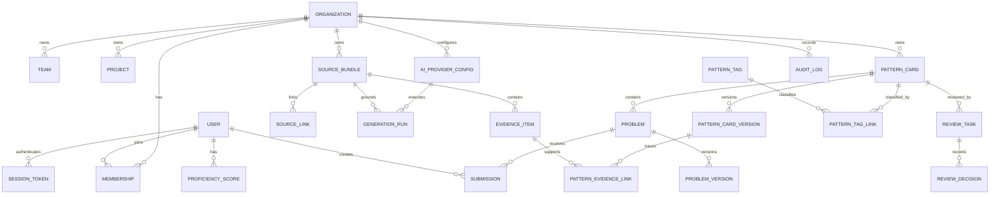

# feat: Split AI Code Learning Platform into Spring Boot and React

## Enhancement Summary

Deepened on: 2026-05-17

Research and review inputs:

- `architecture-strategist`: module boundaries, aggregate ownership, dependency rules, API compatibility, vertical migration sequencing.
- `java-springboot-best-practice`: Gradle/Kotlin setup, Spring Security, validation, transaction placement, OpenAPI contract rules, Spring testing strategy.
- `data-integrity-guardian`: database constraints, Flyway safety, retention/deletion, audit immutability, transactional workflows.
- `security-sentinel`: authentication, authorization, credential handling, evidence leakage, CORS/CSP, rate limits, secret scanning, OpenAPI exposure, audit tamper resistance.
- `performance-oracle`: indexes, bounded queries, cursor pagination, generation queue shape, request limits, TanStack Query cache behavior, metrics.
- `spec-flow-analyzer`: admin/contributor/reviewer/learner flows, request-changes loop, concurrent review, import atomicity, frontend error recovery.
- `code-simplicity-reviewer`: vertical-slice-first sequencing, scope control, avoiding premature abstractions while preserving MVP parity.
- Context7 framework docs: Spring Boot 3.5.9, Spring Security 6.5, springdoc-openapi, TanStack Query v5, Vite 7, React Router 7.

Key improvements:

1. Reframed implementation around small vertical slices instead of building the full target schema and module tree up front.
2. Added enforceable backend module and aggregate boundary rules, including ArchUnit-style checks.
3. Added database constraints, index requirements, migration safety rules, transaction boundaries, and retention/deletion defaults.
4. Moved security controls earlier than the final scan phase so auth, authorization, evidence access, redaction, CORS/CSP, rate limits, OpenAPI exposure, and audit integrity are designed into each slice.
5. Added performance baselines for pagination, DTO projections, bounded generation, input limits, frontend cache invalidation, and observability.
6. Expanded user-flow coverage for admin, contributor, reviewer, learner, concurrent decisions, retries, and frontend error states.

## Overview

Rebuild the current AI Code Learning Platform MVP as a split application with a Kotlin/Spring Boot backend and a TypeScript/React frontend. Keep the existing dependency-free Node MVP in the repository as an executable reference implementation until the new stack reaches feature parity.

The migration must preserve the full product loop: provider registration, source ingestion, `codex-obsidian-sync` import, PR/commit/diff evidence entry, source linking, pattern generation, human review, organization publication, learner practice, submissions, proficiency tracking, recommendations, audit, and security controls.

## Problem Statement

The current MVP proves the product loop but is implemented as a small Node HTTP server with a JSON file store and static frontend. That shape was useful for fast validation, but it is not the intended long-term architecture for organization use, relational audit trails, OpenAPI contracts, or a richer React learning experience.

The next version should introduce a maintainable production-oriented structure without losing the working MVP behavior that already exists.

## Research Findings

### Local Context

- Product brainstorm: `docs/brainstorms/2026-05-17-ai-generated-code-learning-platform-brainstorm.md`
- Stack split brainstorm: `docs/brainstorms/2026-05-17-spring-react-platform-split-brainstorm.md`
- Existing plan: `docs/plans/2026-05-17-feat-ai-code-learning-platform-plan.md`
- Reference API: `src/app.js`
- Reference domain behavior: `src/platform.js`
- Reference authorization/security: `src/authz.js`, `src/security.js`
- Reference store collections: `src/config.js`
- Reference parity tests: `tests/platform.test.js`
- `docs/solutions/` does not exist yet, so there are no institutional solution notes to reuse.

### External Documentation Notes

- Spring Boot 3.5 docs show standard Gradle setup around Spring Boot plugin, dependency management, starter dependencies, Actuator, and MockMvc/TestRestTemplate testing patterns.
- Spring Security 6.5 docs support opaque bearer token resource-server style configuration, custom token introspection, explicit `SecurityFilterChain` rules, and delegated password encoders.
- springdoc-openapi docs support WebMVC starter generation, grouped OpenAPI definitions, Gradle/OpenAPI generation, and hiding schema fields with `@Schema(hidden = true)`.
- TanStack Query v5 docs emphasize one `QueryClientProvider`, `useQuery`, `useMutation`, and mutation-driven cache invalidation.
- Vite 7 docs support type-safe `defineConfig`, React plugin usage, dev server proxying, typed `import.meta.env`, and `dist` production output.
- React Router 7 docs support nested route layouts, protected-route redirects, and preserving original location before login.

## Proposed Solution

Add a modular monolith Spring Boot API under `backend/` and a separately served Vite React app under `frontend/`.

The backend owns domain behavior, PostgreSQL persistence, session authentication, role authorization, OpenAPI generation, audit logging, and local mock AI generation. The frontend owns the Lovable-inspired application workspace, API state, navigation, generated OpenAPI types, and UI smoke coverage.

The existing Node implementation remains in `src/`, `public/`, and `tests/` during the migration. It acts as the parity oracle and can be removed only after the Spring/React version passes the same product flow and security gates.

### Deepened Implementation Principles

- Build vertical slices first: scaffold the split stack, then implement session/auth plus one working evidence-to-learning flow before broadening every module.
- Keep target boundaries visible, but do not pre-create unused packages, tables, abstractions, or generated clients before the slice that needs them.
- Treat the current Node MVP tests as behavior requirements, not exact JSON field-order contracts.
- Put security, audit, and authorization checks inside each mutating slice as it is built; do not defer them to the final security review.
- Prefer simple PostgreSQL-backed persistence for MVP evidence content. Introduce object storage or a richer `EvidenceStorage` abstraction only when file/object storage becomes an active requirement.
- Keep OpenAPI generation from the beginning, but enforce generated frontend-client drift checks after endpoint shapes stabilize through the parity smoke flow.

## Technical Approach

### Repository Shape

```text
backend/
  build.gradle.kts
  settings.gradle.kts
  src/main/kotlin/com/aicodelearning/...
  src/main/resources/application.yml
  src/main/resources/db/migration/
  src/test/kotlin/com/aicodelearning/...
frontend/
  package.json
  vite.config.ts
  src/
  src/api/generated/
  src/app/
  src/features/
  src/styles/
docker-compose.yml
scripts/
docs/brainstorms/
docs/plans/
src/ public/ tests/
```

### Backend Architecture

Use a modular monolith. The following are target domain boundaries, not permission to build unused scaffolding before the owning vertical slice exists:

- `auth`: sessions, password hashing, bearer-token filter, rate limiting hooks.
- `organization`: organizations, teams, projects, users, memberships, role checks.
- `provider`: organization and personal AI provider configs, credential references, provider policy.
- `evidence`: source bundles, evidence items, secret scanning, evidence content persistence.
- `source`: source-link suggestion and confirmation, GitHub URL/commit metadata, `GitSourceProvider` extension point.
- `generation`: `GenerationRun`, provider interface, deterministic local mock generator.
- `review`: review tasks, decisions, self-review prevention, publication transition.
- `library`: pattern cards, versions, tags, problems, visibility rules.
- `learning`: submissions, proficiency, recommendations.
- `audit`: immutable audit log and redacted metadata.
- `platform`: bootstrap/demo data and cross-module orchestration only where needed.

Use Spring MVC REST controllers and DTOs as the OpenAPI source of truth through `springdoc-openapi`.

Module boundary rules:

- Controllers depend on application services and request/response DTOs only. They must not load repositories directly.
- Application services own use-case orchestration, transactions, authorization calls, and audit emission.
- Domain code should avoid Spring, JPA, Jackson, HTTP, and persistence details where practical.
- Each module owns its entities, repositories, migrations, application services, domain policy tests, and public ports.
- Cross-module reads go through explicit query/application ports, not direct repository imports.
- Cross-module writes go through commands/application services or domain events, not table-level coupling.
- `platform` may orchestrate demo bootstrap and cross-module workflows, but business rules remain in the owning module.
- `audit` is append-only and can be called by other modules; other modules must not query audit records for business decisions.
- `auth` authenticates identity; `organization` authorizes organization/team/project scope.

Allowed dependency direction:

```text
presentation -> application -> domain
application -> module ports
infrastructure -> domain mappings

auth -> organization read port
provider -> organization authorization port
evidence -> organization authorization port, audit append port
source -> evidence read port, audit append port
generation -> provider policy port, source/evidence read ports, library draft port, review task port, audit append port
review -> library publication port, audit append port
learning -> library read port, audit append port
```

Add ArchUnit-style tests to reject controller-to-repository dependencies, direct imports across forbidden modules, and domain dependencies on Spring/JPA/Jackson where they are not explicitly accepted.

Aggregate ownership:

- `OrganizationAggregate`: organization, teams, projects, memberships, and role-scope invariants.
- `SessionAggregate`: session token lifecycle, expiration, revocation, token hash, last-used metadata.
- `ProviderConfigAggregate`: provider config, credential reference, org approval, quota, retention policy, rotation/revocation state.
- `SourceBundleAggregate`: source bundle, evidence items, blocked-sensitive status, content hash, source metadata.
- `SourceLinkAggregate`: suggestion, confirmation/rejection, linked bundle IDs, confidence metadata.
- `GenerationRunAggregate`: provider config ID, confirmed source link IDs, run state, failure reason, generated draft references.
- `PatternCardAggregate`: card, versions when needed, tags, evidence links, visibility, publication status.
- `ReviewTaskAggregate`: review task and decisions; it may trigger publication but does not own card content.
- `ProblemAggregate`: problem prompt/reference answer and answer visibility policy.
- `SubmissionAggregate`: learner submission, answer reveal eligibility, result status.
- `ProficiencyAggregate`: user/org proficiency scores and recommendation inputs.
- `AuditLog`: append-only event record, not a mutable aggregate.

Core invariants:

- A generation run may reference only confirmed source links.
- Pattern-card publication requires an approved review decision from a non-author reviewer.
- Learners never receive raw evidence or reference answers before submission.
- Organization publication requires an organization-approved provider config.
- Public visibility is rejected at command validation, not merely hidden in the UI.

### Authentication Decision

Use opaque server-side session tokens for the first Spring implementation. Store only token hashes in PostgreSQL, send tokens as `Authorization: Bearer <token>`, and support expiration/revocation. This matches the secured Node MVP behavior and keeps revocation simple. Keep the authentication service boundary compatible with a future JWT or OIDC adapter.

Token requirements:

- Generate at least 256 bits of randomness per session token.
- Store only a SHA-256 or stronger token hash plus `created_at`, `expires_at`, `revoked_at`, and `last_used_at`.
- Treat `/api/session` throttling separately from general authenticated API rate limits.
- Reject missing, malformed, unknown, expired, revoked, and replayed tokens with predictable `401` responses.
- Disable CSRF for bearer-token API routes, but configure CORS by profile: Vite localhost in development, explicit production allowlist only.

### Data Model

The ERD below is the target parity model. Implement migrations incrementally with the owning vertical slice. Do not create the full schema before the commands and invariants that own it exist. Across aggregate boundaries, prefer IDs and application ports over rich JPA relationship graphs.



### API Surface

Spring endpoints should preserve the current route concepts while allowing DTO cleanup:

- `POST /api/session`
- `GET /api/health`
- `GET /api/bootstrap`
- `GET/POST /api/providers`
- `POST /api/ingest/manual`
- `POST /api/ingest/codex-obsidian`
- `POST /api/source-links/suggest`
- `POST /api/source-links/{id}/confirm`
- `POST /api/source-links/{id}/reject`
- `POST /api/generation/runs`
- `GET /api/review/tasks`
- `POST /api/review/tasks/{id}/decision`
- `GET /api/library`
- `GET /api/pattern-cards/{id}`
- `POST /api/problems/{id}/submissions`
- `GET /api/progress`
- `GET /api/recommendations`
- `GET /api/audit`

Add PR/commit/diff evidence fields to manual ingestion:

- `sourceKind`: `code`, `diff`, `commit`, `pull_request`, `conversation`, `supporting_context`
- `repositoryUrl`
- `pullRequestUrl`
- `commitSha`
- `branchName`
- `filePaths`
- `provenance`

API contract rules:

- Mark route differences from the Node MVP as intentional. In particular, decide whether `/api/generation/run` remains as a compatibility alias for `/api/generation/runs` during migration.
- Use controller request/response DTOs as the OpenAPI source. Do not expose entities, token hashes, credential internals, raw evidence content, or audit integrity internals directly.
- Add stable `operationId` and module tags for generated TypeScript clients.
- Define a canonical error shape for `400`, `401`, `403`, `404`, `409`, `413`, `422`, `429`, and `500`.
- Validation errors should include field path, error code, safe message, and request ID, without echoing secret values or raw evidence.
- Version `codex-obsidian-sync` import payloads explicitly and define unknown-field behavior.
- Use opaque string IDs in API responses so seeded demo IDs can stay stable while database rows may use UUIDs internally.
- Add OpenAPI examples for the core parity flow so frontend behavior does not depend on incidental implementation details.

### Frontend Architecture

Use Vite, React, TypeScript, TanStack Query, React Router, and generated OpenAPI types.

Start with the current MVP workspace as the first React parity target. Do not build a marketing landing page. The default authenticated screen should expose the usable workbench: source intake, linking, generation, review, library, practice, and activity.

Use the Lovable-inspired design system as tokens:

- `--color-cream: #f7f4ed`
- `--color-charcoal: #1c1c1c`
- `--color-off-white: #fcfbf8`
- `--color-border: #eceae4`
- `--color-muted: #5f5f5d`
- opacity-derived charcoal tokens for secondary states.

Use warm bordered panels, dense readable app layouts, charcoal primary buttons with inset shadows, cream inputs, and no heavy card shadows. Keep the UI operational and scannable.

Frontend routing and API-state rules:

- Use a nested React Router app shell with protected routes. Preserve the intended destination when redirecting an unauthenticated user to login.
- Organize routes by workflow: source intake, source links, generation/review, library/practice, provider settings, audit.
- UI role hiding is convenience only; backend authorization remains authoritative.
- Use TanStack Query keys scoped by organization, role, filters, pagination cursor, and entity ID.
- Invalidate narrowly after mutations: provider changes, evidence ingest, source-link decisions, generation completion, review decisions, submissions, progress, recommendations, and audit.
- Use optimistic UI only for low-risk local state, not review/publication decisions.
- Stop generation polling on terminal state or route unmount, and avoid refetching full library/review lists on every polling tick.

### OpenAPI Types

Generate TypeScript API types from the Spring OpenAPI spec. Start with `springdoc-openapi` and a small typed API wrapper while endpoint shapes are still stabilizing. Commit generated types and add a CI/script drift check after the core parity smoke is stable.

### Testing Strategy

- Backend unit tests for pure domain policies: role checks, secret scanning, provider policy, generation validation, publication transitions.
- Backend integration tests with Testcontainers PostgreSQL for repeatable CI.
- Docker Compose PostgreSQL for local development and manual smoke testing.
- Frontend component/API smoke tests for core screens and mutation flows.
- End-to-end smoke script that proves the core parity loop against the Spring/React app.
- Keep Node MVP tests available as the behavior reference until final removal.

Backend test stack defaults:

- Use JUnit 5, AssertJ, Spring MockMvc, Testcontainers PostgreSQL, and ArchUnit.
- Use `@WebMvcTest`/MockMvc for controller validation, auth failures, and error shape.
- Use `@SpringBootTest` with Testcontainers for Flyway, repository behavior, transaction rollback, security filter chain, and the core parity flow.
- Add OpenAPI contract tests that assert security requirements, stable operation IDs, error schemas, and absence of banned fields.

### Data Integrity Baseline

- Enforce required ownership, status, hash, and timestamp fields with `NOT NULL` once created with safe defaults.
- Add foreign keys for memberships, providers, evidence, source links, generation runs, pattern versions, review tasks, submissions, proficiency, and audit ownership.
- Add unique constraints for user email, membership `(organization_id, user_id)`, provider names per owner scope, tag names per organization, expected content hashes, and active session token hashes.
- Constrain status/scope/type fields through database checks or persistence enum mappings.
- Give every Flyway migration a rollback/recovery note. Destructive changes must use expand/backfill/contract steps.
- Test migrations against an empty database and a seeded representative database.
- Add retention behavior for sessions, raw evidence, rejected drafts, failed generation runs, submissions, credentials, and audit logs.
- Wrap multi-entity workflows in service-level transactions: session creation/revocation, evidence ingestion, source-link decision, generation completion, review decision, submission/proficiency update, and audit emission.

### Security Baseline

- Every controller method must declare or call its organization/project authorization policy.
- Resource ownership checks happen after request path/body IDs are loaded from the database, not only from client-supplied organization IDs.
- Backend negative tests cover cross-organization access for providers, evidence, generation runs, review tasks, library cards, submissions, progress, recommendations, and audit logs.
- Provider credentials are handled through a secret abstraction and persisted only as references, masked labels, fingerprints, creator, rotation metadata, and status.
- Raw evidence is available only to contributor/reviewer/admin contexts that need it; learner APIs return only reviewed/redacted learning assets.
- Evidence content, full submissions, bearer tokens, raw credentials, and detected secret matches never appear in logs, audit metadata, frontend cache keys, generation errors, OpenAPI JSON, or API validation errors.
- CORS is profile-specific and production never uses wildcard credentialed origins.
- Security headers include CSP, `X-Content-Type-Options`, referrer policy, frame restrictions, and no-store headers for authenticated API responses.
- Separate rate limits are defined for login, ingestion, generation, submission, failed authorization probes, and OpenAPI/spec endpoints.
- OpenAPI docs are dev-only or admin-protected by default; contract tests fail if schemas expose banned names such as `passwordHash`, `tokenHash`, `secret`, `credentialValue`, or `rawCredential`.
- Audit logs are append-only and tamper-evident through `previousHash` and `eventHash` over canonical redacted event content.

### Performance And Scalability Baseline

- All growing list endpoints use cursor pagination with default and maximum limits. Avoid offset pagination for audit, library, review queue, and generation runs.
- Standard page shape:

```json
{
  "items": [],
  "nextCursor": "opaque-string-or-null",
  "limit": 25
}
```

- Backend list endpoints use DTO projections and bounded SQL queries. Large evidence/content fields load only on detail or generation paths.
- Add indexes for auth, authorization, provider policy lookup, evidence intake, source links, generation runs, pattern library filters, review queue, submissions, proficiency, recommendations, and audit filters.
- No endpoint should perform one query per returned row.
- Library, review queue, audit, recommendation, and generation polling queries should have documented query plans or representative `EXPLAIN` checks.
- Generation runs keep a persisted status model with idempotency keys, explicit timestamps, attempt count, failure code, timeout handling, org/global concurrency limits, and cheap status polling. The local mock may complete immediately, but the API shape should be ready for bounded async workers.
- Request, import, evidence, generation, submission, audit metadata, file path, and source-link candidate sizes have explicit backend and frontend limits.
- Observability tracks route latency, DB/query latency, DB pool health, Flyway duration, generation queue depth/wait/duration/failure code, evidence rejection, source-link duration, review queue depth, submission/recommendation metrics, frontend route load time, API error rate, and generation polling duration.

## Implementation Phases

Each implementation phase must finish with an explicit verification step. Do not mark a phase complete because files compile only; complete it when the listed behavior is proven through tests, smoke scripts, browser checks, or documented manual verification.

### Phase 1: Root Workspace And Tooling

Goal: prepare the split-stack repository without changing product behavior.

- Add root scripts for DB, backend, frontend, all tests, and smoke.
- Preserve existing Node MVP scripts as reference commands.
- Add or choose a root Gradle wrapper strategy.
- Add `.gitignore` entries for Spring, Gradle, Vite, build output, and local DB artifacts.

Verification:

- Existing Node MVP tests still pass.
- Root scripts fail clearly when prerequisites are missing.
- Git status shows only intentional scaffold/documentation changes.

### Phase 2: Backend Skeleton

Goal: create a minimal Kotlin/Spring Boot service.

- Add `backend/` with Gradle Kotlin DSL, Kotlin 2.x, Spring Boot 3.x, Java 21 toolchain.
- Add baseline dependencies: Web, Security, Validation, persistence, Flyway, PostgreSQL, Actuator, springdoc, test starter, Testcontainers PostgreSQL, ArchUnit.
- Add `GET /api/health`.
- Add dev/test profiles.

Verification:

- `backend` test task passes.
- `GET /api/health` returns healthy JSON locally.
- Actuator health confirms app startup without requiring a database migration yet.

### Phase 3: Frontend Skeleton

Goal: create a minimal Vite React app with the target visual foundation.

- Add `frontend/` with Vite, React, TypeScript, TanStack Query, React Router.
- Add app shell placeholder, API client placeholder, and style token file.
- Configure Vite dev proxy to Spring backend.
- Add typecheck/build scripts.

Verification:

- Frontend dev server starts.
- Frontend build and typecheck pass.
- A browser can load the app shell without console errors.

### Phase 4: Local PostgreSQL Environment

Goal: make local persistence repeatable.

- Add root `docker-compose.yml` for PostgreSQL.
- Add backend datasource configuration for local/test profiles.
- Add a DB startup script and health check.

Verification:

- Fresh `docker compose up` starts PostgreSQL.
- Backend connects to PostgreSQL in the local profile.
- README draft commands can start DB and backend in sequence.

### Phase 5: Organization, User, Membership, And Session Schema

Goal: add the first real persistence slice.

- Add Flyway migrations for organizations, teams, projects, users, memberships, and session tokens.
- Add `NOT NULL`, foreign key, unique, and status/scope constraints.
- Add indexes for session lookup and membership authorization.
- Seed demo organization and users in dev profile.

Verification:

- Migrations apply to empty PostgreSQL.
- Migrations apply to seeded PostgreSQL.
- Integration tests can read demo org/users/memberships.
- Session token lookup uses indexed token hash.

### Phase 6: Session Authentication

Goal: match secured Node MVP authentication behavior.

- Implement `POST /api/session`.
- Store password hashes and session token hashes only.
- Add bearer token authentication filter.
- Add session expiry, revocation fields, and `last_used_at`.
- Add login-specific rate limiting.

Verification:

- Valid demo login returns a bearer token.
- Missing, malformed, unknown, expired, and revoked tokens return `401`.
- `x-user-id` spoofing is ignored.
- Login throttling returns safe `429` JSON.

### Phase 7: Authorization Policy Foundation

Goal: centralize organization/team/project access checks before feature controllers expand.

- Implement role hierarchy and scoped authorization service.
- Add method or application-service authorization checks for protected endpoints.
- Add canonical JSON error shape for `401`, `403`, `404`, `409`, `413`, `422`, and `429`.
- Add CORS/CSRF profile decisions and security headers.

Verification:

- Positive and negative auth tests cover admin, contributor, reviewer, and learner.
- Cross-organization access fails closed in tests.
- Security headers and CORS preflight behavior are asserted.

### Phase 8: Provider Configuration Slice

Goal: support local mock AI provider configuration safely.

- Add provider schema and repository/service/controller.
- Register organization and personal providers.
- Store only credential references, masked labels, fingerprints, creator, retention, rotation/revocation metadata, and status.
- Seed an organization-approved local mock provider.

Verification:

- Provider create/list/read APIs never expose raw credentials, full fingerprints, token hashes, or decrypted values.
- Personal provider cannot generate organization-published assets.
- Disabled/revoked providers cannot start new generation runs.

### Phase 9: Audit Append Foundation

Goal: make state-changing slices auditable from the start.

- Add audit log schema.
- Implement audit append port/service.
- Store actor, organization, event type, target type/id, request ID, timestamp, redacted metadata, `previousHash`, and `eventHash`.
- Forbid update/delete audit repository operations in application code.

Verification:

- Provider registration emits audit in the same transaction.
- Audit metadata is redacted.
- Admin can read audit; non-admin receives `403`.
- Hash-chain verification detects modified, deleted, or reordered audit rows.

### Phase 10: Manual Evidence Ingestion

Goal: persist clean source evidence and block sensitive evidence.

- Add source bundle and evidence item schema.
- Implement `POST /api/ingest/manual`.
- Support `sourceKind`, repository URL, PR URL, commit SHA, branch, file paths, and provenance.
- Store evidence content in PostgreSQL for MVP.
- Add secret scanning, dedupe by content hash/source metadata, and payload limits.

Verification:

- Contributor can ingest clean code/diff/supporting context.
- Sensitive evidence is blocked without echoing detected values.
- Over-limit payloads return `413` or validation errors before expensive processing.
- Learner cannot read raw evidence.

### Phase 11: codex-obsidian-sync Import

Goal: support conversation-log ingestion.

- Implement `POST /api/ingest/codex-obsidian` for schema version 1.
- Parse conversations into evidence items.
- Use partial-success item errors for conversation-level failures and request-level validation errors for malformed schema.
- Reuse secret scanning, limits, hashes, audit, and authorization.

Verification:

- Valid export creates conversation evidence.
- Empty/malformed conversations return item-level errors.
- Export with secrets stores only redacted finding categories/fingerprints.
- Import behavior is covered by integration tests.

### Phase 12: Source Link Suggestion And Decision

Goal: connect conversation and code/diff evidence.

- Add source-link schema and indexes.
- Implement source-link suggestion between conversation and code/diff bundles.
- Implement confirm/reject endpoints.
- Cap candidate bundles/items before text comparison.

Verification:

- Contributor can suggest, confirm, and reject links.
- Unconfirmed/rejected links cannot be used for generation.
- Cross-organization bundle linking is rejected.
- Source-link decisions and audit commit atomically.

### Phase 13: Generation Run Persistence

Goal: add the generation run state model before generating cards.

- Add generation run schema with status, idempotency key, timestamps, attempt count, and failure code.
- Add per-organization/global concurrency settings.
- Add cheap run detail endpoint for polling.
- Add duplicate request handling by idempotency key.

Verification:

- Generation run can be created only from confirmed source links.
- Duplicate idempotency request does not create duplicate runs.
- Run detail polling does not load raw evidence content.

### Phase 14: Local Mock Pattern Generator

Goal: generate deterministic draft learning assets.

- Implement provider interface and local mock provider.
- Transform linked evidence into draft pattern card, tags, problems, and reference answers.
- Enforce provider policy, input size, public visibility rejection, and redaction.
- Store generated output through the application service transaction.

Verification:

- Generation creates a draft card and generated problems.
- Failed generation stores only redacted failure category.
- Organization publication requires organization-approved provider.
- Generation completion is atomic: no partial reviewable draft remains on failure.

### Phase 15: Review Task Creation And Queue

Goal: make generated drafts reviewable.

- Add review task and review decision schema.
- Create an open review task when generation succeeds.
- Implement paginated review queue with compact card summaries.
- Add reviewer authorization and self-review prevention.

Verification:

- Reviewer can list open review tasks.
- Contributor cannot review own draft.
- Learner cannot access review queue.
- Review queue avoids N+1 queries in representative tests.

### Phase 16: Review Decisions And Publication

Goal: publish only approved organization assets.

- Implement approve, request changes, reject, and duplicate decisions.
- Require comments for request changes and duplicate target for duplicate decisions.
- Add optimistic locking or version conflict for concurrent decisions.
- Update card review/publication state and audit in the same transaction.

Verification:

- Approve publishes organization-visible card.
- Reject/duplicate cards are not visible to learners.
- Concurrent decision returns `409` or deterministic conflict.
- Request-changes/resubmission behavior is tested.

### Phase 17: Library Listing And Pattern Detail

Goal: expose published assets to learners.

- Implement cursor-paginated library listing with tag/status/difficulty filters.
- Implement pattern-card detail.
- Hide reference answers until learner submission.
- Use DTO projections and bounded SQL queries.

Verification:

- Learner sees only published organization-visible cards.
- Learner cannot deep-link to draft/rejected cards.
- Reference answers are hidden before submission.
- Library list query has a bounded plan and no one-query-per-row behavior.

### Phase 18: Submissions And Proficiency

Goal: support learner practice and progress.

- Add submission and proficiency schema.
- Implement text/code submissions.
- Scan submissions for secrets.
- Store each submission and mark latest/current for display.
- Recalculate proficiency after submission, with recoverable retry behavior if recalculation fails.

Verification:

- Learner can submit text/code answers.
- Empty, oversized, unsupported, and secret-like submissions are rejected safely.
- Reference answer is visible after submission.
- Submission, proficiency update, and audit commit atomically or recover predictably.

### Phase 19: Recommendations

Goal: return bounded next-practice suggestions.

- Implement recommendation query from unsolved published cards and weak tags.
- Bound candidate set in SQL before application scoring.
- Add empty-state behavior.

Verification:

- Recommendation endpoint returns unsolved relevant cards.
- Empty recommendations return a safe empty state.
- Query avoids scanning all cards in application memory.

### Phase 20: Backend Contract And OpenAPI

Goal: stabilize the API contract for the React app.

- Add springdoc OpenAPI configuration.
- Add bearer auth scheme, operation IDs, module tags, shared error schema, and examples.
- Hide sensitive fields and protect/disable OpenAPI outside dev/admin.
- Decide whether `/api/generation/run` remains a compatibility alias for `/api/generation/runs`.

Verification:

- OpenAPI JSON is generated.
- Contract test fails if banned fields appear: `passwordHash`, `tokenHash`, `secret`, `credentialValue`, `rawCredential`, raw evidence content.
- Protected endpoints show bearer auth requirements.

### Phase 21: Frontend API Layer

Goal: connect React to Spring APIs without type drift.

- Add small typed API wrapper first.
- Add generated OpenAPI types after core endpoint shapes stabilize.
- Add TanStack Query client, auth token handling, and safe error parsing.
- Ensure bearer tokens are not stored in query cache data.

Verification:

- Frontend can login and call bootstrap/library APIs.
- API wrapper handles `401`, `403`, validation, conflict, rate limit, and network errors.
- Typecheck passes.

### Phase 22: React App Shell And Design Tokens

Goal: build the usable workspace shell.

- Add Lovable-inspired CSS tokens and base primitives.
- Add protected nested routes and login redirect back to intended destination.
- Add role-aware navigation for provider, source, review, library, practice, progress, audit.
- Keep first screen as authenticated workbench, not marketing hero.

Verification:

- Desktop and mobile screenshots show no text overlap.
- Keyboard focus states are visible.
- Role-hidden navigation does not replace backend authorization tests.

### Phase 23: Contributor React Flow

Goal: make contribution workflow usable without manual API calls.

- Build provider selection/status surface.
- Build manual evidence form with PR/commit/diff metadata.
- Build `codex-obsidian-sync` import form with partial-success display.
- Build source-link suggestion/confirm/reject UI.
- Build generation run creation and polling UI.

Verification:

- Contributor can complete upload/import/link/generate flow in the browser.
- Generation polling stops on terminal state or route unmount.
- Validation and secret-scan errors are visible without echoing secrets.

### Phase 24: Reviewer React Flow

Goal: make review and publication usable.

- Build paginated review queue.
- Build review detail with generated card, problems, confirmed links, and redacted evidence summary.
- Build approve/request-changes/reject/duplicate forms.
- Show conflict and permission errors clearly.

Verification:

- Reviewer can approve a draft in the browser.
- Self-review is blocked before submit and by backend.
- Concurrent decision conflict UI prompts refresh/retry.

### Phase 25: Learner React Flow

Goal: make library, practice, and progress usable.

- Build library listing and filters.
- Build pattern detail and problem cards.
- Build text/code submission forms.
- Show reference answer after submission.
- Build progress and recommendations views.

Verification:

- Learner can browse, open, submit, see answer, see progress, and see recommendations in browser.
- Direct URL access to disallowed resources receives clear UI state.
- Empty recommendation list has a designed empty state.

### Phase 26: Admin React Flow

Goal: expose admin-only operations safely.

- Build provider management read/create/disable/rotate surfaces.
- Build audit log filter view by actor, event type, resource, and date.
- Show credential fingerprint/masked label only.
- Hide unavailable non-admin navigation while relying on backend enforcement.

Verification:

- Admin can register provider and inspect audit.
- Non-admin deep-link to audit/provider admin screens receives `403` UI.
- No credential, token hash, or raw evidence appears in rendered admin UI.

### Phase 27: Frontend Error And Accessibility Pass

Goal: make failure states and basic accessibility explicit.

- Add consistent loading, empty, validation, `401`, `403`, `409`, `413`, `429`, network failure, and generation-failed states.
- Preserve unsaved form state where reasonable after `401` login redirect.
- Add accessible labels for inputs/buttons and visible focus states.
- Confirm responsive constraints for cards, forms, navigation, and problem panels.

Verification:

- Component/smoke tests cover primary error states.
- Keyboard-only navigation reaches primary flows.
- Mobile and desktop browser checks show no incoherent overlap.

### Phase 28: Backend Performance And Security Hardening

Goal: harden before final parity sign-off.

- Add documented indexes and representative query-plan checks.
- Add endpoint limits and rate limits for login, ingestion, generation, submission, failed authorization probes, and OpenAPI/spec endpoints.
- Add metrics named in the performance baseline after the core parity slice is stable.
- Add CI secret scan over repository contents and generated artifacts.

Verification:

- Library, review, audit, recommendation, and generation polling queries are bounded.
- Rate-limit tests cover login, generation, ingestion, and submission.
- CI secret scan passes.
- Metrics/health endpoints expose no sensitive values.

### Phase 29: Spring/React Parity Smoke

Goal: prove product parity end to end.

- Add smoke script covering admin, contributor, reviewer, and learner as separate users.
- Cover session, provider, manual ingest, codex import, link, generation, review, publication, library, submission, progress, recommendations, and audit.
- Cover request-changes/resubmission, concurrent review conflict, import partial success, and frontend error states.
- Keep Node MVP tests passing as oracle.

Verification:

- Spring/React smoke passes from a clean local DB.
- Existing Node MVP tests pass.
- Parity smoke asserts named behaviors, not incidental JSON field order.

### Phase 30: Codex Security Review And Fixes

Goal: validate the completed diff with Codex Security.

- Run Codex Security scan on the Spring/React worktree diff.
- Validate findings through threat model, discovery, validation, and attack-path analysis.
- Fix validated findings.
- Add regression tests or documented verification for each fix.

Verification:

- No reportable high or critical findings remain.
- Security report path is recorded.
- Fixed findings have tests or explicit non-testable verification notes.

### Phase 31: Documentation And Developer Onboarding

Goal: make the split stack runnable by another developer.

- Update root `README.md`.
- Add `backend/README.md` and `frontend/README.md`.
- Document demo users, local ports, DB commands, backend/frontend commands, type generation, tests, smoke, security assumptions, and Node reference criteria.

Verification:

- Fresh checkout can run DB, backend, frontend, tests, and smoke from docs.
- Documentation matches actual commands.
- Node MVP retention/removal criteria are explicit.

### Phase 32: Release Readiness

Goal: finish with a clean, verifiable state.

- Run backend tests, frontend typecheck/tests/build, OpenAPI checks, parity smoke, Node MVP tests, and Codex Security scan.
- Review git status and commit logical checkpoints if requested.
- Keep Node MVP unless the user explicitly approves removal.

Verification:

- Full verification checklist passes.
- Plan acceptance criteria are all satisfied or explicitly deferred with reason.
- Working tree contains only intentional changes.

## Alternative Approaches Considered

- Replace Node MVP immediately: rejected because it removes the working behavior oracle too early.
- Build only backend first: rejected because the user asked for backend/frontend split and product parity.
- Use GraphQL: rejected because REST JSON + OpenAPI is simpler and better aligned with generated frontend types.
- Use H2 first: rejected because PostgreSQL-specific schema and query behavior matter for audit and relational data.
- Start with full GitHub App integration: rejected for MVP parity because authentication, private repo permissions, webhook handling, and rate limits would expand scope.

## Acceptance Criteria

### Functional Requirements

- [ ] Spring backend and React frontend run as separate dev servers.
- [ ] PostgreSQL schema is managed through Flyway.
- [ ] API exposes OpenAPI and frontend types are generated from it.
- [ ] Users can create sessions and use bearer-token authenticated APIs.
- [ ] Role authorization matches current MVP behavior.
- [ ] Organization and personal AI providers can be registered without leaking credentials.
- [ ] Manual code/diff/supporting-context ingestion works.
- [ ] `codex-obsidian-sync` import works for schema v1.
- [ ] PR/commit/diff evidence can store GitHub URL and commit metadata.
- [ ] Secret scanning blocks sensitive evidence and submissions.
- [ ] Source links can be suggested, confirmed, and rejected.
- [ ] Pattern generation creates reviewable cards and problem sets through local mock provider.
- [ ] Human review decisions update card and publication states.
- [ ] Learners can browse library cards, open problems, submit answers, and see progress.
- [ ] Recommendations return unsolved relevant cards.
- [ ] Audit logs capture important state-changing events.
- [ ] Generation runs use confirmed source links only and reject duplicate idempotency requests safely.
- [ ] Review request-changes and resubmission are explicitly supported.
- [ ] Concurrent review decisions are rejected or resolved predictably.
- [ ] Import partial-success behavior is implemented and documented.

### Non-Functional Requirements

- [ ] Public publishing remains disabled in MVP UI/API.
- [ ] Raw evidence is not visible to learners.
- [ ] Reference answers are hidden until learner submission.
- [ ] Credentials and tokens are redacted from API responses and logs.
- [ ] API errors use a consistent JSON error shape.
- [ ] Local development requires only documented runtime dependencies plus Docker.
- [ ] Frontend follows the Lovable-inspired warm neutral design system.
- [ ] UI remains usable on mobile and desktop without text overlap.
- [ ] List endpoints are cursor-paginated with default and maximum limits.
- [ ] Large text/content fields are loaded only on detail or generation paths.
- [ ] CORS, CSP, no-store, frame, referrer, and content-type headers are configured and tested.
- [ ] Audit logs are append-only, redacted, and tamper-evident.
- [ ] Retention/deletion behavior is documented for sessions, raw evidence, rejected drafts, failed generation runs, submissions, credentials, and audit logs.

### Quality Gates

- [ ] Backend unit and integration tests pass.
- [ ] Frontend type check, lint/test, and build pass.
- [ ] OpenAPI type generation drift check passes.
- [ ] Spring/React parity smoke passes.
- [ ] Existing Node MVP tests still pass while reference remains.
- [ ] Codex Security scan is complete and validated findings are fixed.
- [ ] README setup instructions are verified from a clean local environment.
- [ ] ArchUnit or equivalent architecture tests enforce forbidden package dependencies.
- [ ] Flyway migrations pass against empty and seeded PostgreSQL databases.
- [ ] OpenAPI JSON does not expose banned credential/token/raw-evidence fields.
- [ ] Every authenticated endpoint has positive and negative authorization coverage.
- [ ] Cross-organization access tests fail closed for all resource types.
- [ ] Query tests or documented query plans cover library, review queue, audit, recommendations, and generation polling.
- [ ] Frontend error states are covered for `401`, `403`, validation, conflict, rate limit, and network failure.

## Success Metrics

- Full parity smoke completes without manual API intervention.
- No high/critical security findings remain after review.
- A developer can run DB, backend, frontend, and smoke tests from README commands.
- Frontend API usage compiles from generated OpenAPI types with no hand-written DTO drift.
- The React UI supports the complete contributor, reviewer, admin, and learner workflows.

## Dependencies And Prerequisites

- Java 21.
- Gradle wrapper or local Gradle compatible with the selected Spring Boot/Kotlin plugin versions.
- Node runtime for frontend tooling.
- Docker for PostgreSQL and optional test infrastructure.
- PostgreSQL JDBC driver.
- Spring Boot 3.x, Kotlin 2.x, Spring Security, Spring Validation, Flyway, Actuator, springdoc-openapi.
- Vite, React, TypeScript, TanStack Query, React Router, OpenAPI TypeScript generator.

## Risk Analysis And Mitigation

- **Feature drift from Node MVP**: keep Node tests and add parity smoke before removing the reference implementation.
- **Overlarge first rewrite**: implement in small vertical phases, each with a verification gate.
- **Auth regression**: start with opaque server-side sessions and regression tests for spoofing and raw evidence access.
- **Credential leakage**: centralize API redaction and credential reference storage.
- **OpenAPI type drift**: commit generated types and enforce regeneration diff checks.
- **Frontend becoming a marketing page**: treat the first screen as an authenticated workbench, not a landing page.
- **Database migration mistakes**: use Flyway from phase 2 and avoid manual schema setup.
- **AI provider scope creep**: ship local mock first; real providers stay behind adapter interfaces.
- **Premature abstraction**: keep target boundaries visible but implement only the tables, packages, generated clients, metrics, and storage abstractions needed by the active vertical slice.
- **Schema overreach**: do not create the full ERD in the first migration. Add tables with their owning command/query behavior and tests.
- **Performance regression**: add pagination, bounded queries, DTO projections, and indexes before list endpoints become feature-complete.
- **Security retrofit risk**: add auth, authorization, redaction, audit, and rate-limit decisions in each feature phase instead of relying only on Phase 15.

## SpecFlow Notes

Critical flows to preserve:

- Admin signs in, selects organization context, configures organization provider, sees credential fingerprint only, disables/rotates provider, and reviews audit by actor/event/resource/date.
- Contributor signs in, uploads source evidence with repo/PR/commit metadata, imports `codex-obsidian-sync` data, links sources, generates a draft, and handles request-changes feedback.
- Reviewer signs in, filters the review queue, inspects redacted evidence summaries, approves, requests changes with comments, rejects, or marks duplicate with a duplicate target.
- Learner signs in, browses published cards, filters library, opens a pattern card, submits text/code answers, sees reference answer after submission, sees progress, and receives recommendations.
- Unauthorized or wrong-role users receive predictable 401/403 responses.
- Sensitive content is blocked before storage or submission.

Edge cases to cover in tests:

- Expired or missing session token.
- Personal provider used for organization publication.
- Public visibility requested.
- Source link missing or not confirmed.
- Empty submission.
- Secret-like content in evidence or submission.
- Reviewer attempts self-review.
- Learner attempts raw evidence or review queue access.
- Duplicate provider names.
- Provider disabled while generation is pending/running.
- Duplicate evidence upload.
- Double-clicked or retried generation request.
- Concurrent review decisions.
- Duplicate decision without duplicate target.
- Request changes with empty comment.
- Multiple submissions to the same problem.
- Empty recommendation list.
- Expired token during unsaved frontend form work.
- `400/422`, `409`, `413`, `429`, and network failure frontend recovery.

## Documentation Plan

- Update `README.md` with split-stack commands.
- Add `backend/README.md` for Spring profiles, migrations, and test commands.
- Add `frontend/README.md` for generated types, design tokens, and dev server proxy.
- Add an API contract note describing OpenAPI generation and drift checks.
- Add a migration note explaining the temporary Node reference implementation.

## References

### Internal

- `docs/brainstorms/2026-05-17-spring-react-platform-split-brainstorm.md`
- `docs/brainstorms/2026-05-17-ai-generated-code-learning-platform-brainstorm.md`
- `docs/plans/2026-05-17-feat-ai-code-learning-platform-plan.md`
- `src/app.js`
- `src/platform.js`
- `src/authz.js`
- `src/security.js`
- `tests/platform.test.js`

### External

- Spring Boot Gradle plugin and dependency management docs from Spring Boot 3.5.9.
- Spring Boot MockMvc/TestRestTemplate testing guidance.
- Spring Security 6.5 opaque bearer token and `SecurityFilterChain` guidance.
- springdoc-openapi WebMVC starter, grouped API, Gradle generation, and schema hiding guidance.
- TanStack Query React quick start and query invalidation guidance.
- Vite configuration, env typing, proxy, and build output guidance.
- React Router 7 nested routes and protected-route redirect guidance.
