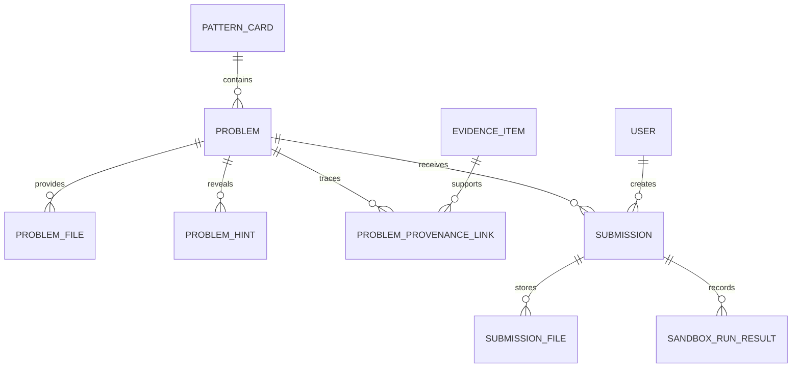

# feat: Add Practice-Centered Code Workbench

## Enhancement Summary

Deepened on: 2026-05-18

Research and review inputs:

- Architecture review: runner boundary, frontend feature slices, canonical asset ownership, attempt ownership.
- Security review: untrusted code execution, Docker socket exposure, path traversal, answer/provenance leakage, local AI credential separation.
- Performance review: Monaco lazy loading, bounded library queries, runner timeout/output limits, frontend bundle budget.
- Data integrity review: Flyway migration safety, per-user attempt uniqueness, canonical problem immutability, audit and retention rules.
- SpecFlow review: first-user, returning learner, offline, Docker-unavailable, timeout, stale draft, and multi-user submission paths.
- Context7 documentation: Monaco Editor, Docker, and Flyway.

Key improvements:

1. Clarified that the implementation should start with a thin vertical slice before adding every runner and conversion-workbench feature.
2. Added explicit Monaco integration constraints: Vite worker setup, model URI strategy, diff editor usage, lifecycle cleanup, command disposal, and lazy loading.
3. Strengthened the Docker runner threat model: narrow internal runner API, no arbitrary command/image execution, no public browser runner endpoint, and constrained execution containers.
4. Reworked sync semantics around immutable canonical exercises and per-user attempts with `clientAttemptId` idempotency.
5. Added migration, security, E2E, and performance checkpoints to each major implementation area.
6. Split implementation into Phase 0-53 so each step has a small scope and an explicit verification gate.

## Overview

Build LearnLoop's next learner-facing slice: a practice-centered code workbench that turns reviewed AI-generated code patterns into reusable exercises. The frontend should present a VS Code-like editing experience with Monaco Editor, multi-file tabs, familiar shortcuts, progressive hints, diff feedback, provenance context, and sandbox execution for TypeScript, Kotlin, and Java.

The implementation must keep organization learning assets stable. Original pattern cards and problems are canonical assets. User answers, run results, scores, progress, and history are separate per-user records stored locally first and synchronized to the server without mutating the canonical organization asset.

## Problem Statement

The current React UI proves the platform loop but still behaves like a workflow dashboard. It can run a demo flow and show a latest pattern card, but it does not yet provide a focused practice library, realistic code editing, sandbox execution, or developer-friendly feedback.

For LearnLoop to feel useful to developers, the product needs to make the learning moment concrete: browse a pattern, inspect realistic code context, modify code, run it, compare the diff, submit an attempt, and receive pattern-aware feedback.

## Research Findings

### Local Context

- Brainstorm source: `docs/brainstorms/2026-05-18-frontend-practice-library-code-workbench-brainstorm.md`
- Spring/React architecture plan: `docs/plans/2026-05-17-feat-spring-react-platform-split-plan.md`
- Current frontend app: `frontend/src/App.tsx`, `frontend/src/styles.css`, `frontend/src/api/client.ts`
- Current frontend dependencies: React 19, TypeScript 5.9, Vite 7, `lucide-react`
- Current backend learning model: `backend/src/main/kotlin/com/aicodelearning/learning/LearningEntities.kt`
- Current library/submission APIs: `LibraryController.kt`, `SubmissionController.kt`, `SubmissionService.kt`, `PatternReadService.kt`
- Current schema already has canonical `pattern_cards`, `problems`, per-user `submissions`, and `proficiency_scores`.
- Current installed-app and E2E scripts exist: `scripts/e2e-installed.sh`, `scripts/perf-measure.sh`, `scripts/check-split.sh`.
- There is no `docs/solutions/` knowledge base in the current document root, so no prior solution notes apply.

### External Notes

- Monaco Editor is the best fit because it provides the browser editor used by VS Code, including language modes, editor actions, find, multi-cursor editing, theme selection, text models, and diff editor support.
- Monaco with Vite needs explicit worker configuration for editor, JSON, CSS, HTML, and TypeScript/JavaScript workers. This should live in a small setup module imported only by the lazy workbench bundle.
- Monaco text models should use stable virtual file URIs and must be disposed when files/problems unload. Diff editor models must also be disposed explicitly.
- Docker official docs support resource and security controls relevant to local sandboxing, including CPU and memory limits, `security_opt: no-new-privileges`, `tmpfs`, and network disabling. Rootless Docker/cgroup behavior can vary, so status checks should report when limits cannot be enforced.
- Flyway should keep `validate-on-migrate` enabled and use conventional versioned migration names. New migrations should be additive and safe for existing data.

## Proposed Solution

Add a new practice workbench experience with three connected surfaces:

1. Practice library: pattern-centered browsing with language, library/API, difficulty, and status filters.
2. Practice workbench: VS Code-like editor with multi-file exercise context, progressive hints, run/submit actions, diff view, and feedback.
3. Conversion workbench: traceable source-to-learning flow showing evidence on the left, recognized patterns in the center, and generated exercises plus review state on the right.

Backend work should extend the existing learning model instead of introducing a parallel product model. `problems` remain canonical reviewed assets. `submissions` evolve into richer per-user attempt records. New exercise file, hint, provenance, and sandbox result data should be linked to problem IDs and user IDs rather than merged into pattern cards after learners submit.

## Technical Approach

### Frontend Architecture

Use a small feature-oriented split inside the existing Vite React app:

```text
frontend/src/
  App.tsx
  api/client.ts
  features/
    library/
      PracticeLibrary.tsx
      libraryTypes.ts
    practice/
      PracticeWorkbench.tsx
      CodeEditor.tsx
      FileTabs.tsx
      CommandPalette.tsx
      DiffPanel.tsx
      FeedbackPanel.tsx
      ProvenancePanel.tsx
      practiceStorage.ts
    conversion/
      ConversionWorkbench.tsx
  styles.css
```

Keep the first implementation simple: avoid adding a full router unless navigation becomes hard to manage. Lazy-load the Monaco workbench so the login/onboarding/dashboard shell does not pay the editor bundle cost.

Implementation details:

- Use `React.lazy` or a dynamic import boundary around the practice workbench and Monaco setup.
- Keep `monaco-editor` imports out of `App.tsx`; the base app should remain editor-free.
- Create one Monaco model per exercise file using a stable `file:///learnloop/{problemId}/{path}` URI.
- Dispose editor instances, diff editor instances, text models, and command/action disposables when leaving a problem.
- Use Monaco `createDiffEditor` for answer comparison instead of hand-rendering line diffs.
- Use Monaco built-in themes `vs` and `vs-dark` first. Custom themes can wait until the workbench works.
- Keep keyboard command registration local to the editor/workbench to avoid intercepting login or onboarding form shortcuts.
- Store UI-only preferences such as editor theme and open panel state separately from answer attempts.

### Backend Data Model

Extend the learning schema with canonical exercise context and per-user attempt detail:



Target additions:

- `problem_files`: starter/test/supporting file content, path, language, read-only flag, sort order.
- `problem_hints`: ordered hints with reveal labels and optional pattern-reveal marker.
- `problem_provenance_links`: redacted source snippets and links to evidence/source-link IDs.
- `submissions`: add `client_attempt_id`, `language`, `score`, `submitted_at`, `updated_at`, and structured result metadata.
- `submission_files`: submitted per-file code snapshots.
- `sandbox_run_results`: status, duration, stdout/stderr excerpts, test results, failed diff, runner kind, and failure reason.

Canonical asset rule: published problems are not mutated by learner activity. Editing a published organization exercise should happen through a review/edit workflow and create a new problem revision or replacement problem, not overwrite learner history.

Data integrity rules:

- `problem_files.path` must be normalized, relative, unique per problem, and reject `..`, absolute paths, home-directory expansion, null bytes, and platform path separators that escape the exercise root.
- `problem_files.file_role` should distinguish starter, test, support, solution, and hidden-test files. Learners must never receive solution or hidden-test file content before eligibility.
- `problem_hints.reveal_order` must be unique per problem.
- `problem_provenance_links.redacted_excerpt` must be length-bounded and never store raw secrets.
- `submissions.client_attempt_id` must be unique per `(user_id, problem_id, client_attempt_id)` for idempotent local sync.
- `submission_files` should be immutable snapshots for submitted attempts. Draft sync updates may update the same client attempt until final submission.
- `sandbox_run_results.stdout_excerpt`, `stderr_excerpt`, and stack traces must be truncated before persistence.
- Foreign keys should prevent orphaned attempt files and run results. Prefer restrictive deletes for canonical assets and explicit cleanup jobs for old draft attempts.

### API Surface

Add or extend these endpoints:

- `GET /api/library?organizationId=&language=&tag=&difficulty=`
- `GET /api/problems/{id}/practice`
- `POST /api/problems/{id}/attempts/local-sync`
- `POST /api/problems/{id}/runs`
- `POST /api/problems/{id}/submissions`
- `GET /api/problems/{id}/attempts/me`
- `GET /api/progress?organizationId=`
- `GET /api/recommendations?organizationId=`

Response rules:

- Do not return `referenceAnswer`, solution files, or expected final diff before eligibility.
- Return redacted provenance only; raw evidence remains protected by existing evidence permissions.
- Return user attempt records only to the owning user or authorized organization reviewers/admins.
- Use `clientAttemptId` for idempotent local-to-server sync.

API contract details:

- `GET /api/problems/{id}/practice` should return `problemVersion` or `assetRevision` so stale local drafts can be detected.
- `POST /api/problems/{id}/attempts/local-sync` should accept `clientAttemptId`, `assetRevision`, file snapshots, local updated timestamp, and sync intent (`draft` or `submitted`).
- If a local draft targets an older asset revision, return a conflict response with both the current asset revision and a safe message; do not silently merge into a changed exercise.
- `POST /api/problems/{id}/runs` should create a run result owned by the current user. It may reference a draft attempt or include transient files, but it must not persist hidden tests or runner internals in the response.
- `POST /api/problems/{id}/submissions` should be idempotent for the same `clientAttemptId` and should return the updated practice detail with answer eligibility applied.
- Large request bodies should fail fast with clear `413` or validation responses before runner work starts.

### Sandbox Architecture

Implement a local runner boundary instead of letting learner code run in the main backend process.

Preferred installed-app shape:

```text
frontend -> backend API -> local-runner service -> docker run language image
```

The runner service must be internal to the installed environment and guarded by a runner token. It should not expose a public browser API. Avoid mounting the Docker socket directly into the main backend service; if Docker Engine access is required, keep it inside a narrow runner service with minimal endpoints and no arbitrary image/command selection.

Per-run constraints:

- Allowlisted runner images only: TypeScript, JVM/Java, JVM/Kotlin.
- `network_mode: none` for execution containers.
- CPU, memory, process, output-size, and wall-clock timeout limits.
- `security_opt: no-new-privileges`.
- Drop Linux capabilities where supported.
- Read-only root filesystem with `tmpfs` work directory.
- No host project path mounts containing user secrets.
- No package install from the network during a run; dependencies must be baked into runner images.

Docker-unavailable behavior: show a clear disabled execution state while preserving reading, editing, local save, review, and submit-draft flows.

Runner threat model:

- Treat every submitted file as hostile input.
- The browser must call only the backend API. The runner service is internal and authenticated by a backend-only token.
- The backend chooses the runner image and command from a static registry; clients can choose only supported language/problem IDs.
- Runner containers should write only inside a per-run temporary directory.
- The service should delete per-run work directories after result capture, including on timeout.
- Logs should include run IDs and result status, but not full submitted code by default.
- Runner health should distinguish Docker missing, Docker unreachable, image missing, limit unsupported, and runner token mismatch.

### Vertical Slice Strategy

Do not build every table, runner, and UI surface before the first usable experience exists. Implement in this order:

1. Practice read model and frontend library with one generated/demo exercise.
2. Monaco workbench with local-only save and multi-file editing.
3. Per-user server sync and submission without sandbox execution.
4. TypeScript sandbox runner and run feedback.
5. Java/Kotlin JVM runner.
6. Provenance, progressive hints, and richer feedback.
7. Conversion workbench and review-flow refinements.

This sequence keeps risk visible. Each slice should ship with tests and a visible user flow before the next slice broadens scope.

## Implementation Phases

Each phase should be small enough to implement and verify independently. Do not move to the next phase until the listed verification passes or the failure is documented as an explicit blocker.

### Phase 0: Worktree and Baseline Snapshot

- [x] Confirm the target working tree for implementation is the Spring/React app.
- [x] Capture `git status --short` and document unrelated `.idea/` or `.gitignore` changes.
- [x] Decide whether this plan file must be copied into the Spring/React worktree before implementation starts.
- [x] Record current backend schema version and latest Flyway migration number.
- [x] Record Docker availability and version.

Verification:

- [x] Target worktree is unambiguous.
- [x] Unrelated worktree changes are documented and untouched.

Phase 0 notes:

- Target worktree: `.worktrees/spring-react-platform-split`
- Implementation branch: `feat/practice-code-workbench`
- Existing unrelated untracked files left untouched: `.idea/`, `backend/.idea/`
- Latest Flyway migration before implementation: `V4__learning_flow_schema.sql`
- Docker baseline: Docker 29.4.0, cgroup driver `cgroupfs`

### Phase 1: Current Test and Build Baseline

- [x] Run backend tests.
- [x] Run frontend typecheck.
- [x] Run frontend production build.
- [x] Run installed app status or smoke test if the environment is already running.
- [x] Capture current production frontend asset sizes.
- [x] Capture current library/practice API response shapes.

Verification:

- [x] Baseline command results are recorded before production code changes.
- [x] Any existing failure is documented separately from this feature.

Phase 1 notes:

- `./scripts/backend-test.sh`: passed.
- `./scripts/frontend-typecheck.sh`: passed.
- `./scripts/frontend-build.sh`: passed.
- `./scripts/status.sh`: reported `Ready: http://localhost:8080`.
- Baseline frontend assets: CSS 10,400 bytes, JS 211,837 bytes, total 222,237 bytes.
- Current API client has card/problem responses but no dedicated practice detail, attempt sync, run result, or Monaco workbench contracts yet.

### Phase 2: Backend Practice DTO Skeleton

- [x] Add DTOs for practice problem detail.
- [x] Add DTOs for exercise files.
- [x] Add DTOs for hints.
- [x] Add DTOs for provenance.
- [x] Add DTOs for user attempt sync.
- [x] Add DTOs for run results.

Verification:

- [x] Backend compiles.
- [x] DTOs do not expose `referenceAnswer`, solution files, hidden tests, or raw evidence by default.

Phase 2 notes:

- Added practice DTO skeletons in `LearningDtos.kt`.
- Added `PracticeDtosTest` to verify the practice response contract does not serialize answer/solution/hidden/raw-evidence fields.
- `./scripts/backend-test.sh`: passed.

### Phase 3: Backend Constraint Constants and Validation Rules

- [x] Define constrained values for language, file role, hint reveal policy, attempt status, run status, and result status.
- [x] Define maximum file count, individual file size, total payload size, output excerpt length, and provenance excerpt length.
- [x] Add validation helpers for supported languages and file roles.

Verification:

- [x] Unit tests cover accepted and rejected enum/string values.
- [x] Oversized payload cases fail before service work starts.

Phase 3 notes:

- Added `PracticeContract` for supported languages, roles, statuses, size limits, and attempt payload validation.
- Added `PracticeContractTest` for accepted/rejected values and payload limit failures.
- `./scripts/backend-test.sh`: passed.

### Phase 4: Exercise File Path Validation

- [x] Implement normalized relative path validation for exercise files.
- [x] Reject `..`, absolute paths, null bytes, home expansion, and escaping separators.
- [x] Require unique file paths per problem.

Verification:

- [x] Unit tests cover safe paths and path traversal attempts.
- [x] No runner or persistence code accepts unvalidated file paths.

Phase 4 notes:

- Added `PracticeContract.normalizeFilePath`.
- Attempt sync validation now normalizes paths and rejects duplicates after normalization.
- `PracticeContractTest` covers safe paths, traversal-like paths, Windows/absolute/home/null-byte paths, and duplicate normalized paths.
- `./scripts/backend-test.sh`: passed.

### Phase 5: Practice Read Authorization Contract

- [x] Define published learner access rules.
- [x] Define draft author/reviewer access rules.
- [x] Define answer visibility rules before and after submission.
- [x] Define redacted provenance visibility rules.

Verification:

- [x] Backend tests prove published learner access.
- [x] Backend tests prove draft access is limited to author/reviewer.
- [x] Backend tests prove answer data is hidden before eligibility.

Phase 5 notes:

- Added `PracticeAccessPolicy` for published practice, draft access, answer visibility, and redacted provenance policy.
- Reused the answer visibility policy in `PatternReadService`.
- Added `PracticeAccessPolicyTest`.
- `./scripts/backend-test.sh`: passed.

### Phase 6: Migration for Canonical Problem Files

- [x] Add `problem_files`.
- [x] Add columns for problem ID, path, language, file role, content, read-only flag, and sort order.
- [x] Add foreign key to `problems`.
- [x] Add unique index on `(problem_id, path)`.
- [x] Add index on `(problem_id, sort_order)`.

Verification:

- [x] Flyway migration applies from a clean database.
- [x] Existing tests still start the Spring context.

Phase 6 notes:

- Added `V5__practice_problem_files.sql`.
- `./scripts/backend-test.sh`: passed.

### Phase 7: Migration for Hints and Provenance

- [x] Add `problem_hints`.
- [x] Add unique index on `(problem_id, reveal_order)`.
- [x] Add `problem_provenance_links`.
- [x] Store only redacted, bounded provenance excerpts.
- [x] Add foreign keys to problem/evidence tables where available.

Verification:

- [x] Flyway migration applies from a clean database.
- [x] Integration test can persist hints and redacted provenance.

Phase 7 notes:

- Added `V6__practice_hints_provenance.sql`.
- The provenance table stores bounded `redacted_excerpt` values and optional links to evidence/source-link rows.
- `./scripts/backend-test.sh`: passed.

### Phase 8: Migration for Per-User Attempts

- [x] Extend `submissions` or add a compatible attempt table for `client_attempt_id`, `language`, `score`, `submitted_at`, `updated_at`, and structured metadata.
- [x] Add uniqueness for `(user_id, problem_id, client_attempt_id)`.
- [x] Preserve existing submission rows through additive migration strategy.
- [x] Add indexes for user/problem lookup.

Verification:

- [x] Flyway migration applies on existing demo data.
- [x] Existing submission/proficiency tests still pass.

Phase 8 notes:

- Added `V7__practice_attempts.sql`.
- Existing `submissions` rows are preserved and `submitted_at` is backfilled from `created_at`.
- `client_attempt_id` uniqueness is scoped to `(user_id, problem_id)` and only applies when present.
- `./scripts/backend-test.sh`: passed.

### Phase 9: Migration for Submission Files and Run Results

- [x] Add `submission_files`.
- [x] Add `sandbox_run_results`.
- [x] Add indexes for submission and run-created timestamps.
- [x] Add excerpt-length columns or constraints where practical.

Verification:

- [x] Integration test persists a submitted multi-file snapshot.
- [x] Integration test persists a bounded run result.

Phase 9 notes:

- Added `V8__practice_submission_files_run_results.sql`.
- `sandbox_run_results` supports pre-submission runs through `(problem_id, user_id)` and optional `submission_id`.
- stdout/stderr excerpts are bounded at the database layer.
- `./scripts/backend-test.sh`: passed.

### Phase 10: Repository and Read Model Wiring

- [x] Add repositories for problem files.
- [x] Add repositories for hints.
- [x] Add repositories for provenance links.
- [x] Add repositories for submission files and run results.
- [x] Add batched read methods needed by practice detail.

Verification:

- [x] Repository integration tests load one problem with files, hints, provenance, and latest attempt without N+1 behavior in obvious paths.
- [x] Backend tests pass.

Phase 10 notes:

- Added JPA entities for practice files, hints, provenance links, submission files, and sandbox run results.
- Added repository methods for single-problem and batched practice detail reads.
- Extended `SubmissionEntity` and repository reads for user-scoped latest attempts and idempotent client attempts.
- Added `PracticeRepositoryIntegrationTest` over a real PostgreSQL/Flyway schema.
- `./scripts/backend-test.sh`: passed.

### Phase 11: Demo Exercise Seed Data

- [x] Add controlled starter files for the existing demo/generated problem.
- [x] Add a small hint set.
- [x] Add redacted provenance samples.
- [x] Avoid blanket migration over arbitrary production rows.

Verification:

- [x] Fresh demo data contains at least one usable practice problem.
- [x] Demo problem does not expose raw evidence or hidden answers to learners.

Phase 11 notes:

- Added fixed local/install seed data for `problem-demo-practice-workbench`.
- Seed includes starter/test files plus internal `solution` and `hidden_test` roles for later API filtering verification.
- Seeded two hints and a redacted provenance excerpt without raw code.
- `./scripts/backend-test.sh`: passed.

### Phase 12: Practice Detail API

- [x] Implement `GET /api/problems/{id}/practice`.
- [x] Return `assetRevision`.
- [x] Return starter/support files only.
- [x] Return hints metadata without revealing all hint content if policy requires progressive reveal.
- [x] Return redacted provenance only.

Verification:

- [x] Learner can read a published practice problem.
- [x] Learner cannot read hidden tests, solution files, or reference answer before eligibility.
- [x] Unauthorized user receives the expected 401/403.

Phase 12 notes:

- Added `GET /api/problems/{id}/practice` through `PracticeController` and `PracticeService`.
- Practice detail computes a deterministic `assetRevision` from canonical problem content.
- Learner responses include starter/support files only; solution, visible test, hidden test, reference answer, and raw evidence links are not exposed.
- Manual hints include content, progressive hints stay metadata-only.
- `./scripts/backend-test.sh`: passed.

### Phase 13: Current User Attempt API

- [x] Implement `GET /api/problems/{id}/attempts/me`.
- [x] Return only the current user's draft/submitted attempts.
- [x] Include sync state inputs needed by the frontend.

Verification:

- [x] User A cannot read User B attempts.
- [x] Empty attempts return a stable empty response.

Phase 13 notes:

- Added `GET /api/problems/{id}/attempts/me`.
- Attempts are queried by `currentUser.id`; another user's rows for the same canonical problem are not returned.
- Response includes `clientAttemptId`, `assetRevision`, language, status, timestamps, result status, and saved file snapshots for local sync hydration.
- Empty attempt lists return `{ "attempts": [] }`.
- `./scripts/backend-test.sh`: passed.

### Phase 14: Local Sync API

- [x] Implement idempotent `POST /api/problems/{id}/attempts/local-sync`.
- [x] Accept `clientAttemptId`, `assetRevision`, file snapshots, local updated timestamp, and sync intent.
- [x] Return conflict when `assetRevision` is stale.
- [x] Avoid proficiency updates for draft sync.

Verification:

- [x] Repeated sync with the same `clientAttemptId` updates the same draft.
- [x] Stale asset revision returns a safe conflict response.
- [x] Canonical problem/card rows remain unchanged.

Phase 14 notes:

- Added `POST /api/problems/{id}/attempts/local-sync` for draft snapshots.
- Sync is idempotent on `(user, problem, clientAttemptId)` and replaces saved attempt files without mutating canonical `problem_files`.
- Stale `assetRevision` returns HTTP 409.
- Draft sync does not call proficiency updates.
- `./scripts/backend-test.sh`: passed.

### Phase 15: Submission API Upgrade

- [x] Update `POST /api/problems/{id}/submissions` to store multi-file snapshots.
- [x] Make submission idempotent for the same `clientAttemptId`.
- [x] Store final submission snapshots immutably after submission.
- [x] Update proficiency only after submitted attempts.
- [x] Emit audit events without raw large code bodies.

Verification:

- [x] User can submit a multi-file answer.
- [x] Duplicate submit with the same `clientAttemptId` returns the existing submitted result.
- [x] Multiple users can submit to the same problem without mutating canonical content.

Phase 15 notes:

- Upgraded `POST /api/problems/{id}/submissions` to accept optional file snapshots with `clientAttemptId`, `assetRevision`, and language.
- Duplicate submitted `clientAttemptId` returns the existing submission without replacing saved final files.
- Existing text-answer submission flow remains supported.
- Final submissions update proficiency and audit only on the first submitted write.
- `./scripts/backend-test.sh`: passed.

### Phase 16: Frontend API Client Types

- [x] Extend `frontend/src/api/client.ts` with practice detail calls.
- [x] Add current-attempt calls.
- [x] Add local-sync calls.
- [x] Add submission calls.
- [x] Add run-result placeholder types for later runner phases.

Verification:

- [x] Frontend typecheck passes.
- [x] API client keeps local AI credential types separate from practice sync payloads.

Phase 16 notes:

- Added practice detail, current-attempt, local-sync, submission, and run-result placeholder TypeScript types.
- Added API client functions for practice detail, current attempts, local sync, and practice submission.
- Sync/submission payloads carry code file snapshots and revision metadata only; local AI credential types are not included.
- `./scripts/frontend-typecheck.sh`: passed.

### Phase 17: Local Draft Storage

- [x] Add `practiceStorage.ts`.
- [x] Store drafts by user ID, problem ID, asset revision, and file path.
- [x] Generate and persist `clientAttemptId`.
- [x] Defensively parse corrupted local data.
- [x] Bound retained drafts.

Verification:

- [x] Unit or E2E-level checks prove draft restore after refresh.
- [x] Corrupted local data does not crash the app.

Phase 17 notes:

- Added `frontend/src/practice/practiceStorage.ts` with injectable `Storage` support.
- Drafts are scoped by user ID, problem ID, asset revision, and file path, with generated `clientAttemptId`.
- Store reads defensively handle malformed JSON and cap retained drafts at 50.
- `./scripts/frontend-typecheck.sh`: passed.
- Temporary compiled-module smoke test verified draft restore and corrupted local data cleanup.

### Phase 18: Sync State UI and Offline Queue

- [x] Add local-only, syncing, synced, conflict, and failed states.
- [x] Queue sync while offline.
- [x] Retry after network recovery with bounded backoff.
- [x] Show conflict state for stale asset revisions.

Verification:

- [x] Frontend typecheck passes.
- [x] Manual or E2E check confirms offline save does not lose edits.
- [x] Local AI API keys are absent from sync requests.

Phase 18 notes:

- Added `practiceSyncQueue.ts` with `local_only`, `syncing`, `synced`, `conflict`, and `failed` queue states.
- Queue items are persisted locally, bounded at 50 items, and retried with capped exponential backoff.
- Added API conflict error typing for stale-revision handling.
- Sync queue payloads are built from practice drafts and do not include local AI credentials.
- `./scripts/frontend-typecheck.sh`: passed.
- Temporary compiled-module smoke test verified queue due selection, failed retry timing, and conflict suppression.

### Phase 19: Practice Library API Filters

- [x] Extend `GET /api/library` with language, tag/library/API, difficulty, and pagination inputs.
- [x] Keep queries bounded.
- [x] Keep authorization behavior unchanged.

Verification:

- [x] Backend tests cover filter combinations.
- [x] Library endpoint remains bounded and does not expose drafts to learners.

Phase 19 notes:

- Added `language`, `tag`, `difficulty`, `page`, and `pageSize` inputs to `GET /api/library`.
- Library queries use bounded page requests with `pageSize` capped at 100.
- Existing learner authorization and draft hiding behavior remains unchanged.
- Backend integration tests cover combined filters and bounded page size.
- `./scripts/backend-test.sh`: passed.

### Phase 20: Practice Library UI

- [x] Replace or extend `Latest Card` with pattern-centered practice library.
- [x] Add filters for language, tag/library/API, difficulty, and publication state.
- [x] Add loading, empty, and error states.
- [x] Preserve the warm cream shell and dense workspace layout.

Verification:

- [x] Frontend build passes.
- [x] Desktop and mobile layouts do not overflow.
- [x] First authenticated screen remains a usable workspace, not a marketing page.

Phase 20 notes:

- Replaced the latest-card panel with a filtered practice library list.
- Added language, tag/API, difficulty, and published-state controls with loading, empty, and error states.
- Preserved the warm cream workspace and dense authenticated dashboard structure.
- `./scripts/frontend-build.sh`: passed.
- Playwright smoke via system Chrome verified authenticated desktop and mobile layouts without horizontal overflow.

### Phase 21: Practice Workbench Shell

- [x] Add a workbench panel/screen opened from the library.
- [x] Render problem statement, requirements, difficulty, and metadata.
- [x] Add stable regions for editor, side panels, and feedback.
- [x] Add fallback state when practice detail cannot load.

Verification:

- [x] User can open a practice problem without Monaco loaded yet.
- [x] Layout remains stable during loading/error states.

Phase 21 notes:

- Added an `Open practice` action from library cards.
- Added a workbench shell with statement, starter-file placeholder, guidance, provenance, and feedback regions.
- Added loading, empty, and error fallback states for practice detail fetches.
- `./scripts/frontend-build.sh`: passed.
- Playwright smoke via system Chrome verified desktop/mobile open-practice layout without horizontal overflow.

### Phase 22: Monaco Dependency and Lazy Worker Setup

- [x] Add Monaco dependency.
- [x] Add Vite worker setup for Monaco.
- [x] Lazy-load the workbench/editor bundle.
- [x] Keep `monaco-editor` imports out of `App.tsx`.

Verification:

- [x] Frontend build passes.
- [x] Production asset output shows Monaco in a separate lazy chunk.
- [x] Auth/onboarding initial JS does not include Monaco chunk content.

Phase 22 notes:

- Added `monaco-editor`.
- Added Vite worker setup in `monacoEnvironment.ts`.
- Added lazy `PracticeEditorShell` so Monaco is imported outside `App.tsx`.
- `./scripts/frontend-build.sh`: passed.
- Build output includes separate Monaco worker assets and `PracticeEditorShell-*.js`; initial `index-*.js` remains separate.

### Phase 23: Monaco Code Editor Wrapper

- [x] Add thin `CodeEditor` wrapper.
- [x] Create stable Monaco models per exercise file URI.
- [x] Map extensions to TypeScript, Kotlin, Java, JSON, Markdown, and plain text.
- [x] Dispose editor and models on problem unload.

Verification:

- [x] Open and close a problem repeatedly without visible editor failure.
- [x] Typecheck/build passes.
- [x] Manual check confirms syntax highlighting for TypeScript, Kotlin, and Java files.

Phase 23 notes:

- Added `CodeEditor` with Monaco editor lifecycle ownership and per-file `learnloop:/...` models.
- Extracted editor language mapping and smoke-tested TypeScript, Kotlin, Java, JSON, Markdown, and plaintext mapping.
- `./scripts/frontend-build.sh`: passed.
- Browser smoke with mocked API opened a practice problem, reopened it, logged out, and opened it again with `.monaco-editor` visible and starter code rendered.

### Phase 24: Multi-File Tabs and Read-Only Files

- [x] Add file tabs with stable dimensions.
- [x] Switch active Monaco model on tab change.
- [x] Keep read-only files visible but non-editable.
- [x] Preserve unsaved edits across tab switches.

Verification:

- [x] E2E or manual check edits two files and confirms both drafts remain.
- [x] Read-only file cannot be edited.

Phase 24 notes:

- Added active file tab state and stable tab buttons with read-only lock indicators.
- Split Monaco model synchronization from active model switching so tab changes do not overwrite unsaved edits.
- `./scripts/frontend-build.sh`: passed.
- Browser smoke edited TypeScript and Java files, switched between tabs, confirmed both in-memory drafts remained, and confirmed the read-only Markdown file rejected edits.

### Phase 25: Editor Theme Toggle

- [x] Support VS Code Dark and Light editor themes.
- [x] Persist editor theme as UI preference.
- [x] Keep LearnLoop shell cream-toned.

Verification:

- [x] Theme toggle affects editor only.
- [x] Preference survives refresh.

Phase 25 notes:

- Added an editor-only light/dark toggle using Monaco `vs` and `vs-dark`.
- Persisted the editor preference in `localStorage` under `learnloop:editor-theme`.
- `./scripts/frontend-build.sh`: passed.
- Browser smoke confirmed the Monaco theme class changes, the LearnLoop shell background stays unchanged, and the preference survives refresh.

### Phase 26: Save Shortcut and Local Draft Flow

- [x] Implement `Cmd/Ctrl + S`.
- [x] Save current file set locally.
- [x] Trigger background sync when online.
- [x] Show save/sync status.

Verification:

- [x] E2E or manual check confirms shortcut saves draft.
- [x] Shortcut does not affect auth/onboarding forms.

Phase 26 notes:

- Registered Monaco `CtrlCmd+S` to snapshot current editor models and save the file set.
- Connected local draft storage to the existing practice sync queue and immediate online sync API call.
- Added visible save/sync status states in the editor topbar.
- `./scripts/frontend-build.sh`: passed.
- Browser smoke confirmed auth/onboarding shortcuts do not create drafts, editor `Cmd+S` stores the draft locally, syncs it, and marks the queue item as `synced`.

### Phase 27: Find, Quick Open, and Command Palette

- [x] Support `Cmd/Ctrl + F` through Monaco find.
- [x] Implement `Cmd/Ctrl + P` quick file open.
- [x] Implement `Cmd/Ctrl + Shift + P` command palette.
- [x] Dispose command registrations on unmount.

Verification:

- [x] Shortcuts work inside workbench.
- [x] Command palette commands are searchable and disabled with reasons when unavailable.

Phase 27 notes:

- Added Monaco command bindings for find, quick open, and command palette.
- Added a workbench overlay for quick file search and command search.
- Added command palette actions for save, quick open, theme toggle, and a disabled submit command with an unavailable reason.
- `./scripts/frontend-build.sh`: passed.
- Browser smoke confirmed `Cmd+F`, `Cmd+P`, and `Cmd+Shift+P`; quick open switches files, command filtering works, disabled reasons render, and the theme command executes.

### Phase 28: Format, Submit, Diff, and Theme Shortcuts

- [x] Implement `Cmd/Ctrl + Shift + F` for format when supported.
- [x] Implement `Cmd/Ctrl + Enter` for submit.
- [x] Implement `Cmd/Ctrl + Shift + D` for diff toggle.
- [x] Implement `Cmd/Ctrl + Shift + T` for theme toggle.

Verification:

- [x] Shortcut checks pass in E2E where reliable.
- [x] Disabled actions show clear status instead of failing silently.

Phase 28 notes:

- Added Monaco shortcuts for format, submit, failed diff toggle, and editor theme toggle.
- Connected submit to the existing submission API using the current editor snapshot.
- Added a compact failed diff panel and no-diff status handling.
- Disabled Monaco occurrence/selection highlight to avoid stale model occurrence requests during problem switches.
- `./scripts/frontend-build.sh`: passed.
- Browser smoke confirmed format status, submit payload snapshot, diff show/no-diff status, theme shortcut, and command palette disabled diff reason.

### Phase 29: Progressive Hints

- [x] Render hint reveal controls.
- [x] Persist revealed hint IDs per user/problem.
- [x] Reveal recognized pattern only according to problem metadata.
- [x] Log hint reveal without sensitive evidence content.

Verification:

- [x] Revealed hints remain visible after refresh.
- [x] Hidden hints are not pre-rendered in visible UI text.

Phase 29 notes:

- Added `revealPolicy` to practice hint responses so the frontend can gate reveal controls by problem metadata.
- Changed manual hints to require learner reveal in the UI while keeping non-manual hint content hidden.
- Added local hint reveal persistence and a reveal log that records IDs/order/policy only, not hint content.
- `./scripts/backend-test.sh`: passed.
- `./scripts/frontend-build.sh`: passed.
- Browser smoke confirmed hidden hint text is not visible before reveal, reveal persists after refresh, and the reveal log excludes hint content.

### Phase 30: Provenance Panel

- [x] Add collapsible provenance panel.
- [x] Show redacted snippets and source/evidence labels.
- [x] Keep raw evidence out of learner responses.

Verification:

- [x] Learner sees provenance context but not raw evidence.
- [x] Panel can collapse so the editor remains primary.

Phase 30 notes:

- Added a collapsible provenance section in the guidance panel.
- Rendered only `sourceLabel`, `sourceType`, and `redactedExcerpt`.
- `./scripts/frontend-build.sh`: passed.
- Browser smoke confirmed redacted provenance is visible, raw evidence is not visible, and collapsing the panel removes provenance snippets from the page.

### Phase 31: Feedback Panel Skeleton

- [x] Add feedback panel layout.
- [x] Render placeholder states for not run, running, failed, and submitted.
- [x] Render stdout/stderr as escaped plain text.
- [x] Establish deterministic order: summary, tests, diff, explanation, pattern feedback, recommendations.

Verification:

- [x] Frontend build passes.
- [x] Long output text does not overflow its container.

Phase 31 notes:

- Added deterministic feedback sections for summary, tests, diff, explanation, pattern feedback, and recommendations.
- Rendered stdout/stderr excerpts as escaped text in bounded `pre` blocks.
- `./scripts/frontend-build.sh`: passed.
- Browser smoke confirmed not-run/running/failed/submitted placeholders, escaped output, section order, and no horizontal overflow with long output.

### Phase 32: Answer Diff After Submission

- [ ] Use Monaco diff editor for answer/reference comparison.
- [ ] Show diff only after answer eligibility.
- [ ] Dispose diff editor models.

Verification:

- [ ] Learner cannot see answer diff before submission.
- [ ] Learner sees diff after valid submission.

### Phase 33: Runner Service Health Skeleton

- [ ] Add runner module/service with a narrow internal API.
- [ ] Add backend-to-runner token configuration.
- [ ] Add Docker availability detection.
- [ ] Add runner health states: missing, unreachable, image missing, limit unsupported, ready.

Verification:

- [ ] Status script reports runner readiness separately.
- [ ] Docker-unavailable state is surfaced without breaking the app.

### Phase 34: Runner Request Validation and Registry

- [ ] Add static runner registry.
- [ ] Reject client-provided image names or raw commands.
- [ ] Validate language, files, test harness ID, timeout, and payload size.
- [ ] Add per-run ID generation.

Verification:

- [ ] Tests reject unsupported languages, invalid paths, oversized payloads, and arbitrary image/command attempts.

### Phase 35: Runner Workspace and Cleanup

- [ ] Create per-run temporary workspace.
- [ ] Copy only validated files and selected harness content.
- [ ] Enforce cleanup after success, failure, and timeout.
- [ ] Truncate stdout/stderr before persistence.

Verification:

- [ ] Tests prove workspaces are cleaned after run completion and timeout.
- [ ] Oversized output is truncated.

### Phase 36: Docker Execution Constraints

- [ ] Apply network-disabled execution.
- [ ] Apply CPU, memory, process, output, and wall-clock limits.
- [ ] Apply `no-new-privileges`.
- [ ] Drop capabilities where supported.
- [ ] Use read-only root filesystem with tmpfs work directory where practical.

Verification:

- [ ] Runner smoke test reports effective constraints or unsupported-limit warnings.
- [ ] Timeout and resource-limit cases return normalized results.

### Phase 37: TypeScript Runner Image

- [ ] Add TypeScript runner image.
- [ ] Include Node and TypeScript execution dependencies offline.
- [ ] Prefer Node built-in test runner for MVP.
- [ ] Keep package install disabled during run.

Verification:

- [ ] TypeScript runner image builds.
- [ ] Tiny TypeScript passing and failing exercises return normalized results.

### Phase 38: TypeScript Run API Integration

- [ ] Wire `POST /api/problems/{id}/runs` to TypeScript runner.
- [ ] Persist run result.
- [ ] Return test list and output excerpts.
- [ ] Show results in frontend feedback panel.

Verification:

- [ ] Backend integration test runs a TypeScript exercise.
- [ ] E2E or manual check runs TypeScript from the workbench.

### Phase 39: Java Runner Image

- [ ] Add Java runner image with JDK.
- [ ] Add Java compile/run harness.
- [ ] Normalize compiler, test, runtime, timeout, and resource-limit results.

Verification:

- [ ] Java runner image builds.
- [ ] Tiny Java passing and failing exercises return normalized results.

### Phase 40: Java Run API Integration

- [ ] Wire Java problems to the runner registry.
- [ ] Persist Java run results.
- [ ] Show Java results in frontend feedback panel.

Verification:

- [ ] Backend integration test runs a Java exercise.
- [ ] Java compile errors are clear and bounded.

### Phase 41: Kotlin Runner Image

- [ ] Add Kotlin runner image with JDK and Kotlin compiler/runtime.
- [ ] Add Kotlin compile/run harness.
- [ ] Bound Kotlin compile and startup time.

Verification:

- [ ] Kotlin runner image builds.
- [ ] Tiny Kotlin passing and failing exercises return normalized results.

### Phase 42: Kotlin Run API Integration

- [ ] Wire Kotlin problems to the runner registry.
- [ ] Persist Kotlin run results.
- [ ] Show Kotlin results in frontend feedback panel.

Verification:

- [ ] Backend integration test runs a Kotlin exercise.
- [ ] Kotlin compile errors are clear and bounded.

### Phase 43: Recommendation Refresh After Submission

- [ ] Refresh progress after valid submission.
- [ ] Refresh recommendations based on updated tags/proficiency.
- [ ] Keep recommendation refresh bounded or asynchronous.

Verification:

- [ ] Submission updates progress.
- [ ] Recommendation endpoint remains bounded.

### Phase 44: Conversion Workbench Read-Only Trace

- [ ] Add source evidence column.
- [ ] Add recognized pattern summary column.
- [ ] Add generated exercise/review-state column.
- [ ] Reuse existing source-link and review APIs.
- [ ] Keep this surface contributor/reviewer focused.

Verification:

- [ ] Learner path does not expose conversion workbench raw evidence.
- [ ] Draft, review open, changes requested, rejected, and published states render clearly.

### Phase 45: Installed-App E2E for Learner Flow

- [ ] Extend E2E from signup/login through library browse.
- [ ] Open a practice problem.
- [ ] Edit code in Monaco.
- [ ] Save draft.
- [ ] Submit attempt.
- [ ] Confirm diff/feedback/progress.

Verification:

- [ ] Installed-app E2E passes locally.
- [ ] E2E asserts hidden answer is unavailable before submission.

### Phase 46: Installed-App E2E for Sandbox Flow

- [ ] Add E2E path for TypeScript run when Docker is available.
- [ ] Add smoke checks for Java and Kotlin runners.
- [ ] Add Docker-unavailable path verifying run is disabled but edit/save/submit draft remain usable.

Verification:

- [ ] Docker-available sandbox E2E passes.
- [ ] Docker-unavailable test path passes or is documented with environment requirements.

### Phase 47: Multi-User Isolation E2E

- [ ] Create or use two learner users.
- [ ] Submit to the same canonical problem as both users.
- [ ] Confirm each sees only their own attempt.
- [ ] Confirm canonical problem content is unchanged.

Verification:

- [ ] Multi-user attempt isolation E2E passes.
- [ ] Backend authorization tests pass.

### Phase 48: Responsive and Visual Verification

- [ ] Check desktop workbench layout.
- [ ] Check mobile workbench layout.
- [ ] Check long file names, long tags, long stdout/stderr, and long problem titles.
- [ ] Capture screenshots if Browser/Playwright is available.

Verification:

- [ ] No incoherent overlap or text overflow in target viewports.
- [ ] Editor, panels, and buttons keep stable dimensions.

### Phase 49: Security Scan and Fixes

- [ ] Run Codex Security scan after implementation.
- [ ] Validate candidate findings.
- [ ] Fix every validated finding.
- [ ] Re-run targeted tests after fixes.
- [ ] Review Docker socket exposure, path traversal, raw evidence leakage, stdout/stderr leakage, local AI credential non-transmission, and attempt authorization.

Verification:

- [ ] Security scan has no unresolved validated findings.
- [ ] Targeted regression tests pass after fixes.

### Phase 50: Automated Secret and Asset Exposure Checks

- [ ] Check production frontend assets for local AI API keys, runner tokens, hidden tests, raw provenance, and internal prompt markers.
- [ ] Check install/package output for generated `.env` values and test secrets.
- [ ] Ensure CSP remains compatible with Monaco workers.

Verification:

- [ ] Asset exposure checks pass.
- [ ] Frontend production build still passes.

### Phase 51: Performance Verification

- [ ] Run `scripts/perf-measure.sh` before and after major UI/runner changes.
- [ ] Track Monaco chunk size.
- [ ] Track first workbench open time.
- [ ] Track library and practice-detail latency.
- [ ] Track sandbox run duration by language.
- [ ] Document any regression and fix or justify it.

Verification:

- [ ] Auth/onboarding initial JS excludes Monaco chunks.
- [ ] Practice detail avoids obvious N+1 paths for files, hints, provenance, and latest attempt.
- [ ] Runner output truncation keeps frontend rendering bounded.

### Phase 52: Final Full Verification

- [ ] Run backend tests.
- [ ] Run frontend typecheck.
- [ ] Run frontend production build.
- [ ] Run split check.
- [ ] Run installed-app E2E.
- [ ] Run TypeScript, Java, and Kotlin sandbox smoke tests.
- [ ] Confirm app status reports backend, frontend, database, and runner health.

Verification:

- [ ] All required local verification commands pass.
- [ ] Any skipped test has an explicit environment reason.

### Phase 53: Documentation and Packaging

- [ ] Update README runtime requirements for optional Docker-backed sandbox execution.
- [ ] Document Docker-unavailable behavior.
- [ ] Document supported runner languages and limitations.
- [ ] Document local-first attempt storage and server sync behavior.
- [ ] Rebuild release bundle if packaging scripts or Docker services changed.
- [ ] Verify install/start/status/stop scripts handle runner lifecycle.
- [ ] Verify fresh install, restart, and cleanup paths do not delete user attempts unexpectedly.

Verification:

- [ ] Release bundle is regenerated when needed.
- [ ] README and install docs match the actual app behavior.
- [ ] Fresh install path is tested or explicitly documented as pending.

## User Flow Coverage

### Happy Path

1. User logs in.
2. User opens the practice library.
3. User filters by TypeScript/Kotlin/Java or a recognized pattern.
4. User opens a problem.
5. Workbench loads starter files in Monaco.
6. User reveals hints only as needed.
7. User edits code and saves locally.
8. Draft syncs to the server as a per-user attempt.
9. User runs sandbox checks.
10. User submits.
11. User sees test results, diff, explanation, pattern feedback, and recommendations.
12. Progress updates for that user.

### Required Edge Paths

- Docker is missing or stopped.
- Sandbox times out.
- Runner image is unavailable.
- User is offline while editing.
- User returns later and local draft must restore.
- User has a stale local draft for a problem that was replaced through review.
- Two users submit to the same canonical problem.
- Learner tries to inspect raw evidence or answer before eligibility.
- Reviewer/admin inspects attempts without exposing local AI credentials.

## Acceptance Criteria

### Functional Requirements

- [ ] Learners can browse published practice assets by pattern, language, library/API tag, and difficulty.
- [ ] Learners can open a multi-file problem in a VS Code-like Monaco workbench.
- [ ] Learners can use the agreed shortcut set.
- [ ] Learners can save local drafts and sync per-user attempts to the server.
- [ ] TypeScript, Kotlin, and Java exercises can run in Docker-backed local sandbox execution.
- [ ] Docker-unavailable state disables run actions without blocking reading, editing, saving, or draft submission.
- [ ] Submitted attempts do not mutate canonical problem/card assets.
- [ ] Feedback includes test results, output excerpts, diff, pattern feedback, and next recommendations.
- [ ] Provenance is available through a collapsible redacted panel.

### Non-Functional Requirements

- [ ] Monaco is lazy-loaded.
- [ ] Sandbox execution has CPU, memory, process, output, network, filesystem, and timeout limits.
- [ ] Raw evidence, hidden answers, and local AI credentials are not exposed through new APIs or frontend bundles.
- [ ] Attempt sync is idempotent by user/problem/clientAttemptId.
- [ ] UI remains usable on desktop and mobile widths.

### Quality Gates

- [ ] Backend tests pass.
- [ ] Frontend typecheck passes.
- [ ] Frontend build passes.
- [ ] Installed-app E2E passes.
- [ ] Sandbox smoke tests pass for TypeScript, Kotlin, and Java.
- [ ] Codex Security scan has no unresolved validated findings.
- [ ] Release bundle is regenerated if install/runtime shape changes.

## Dependencies and Risks

- Monaco bundle size: mitigate with lazy loading and production asset checks.
- Docker runner security: isolate runner service, never expose arbitrary command/image execution, and avoid mounting Docker access into the main backend.
- Cross-platform install friction: detect Docker availability and keep non-run workflows usable.
- Kotlin runner weight: JVM/Kotlin images may be large; keep runner images separate from the web/backend images.
- Hidden answer leakage: answer masking and eligibility checks need backend tests.
- Attempt sync ambiguity: use per-user records and `clientAttemptId` instead of merging into canonical assets.
- Plan scope risk: keep the vertical slice order strict; defer conversion workbench polish until the learner workbench and one sandbox runner work end to end.
- Runner limit portability: Docker resource limits can vary by platform/rootless mode; report unsupported limit enforcement in runner health.

## Observability Plan

- Add structured backend logs for practice detail reads, attempt syncs, submissions, and runner requests.
- Add runner logs keyed by `runId`, language, result status, timeout flag, and duration.
- Add metrics or script output for library latency, practice-detail latency, Monaco chunk size, first workbench open time, and sandbox run duration by language.
- Avoid logging submitted code, raw evidence, local AI credentials, hidden tests, or runner tokens.
- Make `scripts/status.sh` report backend, frontend, database, and runner readiness separately.

## Documentation Plan

- Update README runtime requirements for optional Docker-backed sandbox execution.
- Document Docker-unavailable behavior.
- Document supported runner languages and limitations.
- Document local-first attempt storage and server sync behavior.
- Add developer notes for adding a new runner language later.

## References

- Brainstorm: `docs/brainstorms/2026-05-18-frontend-practice-library-code-workbench-brainstorm.md`
- Existing Spring/React plan: `docs/plans/2026-05-17-feat-spring-react-platform-split-plan.md`
- Current frontend app: `frontend/src/App.tsx`
- Current API client: `frontend/src/api/client.ts`
- Current learning model: `backend/src/main/kotlin/com/aicodelearning/learning/LearningEntities.kt`
- Current submission service: `backend/src/main/kotlin/com/aicodelearning/learning/SubmissionService.kt`
- Monaco Editor integration docs: https://github.com/microsoft/monaco-editor/blob/main/docs/integrate-esm.md
- Monaco Editor API docs: https://microsoft.github.io/monaco-editor/
- Docker Compose services reference: https://docs.docker.com/reference/compose-file/services/
- Docker tmpfs docs: https://docs.docker.com/engine/storage/tmpfs/
- Docker resource constraints docs: https://docs.docker.com/engine/containers/resource_constraints/
- Flyway documentation: https://documentation.red-gate.com/fd
