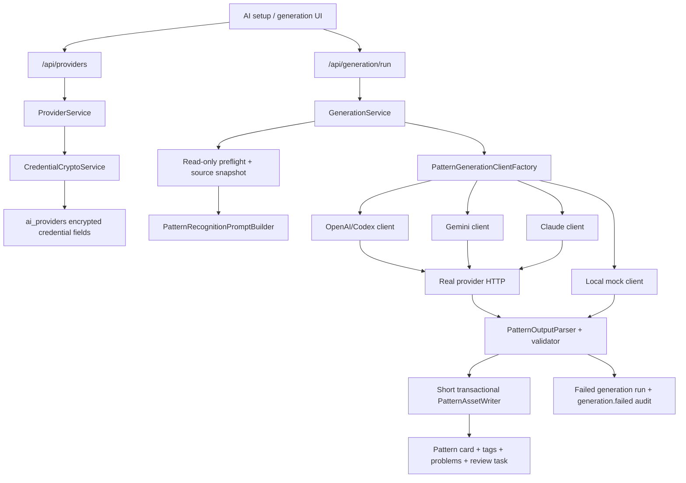
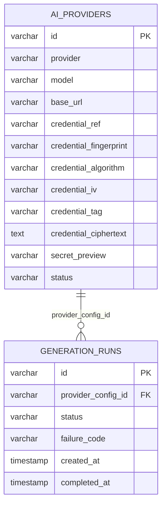

# feat: Add Real Spring AI Provider Generation

## Enhancement Summary

Deepened on: 2026-05-21

Sections enhanced:

- Spring Boot implementation boundaries and testing strategy.
- Provider credential storage, SSRF controls, and prompt/output leakage prevention.
- Database migration constraints, failure persistence, and idempotency behavior.
- Provider HTTP bounds, parser limits, and installed E2E scope.
- UI provider-selection flow and OAuth/local companion boundary.

Key improvements:

1. Provider HTTP calls must run outside any database write transaction or `FOR UPDATE` source-bundle lock.
2. Provider clients receive a resolved, narrow provider config DTO rather than `ProviderEntity`.
3. Failed generation has an explicit API/error contract with `generationRunId` and `failureCode`.
4. Encrypted credentials use AES-GCM with AAD and all encrypted fields are treated as secret-bearing.
5. UI generation must use the exact selected backend provider id and never silently fall back to `provider-local-mock`.

## Overview

Replace the installed Spring app's heuristic-only pattern generation path with real AI provider calls for non-local providers.

The deterministic generator remains available only through the explicit `provider-local-mock` provider. Every non-local provider must either call its configured provider endpoint and persist the validated provider result, or fail the generation run with a safe failure code and no partial learning assets.

## Problem Statement

The current Spring flow creates pattern cards and practice drafts, but it does not call an external AI provider. `GenerationService` builds a `PatternRecognitionPrompt`, then calls `inferPattern(recognitionPrompt.evidenceExcerpt)` and persists the inferred result. Because provider credentials are hash-only and provider rows have no callable endpoint configuration, invalid provider credentials can still produce a successful card.

This breaks the product expectation that selected OpenAI/Codex, Gemini, or Claude providers actually shape generated learning content.

## Assumptions

- This is a local personal installed app, but provider credentials still must not appear in API responses, audit metadata, logs, frontend build output, or browser storage after save.
- Non-local generation intentionally sends the bounded, redacted evidence excerpt to the configured vendor. UI and docs must disclose this trust boundary before generation.
- The trust boundary is: browser -> local backend -> external provider. Browser storage is not a secret store; backend encryption protects at rest only, not against the local machine owner or malware.
- OAuth setup remains local tool authentication only. Backend generation uses API-key providers until a separate OAuth token bridge is designed.
- Local companion endpoints must not become a provider-call proxy in this slice. They remain for local tool auth, collection, watcher, and OAuth status.
- First implementation stays synchronous. A transient `running` generation row may be used for idempotency reservation, but background queues, retries, and streaming are out of scope.
- This local-owner product keeps admin UI out of scope. Existing backend organization-scope behavior may remain, but the new UI should default to local personal provider setup.
- Tests use local fake provider servers. CI must not depend on paid external provider accounts.
- Use Spring MVC/blocking `RestClient`; do not add WebFlux, provider SDKs, or frontend provider SDK dependencies in this slice.

## Research Summary

Internal references:

- `docs/brainstorms/2026-05-21-spring-real-ai-provider-generation-brainstorm.md`: selected Spring backend provider-client approach and failure semantics.
- `backend/src/main/kotlin/com/aicodelearning/learning/GenerationService.kt`: current generation orchestration and `inferPattern` fallback.
- `backend/src/main/kotlin/com/aicodelearning/learning/PatternRecognitionPromptBuilder.kt`: bounded, redacted backend-only prompt construction.
- `backend/src/main/kotlin/com/aicodelearning/provider/ProviderEntity.kt`: current provider table mapping with hash-only credential reference.
- `backend/src/main/kotlin/com/aicodelearning/provider/ProviderService.kt`: current provider registration and audit append path.
- `backend/src/main/kotlin/com/aicodelearning/provider/ProviderController.kt`: current provider API response shape.
- `backend/src/main/resources/db/migration/V3__provider_audit_evidence_schema.sql`: `ai_providers` and audit schema baseline.
- `backend/src/main/resources/db/migration/V4__learning_flow_schema.sql`: `generation_runs.failure_code` already exists.
- `src/platform.js`, `src/security.js`, `tests/platform.test.js`, `scripts/smoke.mjs`: Node MVP reference for encrypted credential storage, provider base URL validation, fake-provider E2E, and no-partial-asset failure checks.
- `docs/solutions/2026-05-18-ai-pattern-e2e-performance-security.md`: installed E2E and prompt privacy constraints; existing setup intentionally kept raw local AI setup secrets out of server requests.

External references:

- Spring Boot 3.5 REST client docs cover blocking HTTP clients, global/default HTTP client timeouts, `RestClient.Builder`, and `@RestClientTest` with `MockRestServiceServer`. See [Spring Boot REST clients](https://docs.spring.io/spring-boot/3.5/reference/io/rest-client.html) and [Spring Boot testing](https://docs.spring.io/spring-boot/3.5/reference/testing/spring-boot-applications.html).
- OpenAI Responses API supports structured output through `text.format` with `type: "json_schema"` and strict schemas; schema adherence is stronger than plain JSON mode. See [OpenAI Structured Outputs](https://platform.openai.com/docs/guides/structured-outputs) and [Create a response](https://platform.openai.com/docs/api-reference/responses/create).
- Gemini supports structured output with JSON Schema through `generationConfig.responseMimeType = "application/json"` and `responseSchema`, including REST `generateContent`. See [Gemini structured outputs](https://ai.google.dev/gemini-api/docs/structured-output).
- Claude supports structured JSON outputs with `output_config.format` and also supports strict tool input validation. Refusals or token-limit stops can still break expected output handling and must be mapped to failure codes. See [Claude structured outputs](https://platform.claude.com/docs/en/build-with-claude/structured-outputs).

AGENTS.md constraints:

- Keep changes surgical and simple.
- Match existing Spring/React style.
- Verify through explicit tests.
- Avoid speculative abstractions beyond this provider generation path.

## Proposed Solution

Add a Spring backend provider-client layer:

- `local` client: wraps existing deterministic inference and is only selected for `provider-local-mock` / `local-mock`.
- `openai` and `codex` client: OpenAI-compatible Responses API request with structured output schema.
- `gemini` client: Gemini REST `generateContent` request with `responseSchema`.
- `claude` client: Anthropic Messages request with `output_config.format` JSON schema.

Provider registration stores encrypted credential material and a normalized optional `baseUrl`. Provider responses normalize into one shared `PatternGenerationResult`, pass strict validation, and are persisted through the existing pattern card/tag/problem/review task tables.

Implementation guardrails:

- `GenerationService` remains orchestration: preflight/source snapshot, provider dispatch, and result persistence are separated.
- Provider clients receive a `ResolvedProviderConfig` DTO containing only provider id, model, normalized base URI, decrypted credential, provider type, and safe metadata. They must not depend on `ProviderEntity`.
- Provider clients only perform transport and provider-response-text extraction. The learning domain owns JSON parsing, schema validation, tag/problem normalization, and persistence mapping.
- Add a small transactional `PatternAssetWriter` or equivalent for completed-run/card/tag/problem/review writes.
- Use one bounded `RestClient` helper with explicit timeouts, no automatic retries, no redirect following, no request/response body logging, and bounded response reading.
- `provider-local-mock` is the only path that may use deterministic inference. Missing, inactive, misconfigured, or decrypt-failed non-local providers fail safely and never call local inference.

Failure handling must be explicit:

- Provider configuration invalid -> `provider_configuration_invalid`
- Timeout -> `provider_timeout`
- Network failure -> `provider_network_error`
- HTTP auth/rate/5xx failure -> `provider_http_error`
- Missing output -> `provider_output_missing`
- Invalid JSON -> `provider_output_invalid_json`
- Schema-invalid output -> `provider_output_invalid_schema`
- Provider refusal or truncated output -> `provider_output_unusable`

Provider-generation API contract:

- Success keeps the current `201` response with `generationRun`, `patternCard`, and `reviewTask`.
- Provider/config/output failures return a safe error envelope with message `Provider generation failed`, a stable public code such as `provider_generation_failed`, and fields containing `generationRunId` and `failureCode`.
- Provider configuration errors should map to `422`; provider transport/output failures should map to `503` unless an existing API contract requires another status.
- Request validation, authorization, missing source, and curation gate failures should not create failed generation runs because a valid generation attempt never reached provider configuration/client execution.
- Failed generation runs must be visible in Conversion Trace without requiring `patternCard` or `reviewTask`.

## Architecture Flow



## Data Model Changes



Migration:

- Add nullable provider call fields to `ai_providers`: `base_url`, `credential_algorithm`, `credential_iv`, `credential_tag`, `credential_ciphertext`.
- Add an `ai_providers` check constraint so encrypted credential material is either all null or all present.
- Constrain `credential_algorithm` to explicit supported values, initially `AES_GCM_V1`, while allowing null for local mock and legacy hash-only rows.
- Preserve `provider-local-mock` rows by allowing credential fields to remain null for local providers.
- Do not fabricate ciphertext for pre-existing hash-only non-local providers. They remain visible but unusable until the user re-enters an API key, and generation fails as `provider_configuration_invalid`.
- Add `running` to `generation_runs.status` if idempotency reservation is implemented before the provider call. `running` rows must always settle to `completed` or `failed`.
- Keep existing `credential_ref`, `credential_fingerprint`, and `secret_preview` response fields for display and compatibility.
- Do not add raw provider response or prompt columns in this slice.
- Do not hard-delete provider rows referenced by `generation_runs`. Revoke/disable them and crypto-shred `credential_ciphertext`, `credential_iv`, `credential_tag`, and `secret_preview` when local data deletion requires credential removal.

## SpecFlow Analysis

### User Flows

0. First install, no eligible provider:
   - User has no saved backend generation provider.
   - Generate action is disabled with a safe setup prompt unless the user explicitly selects `provider-local-mock`.
   - OAuth-only setup does not count as an eligible backend generation provider.

1. API-key setup, success:
   - User selects provider and API-key mode in AI setup.
   - Frontend sends provider, model, credential, scope, retention mode, and optional base URL to `/api/providers`.
   - Backend encrypts credential, clears raw value from response, and lists a redacted provider.
   - Generation uses the provider row, makes a real HTTP call, validates provider JSON, and creates a draft practice asset.

2. Local mock, success:
   - User or seed data selects `provider-local-mock`.
   - Backend uses deterministic generation only for that provider.
   - No provider HTTP request is attempted.

3. Bad credential:
   - User registers OpenAI/Gemini/Claude provider with an invalid key.
   - Provider returns 401/403 or equivalent.
   - Generation returns a safe error, persists a failed run, and creates no card/problem/review task.

4. Invalid provider output:
   - Fake or real provider returns invalid JSON, missing fields, unsupported tag/problem types, refusal, or truncated output.
   - Backend maps to `provider_output_*`, persists only the failed run, and surfaces a concise UI error.

5. OAuth selected:
   - User selects local OAuth for Codex/Claude/Gemini tool auth.
   - UI shows this is local tool authentication only.
   - Backend generation does not silently use OAuth until a token bridge exists.

6. Retry after provider failure:
   - Failed generation shows safe failure text and a retry affordance.
   - Retrying creates a new idempotency key and performs exactly one new provider HTTP request.
   - Replaying the same idempotency key returns the same failed state without a second provider call.

### Flow Permutations

| Flow | Provider | Credential | Expected result |
| --- | --- | --- | --- |
| Success | local mock | none | Deterministic draft created |
| Success | OpenAI/Codex | valid API key | Provider HTTP request and provider title persisted |
| Success | Gemini | valid API key | `generateContent` request and provider title persisted |
| Success | Claude | valid API key | Messages request and provider title persisted |
| Failure | non-local | bad key | Failed run, no assets |
| Failure | non-local | missing encrypted material | `provider_configuration_invalid` |
| Failure | non-local | timeout/network | Failed run, no assets |
| Failure | non-local | invalid JSON/schema | Failed run, no assets |
| Failure | non-local | legacy hash-only row | `provider_configuration_invalid`, no provider HTTP |
| Unsupported | OAuth-only setup | local OAuth profile | Clear unsupported-for-generation state |
| Retry | non-local | previous failure | New idempotency key and one new provider HTTP request |

### Gaps Resolved By Defaults

- Provider fallback: non-local providers never fall back to `inferPattern`.
- UI fallback: the UI never chooses the first active provider implicitly; it sends the exact selected backend provider id.
- Base URL safety: HTTPS by default; loopback HTTP only under an explicit local test/dev flag.
- Idempotency: completed and failed runs return existing state for the same key; same key with a different provider/source/visibility payload is rejected.
- Failure persistence: provider exceptions are caught outside the asset transaction and recorded in a short committed transaction so failed runs are not rolled back.
- Secret handling: raw credential is accepted only on create/update, encrypted immediately, and never included in audit metadata.
- Trace UX: failed terminal runs are shown as failed with a safe `failureCode`, not as "Pattern pending" or "Not generated."

## Implementation Phases

Implementation is split into small slices. Each slice should be independently reviewable, touch the narrowest possible file set, and stop if its verification fails. Prefer adding or tightening tests before production behavior changes.

### Slice 0: Baseline Inventory

Scope:

- [x] Record current backend provider rows, generation response shape, and local mock behavior.
- [x] Record current frontend provider selection and localStorage keys.
- [x] Record current frontend gzip JS size as the bundle budget baseline.

Verification:

- [x] `git status --short`
- [x] `./gradlew :backend:test --tests "*Provider*" --tests "*Generation*"` or document missing test classes.
- [x] `npm --prefix frontend run build`

Baseline notes:

- Backend seed provider is `provider-local-mock` with `provider=local`, `model=deterministic-pattern-generator`, and no callable external provider configuration.
- Current generation success response requires `generationRun`, `patternCard`, and `reviewTask`; failed provider runs need a new safe error-envelope path.
- There are no backend tests matching `*Provider*` or `*Generation*` yet; the filtered Gradle command reports "No tests found".
- Full backend baseline passed with `./gradlew :backend:test`.
- Frontend generation currently selects `providers.find(status === "active")?.id ?? "provider-local-mock"`, so provider choice is implicit.
- Local AI setup storage uses `learnloop:local-ai:<userId>` and migrates from `ai-code-learning:local-ai:<userId>`.
- Frontend build requires the bundled workspace Node first in `PATH` because the local Homebrew Node is missing `libllhttp.9.3.dylib`.
- Frontend JS gzip baseline after `npm --prefix frontend run build`: `3,337,051` bytes across 95 JS assets.

### Slice 1: Backend Fake Provider Test Helper

Scope:

- [x] Add a backend test helper based on JDK `HttpServer`.
- [x] Capture request count, path, method, headers, body, response status, response body, and elapsed time.
- [x] Ensure captured auth headers are available to assertions but never printed by default.

Verification:

- [x] Helper unit test proves one request is recorded and server shutdown releases the port.
- [x] `./gradlew :backend:test --tests "*FakeProvider*"`

### Slice 2: Failing Test: Non-Local Provider Must Call HTTP

Scope:

- [x] Add a Spring generation integration test with a fake OpenAI-compatible provider URL.
- [x] Assert fake provider request count is exactly one.
- [x] Assert generated title comes from fake provider output, not `inferPattern`.

Verification:

- [x] Test fails on current code because no provider HTTP request is made.
- [x] `./gradlew :backend:test --tests "*Generation*"`

### Slice 3: Failing Test: Invalid Output Creates No Assets

Scope:

- [x] Add a fake provider response with invalid JSON.
- [x] Assert one failed generation run is persisted with a safe failure code.
- [x] Assert zero new pattern cards, tag links, problems, and review tasks.

Verification:

- [x] Test fails on current code because current generation succeeds heuristically.
- [x] `./gradlew :backend:test --tests "*Generation*"`

### Slice 4: Failing Test: Provider HTTP Failure Is Safe

Scope:

- [x] Add fake provider `401` or `403` response test.
- [x] Assert public API error is safe and includes `generationRunId` plus `failureCode`.
- [x] Assert response/audit/log assertions do not include provider response body or credential.

Verification:

- [x] Test fails on current code because provider HTTP is not called.
- [x] `./gradlew :backend:test --tests "*Generation*"`

### Slice 5: Failing Test: Local Mock Makes Zero HTTP Requests

Scope:

- [x] Add a regression test for `provider-local-mock`.
- [x] Assert deterministic local generation still succeeds.
- [x] Assert fake provider request count remains zero.

Verification:

- [x] `./gradlew :backend:test --tests "*Generation*"`

### Slice 6: Migration Columns Only

Scope:

- [x] Add next Flyway migration with nullable `base_url`, `credential_algorithm`, `credential_iv`, `credential_tag`, and `credential_ciphertext`.
- [x] Keep existing rows valid.
- [ ] Do not add constraints in this slice.

Verification:

- [ ] Migration test verifies columns exist and existing seed data migrates.
- [ ] `./gradlew :backend:test --tests "*Migration*"`

### Slice 7: Migration Constraints

Scope:

- [x] Add all-null/all-present constraint for encrypted credential fields.
- [x] Add `credential_algorithm` constraint for `AES_GCM_V1` or null.
- [ ] Add migration fixture for `provider-local-mock` and legacy non-local hash-only row.

Verification:

- [ ] Constraint test rejects partially populated encrypted credential fields.
- [ ] Legacy non-local hash-only row remains migrated but unusable.
- [ ] `./gradlew :backend:test --tests "*Migration*"`

### Slice 8: Provider Entity Mapping

Scope:

- [x] Add new fields to `ProviderEntity`.
- [x] Keep DTO responses from exposing ciphertext, IV, tag, or algorithm.
- [x] Keep local mock nullable credential fields valid.

Verification:

- [ ] Repository/entity test persists and reloads a provider with encrypted fields.
- [x] Provider API response JSON does not include encrypted fields.
- [x] `./gradlew :backend:test --tests "*Provider*"`

### Slice 9: Provider Configuration Properties

Scope:

- [ ] Add `@ConfigurationProperties` for credential encryption key and provider HTTP bounds.
- [ ] Include connect timeout, read/total timeout, max request bytes, max response bytes, and max output tokens.
- [ ] Add defaults for local dev/test where appropriate, but require an explicit valid key for non-local provider creation/use.

Verification:

- [ ] Properties binding test covers defaults and invalid values.
- [ ] `./gradlew :backend:test --tests "*Properties*"`

### Slice 10: Credential Encryption Round Trip

Scope:

- [ ] Add `CredentialCryptoService`.
- [ ] Use AES-GCM, 256-bit key, random 96-bit IV, separate auth tag, and `AES_GCM_V1`.
- [ ] Bind AAD to `providerId`, `organizationId`, `provider`, and `model`.

Verification:

- [ ] Round-trip test opens sealed credential with matching AAD.
- [ ] AAD mismatch fails decryption.
- [ ] Ciphertext differs between two seals of the same secret.
- [ ] `./gradlew :backend:test --tests "*CredentialCrypto*"`

### Slice 11: Credential Key Failure Behavior

Scope:

- [ ] Fail non-local provider creation when encryption key is missing or invalid.
- [ ] Fail legacy hash-only non-local generation as `provider_configuration_invalid`.
- [ ] Keep local mock unaffected by missing encryption key.

Verification:

- [ ] Provider creation missing-key test fails safely.
- [ ] Legacy provider generation test fails safely and makes zero provider HTTP requests.
- [ ] `./gradlew :backend:test --tests "*Provider*"`

### Slice 12: Provider Create DTO Contract

Scope:

- [ ] Extend `ProviderCreateRequest` with optional `baseUrl`.
- [ ] Make `credential` nullable/blank only for canonical local mock.
- [ ] Return only safe display fields in `ProviderResponse`.

Verification:

- [ ] Controller tests cover local mock without credential and non-local without credential rejected.
- [ ] API response redaction test verifies no raw credential or encrypted fields.
- [ ] `./gradlew :backend:test --tests "*ProviderController*"`

### Slice 13: Provider Normalization And Defaults

Scope:

- [ ] Normalize provider families: `local`, `openai`, `codex`, `gemini`, `claude`.
- [ ] Apply default base URLs for OpenAI/Codex, Gemini, and Claude.
- [ ] Canonicalize `provider-local-mock` so arbitrary rows cannot use local fallback.

Verification:

- [ ] Provider service tests cover aliases, defaults, and non-canonical local rejection.
- [ ] `./gradlew :backend:test --tests "*ProviderService*"`

### Slice 14: Base URL Safety

Scope:

- [ ] Reject URL credentials, query strings, fragments, and non-HTTPS URLs by default.
- [ ] Allow loopback HTTP only under explicit test/dev flag.
- [ ] Keep normalized safe base URL display if exposing `baseUrl`.

Verification:

- [ ] Provider validation tests cover HTTPS accepted, query/fragment rejected, non-HTTPS rejected, loopback accepted only with flag.
- [ ] `./gradlew :backend:test --tests "*ProviderService*"`

### Slice 15: SSRF Host Validation

Scope:

- [ ] Resolve hostnames at registration and immediately before provider request.
- [ ] Reject private, loopback, link-local, multicast, unspecified, IPv6 ULA, IPv4-mapped private, metadata ranges, and encoded IP variants unless loopback dev flag is enabled.
- [ ] Ignore proxy environment variables for provider clients unless explicitly configured.

Verification:

- [ ] SSRF tests cover metadata/private/encoded hosts.
- [ ] Fake metadata endpoint receives zero requests.
- [ ] `./gradlew :backend:test --tests "*ProviderSecurity*"`

### Slice 16: Provider Audit Redaction

Scope:

- [ ] Remove raw credential from provider audit calls before invoking `AuditService`.
- [ ] Expand audit allowlist only for safe provider fields: provider, model, scope, auth type, retention mode, status, and safe counts.
- [ ] Keep full `baseUrl`, prompt, response, credential, path, evidence, and headers out of audit metadata.

Verification:

- [ ] Stored `audit_logs.metadata_json` for `provider.created` contains safe fields only.
- [ ] `./gradlew :backend:test --tests "*Audit*"`

### Slice 17: Resolved Provider Config

Scope:

- [ ] Add `ResolvedProviderConfig` DTO.
- [ ] Add resolver that loads provider, validates scope/status/org, opens credential, and normalizes base URI.
- [ ] Ensure provider clients never receive `ProviderEntity`.

Verification:

- [ ] Resolver tests cover active provider, personal owner mismatch, legacy hash-only row, disabled row, and local mock.
- [ ] `./gradlew :backend:test --tests "*ResolvedProvider*"`

### Slice 18: Provider Failure Codes

Scope:

- [ ] Add provider failure code enum/constants.
- [ ] Include configuration, timeout, network, HTTP, missing output, invalid JSON, invalid schema, unusable output, and source unavailable codes.
- [ ] Add safe exception type carrying failure code and safe HTTP mapping.

Verification:

- [ ] Unit test proves all codes serialize to expected public values.
- [ ] Exception messages do not include credential, prompt, response body, auth header, or URL query.
- [ ] `./gradlew :backend:test --tests "*ProviderFailure*"`

### Slice 19: Bounded RestClient Helper

Scope:

- [ ] Add one shared blocking `RestClient` helper.
- [ ] Enforce connect timeout, read/total timeout, max request bytes, max response bytes, no redirects, no automatic retries, and no body logging.
- [ ] Return bounded response body or safe provider failure.

Verification:

- [ ] Focused tests cover timeout, oversized request, oversized response, redirect rejection, and HTTP status mapping.
- [ ] `./gradlew :backend:test --tests "*ProviderHttp*"`

### Slice 20: Provider Client Contract Skeleton

Scope:

- [ ] Add `PatternGenerationClient`, `PatternGenerationRequest`, and `PatternGenerationResult`.
- [ ] Add client selection by provider family.
- [ ] Add unsupported provider failure behavior.

Verification:

- [ ] Factory/selection tests cover local, openai, codex, gemini, claude, and unsupported provider.
- [ ] `./gradlew :backend:test --tests "*PatternGenerationClient*"`

### Slice 21: Persisted Output Schema

Scope:

- [ ] Define the strict persisted-output schema separately from prompt-only fields.
- [ ] Use exactly `{ "patterns": [single pattern] }`.
- [ ] Define tag and problem enum constants used by validation and persistence.

Verification:

- [ ] Schema/unit tests verify required fields and enum names.
- [ ] `./gradlew :backend:test --tests "*PatternOutput*"`

### Slice 22: Provider Output Parser Happy Path

Scope:

- [ ] Add shared parser using dedicated Jackson mapper.
- [ ] Map tag `type` to stored `tagType`.
- [ ] Return `PatternGenerationResult`.

Verification:

- [ ] Parser test accepts one valid pattern with tags and three problems.
- [ ] `./gradlew :backend:test --tests "*PatternOutputParser*"`

### Slice 23: Provider Output Parser Rejection Cases

Scope:

- [ ] Reject invalid JSON, missing fields, unsupported enums, multiple patterns, too many tags/problems, oversized fields, excessive nesting, and response body over `64 KiB`.
- [ ] Reject prompt-marker echo, secret-like output, and large copied evidence/code blocks.
- [ ] Keep markdown fence stripping out unless a provider-specific test requires it.

Verification:

- [ ] Parser rejection tests cover each failure code.
- [ ] `./gradlew :backend:test --tests "*PatternOutputParser*"`

### Slice 24: Local Mock Client Isolation

Scope:

- [ ] Move existing `inferPattern` behavior behind `LocalPatternGenerationClient`.
- [ ] Ensure local mock uses redacted evidence excerpt.
- [ ] Ensure non-local misconfiguration cannot reach local mock.

Verification:

- [ ] Local mock generation still succeeds.
- [ ] Non-local misconfiguration test proves zero local mock fallback.
- [ ] `./gradlew :backend:test --tests "*Generation*"`

### Slice 25: OpenAI/Codex Client Request Shape

Scope:

- [ ] Implement `OpenAiPatternGenerationClient`.
- [ ] POST to `{baseUrl}/v1/responses`.
- [ ] Send bearer auth, model, prompt input, `text.format.type=json_schema`, schema name, strict mode, and bounded output tokens.

Verification:

- [ ] Fake OpenAI-compatible server asserts path, method, auth header, model, schema shape, and max output tokens.
- [ ] `./gradlew :backend:test --tests "*OpenAi*"`

### Slice 26: OpenAI/Codex Client Response And Failure Mapping

Scope:

- [ ] Extract JSON text from `output_text` and nested `output[].content[].text`.
- [ ] Map 401/403/429/5xx, timeout, network, missing output, and invalid output safely.
- [ ] Reuse this client for `codex`.

Verification:

- [ ] Fake server tests cover success, 401, 429, 500, missing output, invalid JSON, and timeout.
- [ ] Auth header and provider response body do not appear in exception/audit/log assertions.
- [ ] `./gradlew :backend:test --tests "*OpenAi*"`

### Slice 27: Gemini Client Request Shape

Scope:

- [ ] Implement `GeminiPatternGenerationClient`.
- [ ] POST to `{baseUrl}/v1beta/models/{model}:generateContent` using URI builder/path encoding.
- [ ] Send supported API-key auth plus `generationConfig.responseMimeType=application/json` and `responseSchema`.

Verification:

- [ ] Fake Gemini server asserts endpoint, auth style, model path encoding, and schema fields.
- [ ] `./gradlew :backend:test --tests "*Gemini*"`

### Slice 28: Gemini Client Response And Failure Mapping

Scope:

- [ ] Extract candidate text/parts and pass only JSON text to shared parser.
- [ ] Keep Gemini-specific DTOs private to the adapter.
- [ ] Map Gemini error statuses and malformed responses to safe codes.

Verification:

- [ ] Fake server tests cover success, provider HTTP error, missing candidate, invalid JSON, and invalid schema.
- [ ] `./gradlew :backend:test --tests "*Gemini*"`

### Slice 29: Claude Client Request Shape

Scope:

- [ ] Implement `ClaudePatternGenerationClient`.
- [ ] POST to `{baseUrl}/v1/messages`.
- [ ] Send `x-api-key`, `anthropic-version`, model, max tokens, prompt messages, and structured output config/schema.

Verification:

- [ ] Fake Claude server asserts endpoint, headers, model, max tokens, and structured output config.
- [ ] `./gradlew :backend:test --tests "*Claude*"`

### Slice 30: Claude Client Response And Failure Mapping

Scope:

- [ ] Extract JSON text from Claude content.
- [ ] Treat refusal, max-token stop, missing text, malformed response, invalid JSON, and invalid schema as failed generation.
- [ ] Keep Claude-specific DTOs private to the adapter.

Verification:

- [ ] Fake server tests cover success, refusal, stop due to max tokens, missing text, invalid JSON, and HTTP errors.
- [ ] `./gradlew :backend:test --tests "*Claude*"`

### Slice 31: Generation Preflight Snapshot

Scope:

- [ ] Extract source resolution, authorization, evidence materialization, and prompt construction into a read-only preflight step.
- [ ] Avoid holding `FOR UPDATE` locks across provider HTTP.
- [ ] Return a snapshot containing source ids, evidence item ids, first bundle context, redacted prompt, and provider config id.

Verification:

- [ ] Preflight tests cover source link generation and local session bundle generation.
- [ ] Test asserts provider HTTP is not called in preflight.
- [ ] `./gradlew :backend:test --tests "*GenerationPreflight*"`

### Slice 32: Pattern Asset Writer

Scope:

- [ ] Add transactional `PatternAssetWriter` or equivalent.
- [ ] Persist completed run, pattern card, tags, tag links, problems, review task, and `generation.completed` audit atomically.
- [ ] Re-check referenced source bundles/evidence before asset persistence; fail as `source_evidence_unavailable` if unavailable.

Verification:

- [ ] Writer success test persists all assets.
- [ ] Writer failure test rolls back all assets.
- [ ] Source-unavailable test creates no assets.
- [ ] `./gradlew :backend:test --tests "*PatternAssetWriter*"`

### Slice 33: Generation Success Dispatch

Scope:

- [ ] Replace direct `inferPattern` with provider client dispatch.
- [ ] Execute preflight, provider call outside transaction, then asset writer.
- [ ] Keep local mock and OpenAI-compatible success paths working first.

Verification:

- [ ] Fake provider receives request while no Spring transaction is active.
- [ ] Fake provider title persists to pattern card.
- [ ] Local mock still succeeds.
- [ ] `./gradlew :backend:test --tests "*Generation*"`

### Slice 34: Failed Generation Recorder

Scope:

- [ ] Add short independent transaction for failed run plus `generation.failed` audit.
- [ ] Save `failure_code` and `completed_at`.
- [ ] Do not create failed runs for validation, authorization, missing source, or curation failures.

Verification:

- [ ] Provider HTTP failure persists one failed run and no assets.
- [ ] Request validation failure persists no failed run.
- [ ] Stored `audit_logs.metadata_json` is safe.
- [ ] `./gradlew :backend:test --tests "*Generation*"`

### Slice 35: Generation Error API Contract

Scope:

- [ ] Add provider-generation error mapping.
- [ ] Return safe message `Provider generation failed`.
- [ ] Include `generationRunId` and `failureCode` in the error envelope fields or an equivalent typed response.

Verification:

- [ ] API tests cover provider configuration error as `422` and provider/client/output failure as `503`.
- [ ] Response contains no prompt, evidence, credential, auth header, provider response body, or base URL query.
- [ ] `./gradlew :backend:test --tests "*GenerationController*"`

### Slice 36: Idempotency Reservation

Scope:

- [ ] Add `running` status if used for reservation.
- [ ] Reserve idempotency before provider call.
- [ ] Same key with same request returns existing completed/failed state.
- [ ] Same key with different provider/source/visibility is rejected.

Verification:

- [ ] Concurrent same-key fake-provider test receives at most one provider request.
- [ ] Same-key/different-payload test rejects without assets or second provider call.
- [ ] `./gradlew :backend:test --tests "*GenerationIdempotency*"`

### Slice 37: Conversion Trace Failure Support

Scope:

- [ ] Include failed generation runs in Conversion Trace.
- [ ] Parse `sourceBundleIdsJson` for direct local-session failed runs.
- [ ] Enforce contributor visibility for failed runs without cards.
- [ ] Expose safe `failureCode`.

Verification:

- [ ] Trace tests cover failed source-link run and failed local-session run.
- [ ] Trace response contains no raw evidence or prompt.
- [ ] `./gradlew :backend:test --tests "*ConversionTrace*"`

### Slice 38: Frontend API Types And Provider Save

Scope:

- [ ] Add API client support for provider creation with `baseUrl` and safe provider response.
- [ ] API-key setup calls `POST /api/providers`, then refreshes `GET /api/providers`.
- [ ] Save browser settings only after backend registration succeeds.

Verification:

- [ ] Frontend typecheck passes.
- [ ] UI/API test or Playwright step proves provider save refreshes provider list.
- [ ] `npm --prefix frontend run typecheck`

### Slice 39: Frontend Secret Storage Cleanup

Scope:

- [ ] Clear raw API key component state after save.
- [ ] Store only provider id, provider label, auth mode, and redacted metadata in localStorage.
- [ ] Add legacy cleanup for `learnloop:local-ai:*` and `ai-code-learning:local-ai:*` entries containing `apiKey`.

Verification:

- [ ] Browser/localStorage test proves submitted key is absent after save and after failed save.
- [ ] `npm --prefix frontend run typecheck`

### Slice 40: Frontend Provider Selection

Scope:

- [ ] Generation UI sends the exact selected backend provider id.
- [ ] Remove implicit first-active-provider selection.
- [ ] Disable generation when no eligible backend provider exists unless local mock is explicitly selected.

Verification:

- [ ] UI test proves multiple providers use the selected provider id.
- [ ] UI test proves no-provider state disables generation.
- [ ] `npm --prefix frontend run typecheck`

### Slice 41: Frontend OAuth Unsupported State

Scope:

- [ ] Keep OAuth setup as local tool auth only.
- [ ] Label OAuth-only setup as unsupported for backend generation.
- [ ] Ensure OAuth-only setup never creates/selects a backend generation provider.

Verification:

- [ ] UI test proves OAuth-only setup cannot trigger non-local generation.
- [ ] `npm --prefix frontend run typecheck`

### Slice 42: Frontend Failure Display

Scope:

- [ ] Display failed generation as terminal failure with safe `failureCode`.
- [ ] Do not show terminal failures as "Pattern pending" or "Not generated."
- [ ] Add retry affordance that creates a new idempotency key.

Verification:

- [ ] Playwright or component test covers failed generation display and retry request body.
- [ ] `npm --prefix frontend run typecheck`

### Slice 43: Frontend Copy And Bundle Budget

Scope:

- [ ] Remove or conditionalize "Stored only in this browser" copy for API-key mode.
- [ ] Add local-backend encrypted storage copy.
- [ ] Keep frontend dependency-free for provider setup changes.

Verification:

- [ ] `npm --prefix frontend run build`
- [ ] Compare gzip byte total for `frontend/dist/assets/*.js` against Slice 0 baseline; delta <= `5 KiB` or explicitly documented.

### Slice 44: Installed E2E Success

Scope:

- [ ] Add installed fake provider server helper or reuse backend helper pattern from scripts.
- [ ] Configure one OpenAI-compatible provider through UI or API.
- [ ] Run generation and assert fake provider request count is exactly one.
- [ ] Assert provider title appears in Practice Library and a generated problem opens in Practice Workbench.

Verification:

- [ ] `./scripts/e2e-installed.sh`
- [ ] Provider-generation segment completes under `10_000ms`.

### Slice 45: Installed E2E Failure

Scope:

- [ ] Add installed fake provider `401` path.
- [ ] Assert safe failure text and `failureCode`.
- [ ] Assert local mock makes zero fake-provider requests.
- [ ] Keep timeout/oversized scenarios in backend tests, not installed E2E.

Verification:

- [ ] `./scripts/e2e-installed.sh`
- [ ] Total installed E2E stays under `120_000ms` locally.

### Slice 46: Secret And Audit Regression Sweep

Scope:

- [ ] Scan backend logs, E2E artifacts, localStorage dumps, API responses, and stored audit metadata.
- [ ] Search for raw fake credential, auth header value, ciphertext, provider response body, internal prompt marker, and evidence sentinel strings.
- [ ] Confirm provider request captures are not printed by default.

Verification:

- [ ] `rg "ACL_INTERNAL_PATTERN_PROMPT_V1_DO_NOT_EXPOSE|You are a senior software engineering educator|Evidence excerpt" frontend/dist`
- [ ] Project-specific secret scan command over generated test artifacts returns no matches for fake credential/sentinel strings.

### Slice 47: Documentation

Scope:

- [ ] Document API-key provider setup.
- [ ] Document `APP_CREDENTIAL_ENCRYPTION_KEY`, local dev loopback flag, blocking `RestClient`, timeouts, no retries, and fake-provider tests.
- [ ] Document OAuth as local tool auth only.
- [ ] Document failure codes, HTTP status contract, safe message, `generationRunId`, and Conversion Trace failure location.

Verification:

- [ ] Documentation review confirms browser-only API-key claim is removed or scoped to OAuth/local tool setup only.

### Slice 48: Final Verification

Scope:

- [ ] Run backend, frontend, installed E2E, and secret/audit checks together.
- [ ] Confirm no untracked debug artifacts or fake provider logs containing secrets remain.
- [ ] Confirm all acceptance criteria are either checked or explicitly moved out of scope.

Verification:

- [ ] `./gradlew :backend:test`
- [ ] `./scripts/test.sh`
- [ ] `npm --prefix frontend run typecheck`
- [ ] `npm --prefix frontend run build`
- [ ] `./scripts/e2e-installed.sh`
- [ ] Final secret/audit scan commands from Slice 46.

## Acceptance Criteria

Functional requirements:

- [ ] `provider-local-mock` still generates deterministic local drafts.
- [ ] `provider-local-mock` is used only when explicitly selected; no UI or backend path silently falls back to it for non-local failures.
- [ ] OpenAI/Codex providers make a real HTTP request during generation.
- [ ] Gemini providers make a real HTTP request during generation.
- [ ] Claude providers make a real HTTP request during generation.
- [ ] Provider-returned title, summary, tags, and problems are the data persisted into the created draft assets.
- [ ] Wrong provider credentials fail generation instead of falling back to local inference.
- [ ] Invalid provider JSON/schema fails generation instead of creating partial assets.
- [ ] Missing, inactive, legacy hash-only, decrypt-failed, or misconfigured non-local providers fail with `provider_configuration_invalid`.
- [ ] First install with no eligible backend provider disables generation with a safe setup prompt unless local mock is explicitly selected.
- [ ] OAuth setup saves only local tool-auth status/label and never creates or selects a backend generation provider.
- [ ] Generation UI sends the exact selected backend provider id.
- [ ] Failed generation API responses expose safe `generationRunId`, `status=failed`, and `failureCode` through the chosen error-envelope contract.
- [ ] Repeating the same generation request with the same idempotency key returns the same completed or failed run without a second provider HTTP request.
- [ ] A visible retry action creates a new idempotency key and performs exactly one new provider HTTP request.
- [ ] Failed generation creates zero `pattern_cards`, `pattern_tags`, `pattern_tag_links`, `problems`, and `review_tasks`; Practice Library remains unchanged.
- [ ] Conversion Trace clearly displays successful and failed generation runs.
- [ ] Conversion Trace shows failed local-session generations linked to their source bundle and does not label terminal failures as pending.
- [ ] After successful generation, generated provider title appears in Practice Library and generated problems open in Practice Workbench.

Security and privacy requirements:

- [ ] Raw API keys are encrypted at rest.
- [ ] AES-GCM credential fields use random IVs, AAD binding, and all-null/all-present storage constraints.
- [ ] Raw API keys never appear in provider API responses, audit logs, frontend local storage after save, E2E output, or app logs.
- [ ] Ciphertext, IV, auth tag, auth headers, base URL query, raw prompt, raw evidence, and raw provider response never appear in API responses, audit logs, frontend storage, E2E artifacts, or app logs.
- [ ] Raw prompt text, internal prompt marker, raw provider response, and full evidence text are not persisted or exposed through API responses.
- [ ] Provider base URL validation prevents SSRF-prone configuration by default.
- [ ] Provider clients do not follow redirects, do not use proxy environment variables by default, and reject private/metadata network targets unless explicit loopback dev mode is enabled.
- [ ] Provider outputs that echo the internal prompt marker, secret-like content, or large evidence/code excerpts are rejected or sanitized before persistence.

Quality gates:

- [ ] Unit tests cover credential crypto, provider validation, parser validation, and client request mapping.
- [ ] Backend integration tests cover success and all major provider failure codes.
- [ ] Non-local provider generation never performs provider HTTP inside a DB transaction or while holding source-bundle locks.
- [ ] Provider calls enforce connect, read/total, request-size, response-size, output-token, and JSON parser bounds.
- [ ] Stored `audit_logs.metadata_json` is inspected for provider and generation events.
- [ ] Installed E2E proves at least one fake provider was actually called.
- [ ] Installed E2E proves local mock makes zero provider requests and does not add slow timeout waits.
- [ ] Frontend bundle gzip delta is measured and stays within `5 KiB` or has an explicit exception.
- [ ] Existing local collection, evidence, trace, and practice flows still pass.

## Success Metrics

- A fake provider request counter proves actual provider dispatch in E2E.
- Bad credential test fails with a failed generation run and zero created assets.
- Local mock generation remains deterministic and does not perform HTTP.
- No raw credential string appears in serialized DB snapshots, API responses, browser local storage after save, or audit logs used by tests.
- Provider success/failure tests complete without waiting on real network defaults.
- Installed E2E provider-generation segment completes under `10_000ms`.
- Frontend provider setup changes stay under the measured `5 KiB` gzip feature budget unless explicitly justified.

## Dependencies And Risks

- Provider API shapes can change. Keep provider clients small and tested against local fake server request contracts.
- Claude structured outputs can return refusal or max-token stops despite 200 responses; treat those as unusable output.
- Gemini model support differs by model family; validation should fail clearly when a configured model cannot honor structured output.
- Credential encryption key management is a local install concern; missing keys must fail clearly before credential use.
- Existing installed E2E privacy assumption changes from "API key never reaches server" to "API key reaches local backend only during provider registration, then is encrypted and cleared." Update tests and docs explicitly.
- Adding `running` generation status improves idempotency but requires migration and cleanup handling for interrupted requests.
- SSRF defenses are easy to weaken through redirects, DNS rebinding, encoded IPs, and proxy settings; registration-time and request-time validation are both required.
- Current frontend code chooses the first active provider in some flows; failing to replace this will create hidden provider selection bugs.
- Current generation response shape assumes success assets; failed-run API contract must be implemented before UI failure handling.

## Out Of Scope

- OAuth-backed provider generation.
- Async queues, retries, streaming, and cancellation.
- Cost estimation and token accounting beyond provider-reported usage.
- Multi-pattern generation UI.
- Provider SDK dependencies unless plain HTTP proves insufficient.

## Final Verification

- [ ] `./gradlew :backend:test`
- [ ] `./scripts/test.sh`
- [ ] `npm --prefix frontend run typecheck`
- [ ] `npm --prefix frontend run build`
- [ ] `./scripts/e2e-installed.sh`
- [ ] Secret scan assertions:

```sh
rg "ACL_INTERNAL_PATTERN_PROMPT_V1_DO_NOT_EXPOSE|You are a senior software engineering educator|Evidence excerpt" frontend/dist
```

The final `rg` command must return no matches.

Additional secret/audit checks:

- [ ] Inspect `audit_logs.metadata_json` for `provider.created`, `generation.completed`, and `generation.failed`.
- [ ] Scan E2E artifacts/logs/local storage dumps for the raw fake credential, auth header value, ciphertext, provider response body, internal prompt marker, and evidence sentinel strings.
- [ ] Compare frontend gzip byte total before and after provider setup UI changes.

## Next Step

Run:

```sh
/workflows:work docs/plans/2026-05-21-feat-spring-real-ai-provider-generation-plan.md
```
