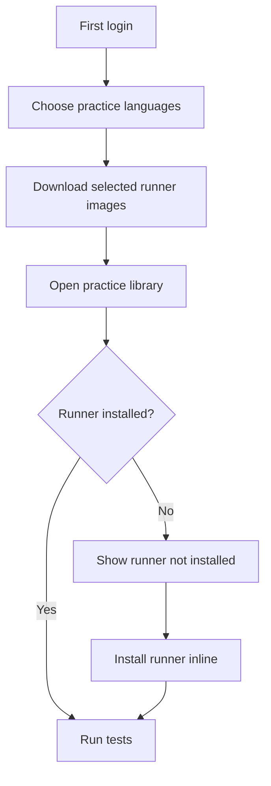

# feat: Add Selective Swift and Rust Runner Support

## Enhancement Summary

**Deepened on:** 2026-05-21

**Sections enhanced:** technical architecture, installer API, Docker/GHCR security boundary, migration safety, CI cost control, user-flow edge cases, E2E verification, and release readiness.

**Review lenses applied:** architecture, security, performance, data integrity, deployment verification, user-flow completeness, and simplicity.

### Key Improvements

1. Split runner capability into four explicit concepts: supported by platform, desired by local instance, installed in Docker, and runnable by the execution service.
2. Added a strict Docker/GHCR trust boundary so clients can never choose image refs, registries, commands, volumes, flags, or networks.
3. Added migration and release safety details, including Flyway version collision checks, public GHCR image policy, install idempotency, and Go/No-Go verification.
4. Added CI/runtime cost controls so PRs do not pull or build the 1GB Swift runner unless Swift runner files changed.
5. Added complete error and recovery flows for Docker unavailable, no network, partial install, stale status, skipped setup, and removed runners.

### New Considerations Discovered

- Standard release packages must remain online-first; Swift should never be included in the default bundle by accident.
- Docker image inspection should be the source of truth, but it should be cached or explicitly refreshed to avoid slow dashboard loads.
- Runner install APIs are local-only but still security-sensitive because they indirectly access the Docker daemon.
- Swift/Rust runner templates must avoid remote dependencies because practice execution remains `--network none`.
- The next Flyway migration version must be chosen from the current `main` branch at implementation time, not from a stale local branch.

## Overview

Add Swift and Rust as fully runnable LearnLoop practice languages while keeping the installable package lightweight. The platform should know about every supported language, but runner images should be installed only when the local user selects them during first setup or installs them inline from a practice screen.

Swift practices will use Swift Package Manager and XCTest. Rust practices will use Cargo and `cargo test`. Runner images will be published to GHCR with app-versioned tags and pulled on demand into the local LearnLoop instance.

## Problem Statement

LearnLoop currently supports TypeScript, Java, and Kotlin runners. Swift and Rust can be added to language metadata, but that is not enough: users expect a supported language to run tests from the practice workbench.

Bundling every runner image by default would make installation too heavy. Local estimates show Rust adds roughly 260-290MB compressed and Swift adds roughly 1GB compressed before runtime expansion. The product needs full language support without forcing all users to download large toolchains.

## Research Findings

### Local Context

- Brainstorm source: `docs/brainstorms/2026-05-21-swift-rust-runner-support-brainstorm.md`
- Existing runner registry: `backend/src/main/kotlin/com/aicodelearning/runner/RunnerRegistry.kt`
- Existing runner validation: `backend/src/main/kotlin/com/aicodelearning/runner/RunnerRequestValidator.kt`
- Existing Docker execution boundary: `backend/src/main/kotlin/com/aicodelearning/runner/DockerRunCommandBuilder.kt`
- Existing runner health probe: `backend/src/main/kotlin/com/aicodelearning/runner/RunnerHealthService.kt`
- Existing practice run flow: `backend/src/main/kotlin/com/aicodelearning/learning/PracticeService.kt`
- Existing runner images: `runner/typescript`, `runner/java`, `runner/kotlin`
- Existing smoke scripts: `scripts/runner-typescript-smoke.sh`, `scripts/runner-java-smoke.sh`, `scripts/runner-kotlin-smoke.sh`
- Existing release packaging saves all runner images when `INCLUDE_RUNNER_IMAGES=true`: `scripts/package-release.sh`
- Existing CI currently tests/builds backend/web images but does not publish runner images to GHCR: `.github/workflows/ci.yml`, `.github/workflows/release.yml`
- README already documents the current runner-extension pattern: add `runner/`, register a fixed harness, extend contract tests, and add smoke scripts.
- No relevant prior `docs/solutions/` notes were found for runner image selection or Swift/Rust support.

### External References

- Swift official Docker images are published on Docker Hub and Swift.org documents Docker-based Linux installation: https://www.swift.org/install/linux/docker/
- Swift Package Manager supports package targets and test targets via `Package.swift`: https://docs.swift.org/package-manager/PackageDescription/PackageDescription.html
- Cargo's official `cargo test` command compiles and executes unit, integration, and documentation tests: https://doc.rust-lang.org/cargo/commands/cargo-test.html
- GitHub Actions can publish Docker images to GitHub Packages/GHCR using `docker/login-action`, `docker/metadata-action`, and `docker/build-push-action`: https://docs.github.com/en/actions/publishing-packages/publishing-docker-images
- GitHub Container Registry supports Docker/OCI images, repository association, and `GITHUB_TOKEN` based workflow publishing: https://docs.github.com/en/packages/working-with-a-github-packages-registry/working-with-the-container-registry

## Proposed Solution

Implement selective runner support in five connected slices:

1. Language taxonomy: Swift/Rust are first-class supported languages in backend contracts, DB constraints, frontend filters, editor detection, and practice sync.
2. Runner images: add Swift and Rust Docker runners with deterministic, offline-safe test commands.
3. Runner installation manager: expose authenticated local APIs that list, install, remove, and refresh runner languages from a static allowlist.
4. UX: first setup language selection, Settings language management, and inline install action when a user runs a practice whose runner is missing.
5. CI/release: publish runner images to GHCR with app-versioned tags, keep default release bundles online-first, and provide optional offline full bundles.

## User Flow Analysis



### Key Flows

1. First-time local setup: user logs in, sees TypeScript/Kotlin/Java selected by default, optionally selects Swift/Rust, and starts downloads.
2. Returning user: app lists installed and available languages based on Docker image inspection plus stored desired language config.
3. Practice run with installed runner: existing run flow works with the new Swift/Rust harnesses.
4. Practice run with missing runner: run request returns `runner_unavailable` or a typed missing-runner response, and the UI offers inline installation.
5. Network failure during install: install job fails with clear retry state without corrupting runner config.
6. Docker unavailable: language selection remains visible, but install/run actions show Docker prerequisites.
7. Offline full bundle: all runner images can be imported locally before first run.

## Technical Approach

### Language Contract

Swift and Rust should be valid values everywhere practice languages are accepted:

- `PracticeContract.supportedLanguages`
- `problem_files.language` DB constraint
- `submissions.language` DB constraint
- frontend library filters
- Monaco language mapping for `.swift` and `.rs`
- local practice draft language inference

Difficulty taxonomy should remain `easy`, `medium`, `hard` only. Any legacy `beginner`, `intermediate`, or `advanced` values should be migrated before adding a difficulty check constraint.

### Runner Registry and Image References

Current `RunnerRegistry` hardcodes local `latest` image names. Add version-aware image refs:

```text
learnloop-runner-typescript:<appVersion>
learnloop-runner-java:<appVersion>
learnloop-runner-kotlin:<appVersion>
ghcr.io/<owner>/<repo>/learnloop-runner-swift:<appVersion>
ghcr.io/<owner>/<repo>/learnloop-runner-rust:<appVersion>
```

Implementation should support environment overrides for local development:

```text
APP_RUNNER_TYPESCRIPT_IMAGE
APP_RUNNER_JAVA_IMAGE
APP_RUNNER_KOTLIN_IMAGE
APP_RUNNER_SWIFT_IMAGE
APP_RUNNER_RUST_IMAGE
APP_RUNNER_IMAGE_REGISTRY
APP_RUNNER_IMAGE_VERSION
```

Keep `DockerRunCommandBuilder` on `--pull never`. Pulling happens only through the explicit installer flow, never during execution.

### Runner Installation State

Add a local instance-level runner language state. This is not user scoped.

Suggested table:

```sql
CREATE TABLE runner_language_installations (
    language VARCHAR(40) PRIMARY KEY,
    desired_enabled BOOLEAN NOT NULL DEFAULT false,
    image_ref VARCHAR(240) NOT NULL,
    status VARCHAR(40) NOT NULL,
    installed_at TIMESTAMPTZ,
    last_checked_at TIMESTAMPTZ,
    last_error TEXT
);
```

Allowed statuses:

- `available`: supported but not selected or installed
- `installing`: install job is running
- `installed`: local Docker image exists
- `missing`: desired but image is absent
- `failed`: latest install attempt failed

Docker image inspection remains the source of truth for whether a runner can execute. DB state is used for desired selection, UX, and latest error context.

### Runner Installation API

Add authenticated local APIs. Since this is a local install model, any logged-in local user may install or remove runner languages.

```text
GET  /api/runner/languages
POST /api/runner/languages/{language}/install
POST /api/runner/languages/{language}/remove
POST /api/runner/languages/refresh
```

Response shape should include:

- `language`
- `displayName`
- `imageRef`
- `status`
- `installed`
- `selectedByDefault`
- `estimatedCompressedSizeMb`
- `lastError`

Security rule: clients can choose only a language from the static server allowlist. They must never submit arbitrary image names, commands, Docker flags, or registry URLs.

### Installer Service

Add a backend service that runs Docker commands with fixed arguments:

```text
docker pull <static image ref>
docker image inspect <static image ref>
docker rmi <static image ref>
```

Implementation constraints:

- Use bounded process timeout.
- Capture and truncate stdout/stderr.
- Do not log credentials or full Docker output if it contains registry tokens.
- Prevent parallel install/remove for the same language.
- Surface clear states for Docker missing, daemon unreachable, registry auth failure, image not found, timeout, and disk-full errors.
- Keep install jobs simple: one in-memory job map plus persisted latest status is enough for the local version.

### Swift Runner

Add `runner/swift/Dockerfile` and `runner/swift/run-tests.sh`.

Default exercise layout:

```text
Package.swift
Sources/LearnLoopPractice/Solution.swift
Tests/LearnLoopPracticeTests/SolutionTests.swift
```

Runner behavior:

- Use an official Swift Linux image.
- Run from `/workspace`.
- Require `Package.swift` and at least one `.swift` file.
- Execute `swift test`.
- Emit a minimal TAP-compatible line so existing `PracticeService.parseRunTests` can show at least one test result:
  - `ok 1 - swift test`
  - `not ok 1 - swift test`
- Return exit code `2` for compile/package errors when possible so LearnLoop can distinguish compile errors from failed tests.

### Rust Runner

Add `runner/rust/Dockerfile` and `runner/rust/run-tests.sh`.

Default exercise layout:

```text
Cargo.toml
src/lib.rs
tests/solution_test.rs
```

Runner behavior:

- Use an official Rust slim image.
- Run from `/workspace`.
- Require `Cargo.toml` and at least one `.rs` file.
- Execute `cargo test --locked` if `Cargo.lock` exists, otherwise `cargo test`.
- Emit a minimal TAP-compatible line:
  - `ok 1 - cargo test`
  - `not ok 1 - cargo test`
- Prefer no network during test execution. The Docker run already uses `--network none`; starter templates should avoid remote dependencies.

### Practice Template Generation

Add template generation only when collected evidence has a clear Swift or Rust primary language.

Detection sources:

- evidence file extensions: `.swift`, `.rs`
- existing language tags from recognized patterns
- majority language among source bundle file paths

If language is ambiguous, keep generation language-neutral.

### Frontend UX

Add three UX surfaces:

1. First setup language selector:
   - TypeScript, Kotlin, Java selected by default.
   - Swift and Rust available but unchecked.
   - Show approximate download sizes.
   - Start selected downloads after confirmation.
2. Settings language manager:
   - Show installed, installing, failed, and available states.
   - Allow install/remove for any language.
   - Provide retry on failure.
3. Inline practice install:
   - If user clicks Run for an uninstalled language, show `Runner not installed`.
   - Present `Install runner` next to the run result.
   - After install succeeds, allow immediate rerun.

Do not block reading, editing, local saving, or syncing for uninstalled languages.

### Packaging and Release

Default release should be online-first:

- Do not require every runner tar inside the standard release bundle.
- Keep `INCLUDE_RUNNER_IMAGES` available for offline/full bundles.
- Add `RUNNER_IMAGE_MODE=online|offline` or similar release packaging switch.
- Release bundle should include install scripts capable of pulling selected runner images from GHCR.
- Offline full bundle should save all selected runner image tar files and import them during install.

### CI/CD

Add runner image publishing to GHCR:

- PR CI:
  - Run shell validation.
  - Build and smoke-test only changed runner images when practical.
  - Run Swift/Rust smoke scripts when their files changed.
- Main/release CI:
  - Build all runner images.
  - Push app-versioned tags to GHCR.
  - Optionally tag `latest` only for development convenience.
  - Scan runner images with Trivy where runtime allows.

Required GitHub Actions permissions:

```yaml
permissions:
  contents: read
  packages: write
  security-events: write
```

## Deepened Implementation Details

### Runner Capability State Model

Use four separate concepts in code and UI. Avoid collapsing them into one `supported` or `installed` boolean.

| Concept | Meaning | Source of Truth | Example |
| --- | --- | --- | --- |
| `supported` | LearnLoop knows how to display/edit/generate this language | static application catalog | Swift appears in filters |
| `desired` | this local installation wants the runner available | `runner_language_installations.desired_enabled` | Rust selected during setup |
| `installed` | Docker image exists locally | `docker image inspect` | `ghcr.io/.../learnloop-runner-rust:1.4.0` exists |
| `runnable` | installed image plus Docker daemon is usable | execution preflight | practice run can start |

Implementation rule: a language can be supported and editable even when it is not desired, installed, or runnable.

### Server-Side Runner Image Catalog

Create a small server-side catalog object, for example `RunnerImageCatalog`, that owns:

- canonical language id
- display name
- harness id
- default-selected flag
- estimated compressed size
- image ref template
- environment override key
- optional smoke-script path

The controller should expose catalog-derived values only. Client requests should send a language id, never an image ref. This keeps future languages easy to add without adding a generic image-pull API.

### Installer API Contract Details

Use idempotent install/remove semantics:

- `GET /api/runner/languages`: returns current catalog plus persisted desired state plus latest Docker probe result.
- `POST /api/runner/languages/{language}/install`: marks `desired_enabled=true`, starts or reuses the install job, and returns `202 Accepted` with the current state.
- `POST /api/runner/languages/{language}/remove`: marks `desired_enabled=false`; if image removal is supported, remove only the static image ref for that language.
- `POST /api/runner/languages/refresh`: refreshes Docker inspection state and returns the updated language list.

Suggested response:

```json
{
  "language": "rust",
  "displayName": "Rust",
  "imageRef": "ghcr.io/<owner>/<repo>/learnloop-runner-rust:1.4.0",
  "status": "installing",
  "installed": false,
  "runnable": false,
  "desiredEnabled": true,
  "selectedByDefault": false,
  "estimatedCompressedSizeMb": 290,
  "lastCheckedAt": "2026-05-21T10:15:00Z",
  "lastError": null
}
```

Invalid languages should return a typed validation error. Duplicate install clicks should return the existing install state rather than launching a second Docker process.

### Docker and Registry Security Boundary

Runner install is local, but it touches Docker and must be treated as privileged.

Security requirements:

- Pull only image refs resolved from the server-side catalog.
- Default to public GHCR packages for runner images. Private GHCR auth is out of scope for MVP because it would require local token handling.
- Do not accept arbitrary Docker CLI arguments from the frontend.
- Do not pass user-controlled values to shell commands; use `ProcessBuilder` argument arrays.
- Keep execution-time `docker run` on `--pull never`, `--network none`, fixed volumes, fixed memory/CPU limits, and fixed working directory.
- Truncate Docker stdout/stderr before persistence and API response.
- Redact any line that resembles credentials, tokens, Authorization headers, or registry login output.
- Add backend tests that attempt image-ref injection, shell metacharacters, invalid language ids, and duplicate install calls.

### Data and Migration Safety

Migration work has two separate concerns:

1. Practice taxonomy constraints for Swift/Rust and `easy|medium|hard`.
2. New runner installation state.

Implementation must choose the next Flyway version after syncing current `main`. Do not assume the local branch's latest migration version is still correct.

Migration rules:

- Normalize legacy difficulty values before adding a check constraint.
- Add runner installation rows with deterministic defaults: TypeScript/Kotlin/Java desired, Swift/Rust not desired.
- Keep image refs updateable by application logic because app-versioned runner tags change between releases.
- Avoid destructive migrations for runner state; if rollback is needed, the app can recompute status from Docker image inspection.
- Add read-only verification SQL to confirm supported languages, difficulty values, and default runner rows after migration.

### Performance and Package Size Controls

The main performance risk is accidental heavyweight work in normal UI paths.

Controls:

- Do not run `docker image inspect` separately for every language on every dashboard render. Use one batched refresh operation or a short-lived cached status.
- Use frontend polling with backoff while install is running; do not poll faster than once per second.
- Keep install logs capped before sending them to the browser.
- Keep Swift/Rust runner files out of default release packages unless `RUNNER_IMAGE_MODE=offline`.
- In PR CI, build Swift/Rust runners only when files under `runner/swift`, `runner/rust`, runner scripts, or shared runner infrastructure changed.
- On main/release, build and publish all runner images so app-versioned tags are complete.

### User Flow Edge Cases

The UX must cover these flows explicitly:

| Flow | Expected Behavior |
| --- | --- |
| User skips first setup runner install | App continues; practice cards remain readable/editable; Run shows install prompt when needed |
| Docker Desktop is not running | Install and Run show Docker prerequisite; selection state is preserved |
| Network fails during pull | Status becomes `failed`; retry keeps same desired language |
| User closes page during install | Returning to Settings shows persisted latest state and can refresh Docker status |
| Runner image is manually deleted | Refresh moves desired language to `missing`; Run offers reinstall |
| User removes a runner while a practice is open | Current editor remains usable; next Run returns missing-runner state |
| GHCR image tag is unavailable | Show version-specific failure and keep rollback to previous app version possible |
| Offline bundle is installed | Import script marks included images installed after Docker inspection |

### Runner Output Contract

Keep Swift/Rust harness output deliberately small for the first implementation.

Required contract:

- stdout/stderr is captured separately from normalized test summary.
- pass emits one TAP line: `ok 1 - swift test` or `ok 1 - cargo test`.
- failure emits one TAP line: `not ok 1 - swift test` or `not ok 1 - cargo test`.
- compile/package errors should exit with code `2` when the runner can detect them.
- timeout and infrastructure errors are owned by the Docker executor, not by runner scripts.
- no remote package fetches are allowed during practice execution because Docker run uses `--network none`.

### Verification Matrix

| Area | Verification |
| --- | --- |
| Backend catalog | contract tests for supported/default/optional languages |
| Migration | Flyway migration test plus post-migration SQL assertions |
| Install API | Mock Docker process tests for success, failure, timeout, duplicate call, invalid language |
| Runner health | Docker unavailable, daemon unreachable, missing image, installed image |
| Swift runner | smoke pass, smoke fail, missing `Package.swift`, compile error |
| Rust runner | smoke pass, smoke fail, missing `Cargo.toml`, compile error, lockfile path |
| Frontend setup | first login default selection, optional Rust/Swift selection, skip setup |
| Inline install | missing runner prompt, install, status refresh, rerun |
| Packaging | standard bundle excludes Swift/Rust tar files; offline bundle includes/imports them |
| CI/release | PR changed-runner matrix; main all-runner publish; GHCR pull smoke |

### Release Go/No-Go Checklist

Before merging implementation:

- [ ] `main` is pulled and Flyway migration version is confirmed conflict-free.
- [ ] Standard release artifact size is compared against the previous release and does not include Swift runner tar files.
- [ ] GHCR runner images are public and pullable without credentials.
- [ ] App-versioned runner tags exist for TypeScript, Java, Kotlin, Swift, and Rust.
- [ ] Installed-app smoke passes with no Swift/Rust image installed.
- [ ] Rust install/run E2E passes in online mode.
- [ ] Swift install path is verified manually or by release CI because of image size.
- [ ] Offline full bundle import path is verified separately from standard package.
- [ ] Security scan confirms no arbitrary Docker image/command path.

## Implementation Phases

Each phase should be small enough to implement, review, and verify independently. Do not combine phases unless the previous phase is already green.

### Phase 00: Sync and Scope Guard

- Scope: sync the implementation branch from current `main` and record existing dirty files.
- Verify: `git status --short`; confirm unrelated local changes are not touched.

### Phase 01: Baseline Test Snapshot

- Scope: run the current backend, frontend, and platform tests before changing behavior.
- Verify: `./gradlew :backend:test`, `./scripts/frontend-typecheck.sh`, `./scripts/test.sh`.

### Phase 02: Existing Runner Smoke Snapshot

- Scope: run existing TypeScript, Java, and Kotlin runner smoke tests.
- Verify: `./scripts/runner-typescript-smoke.sh`, `./scripts/runner-java-smoke.sh`, `./scripts/runner-kotlin-smoke.sh`.

### Phase 03: Backend Language Constants

- Scope: add Swift and Rust to backend language constants only.
- Verify: add or update backend contract tests for `supportedLanguages`; run `./gradlew :backend:test --tests '*PracticeContract*'`.

### Phase 04: Difficulty Normalization Migration

- Scope: normalize legacy difficulty values to `easy`, `medium`, and `hard`.
- Verify: migration test proves no `beginner`, `intermediate`, or `advanced` values remain.

### Phase 05: Language Constraint Migration

- Scope: extend DB language constraints for Swift and Rust.
- Verify: migration test inserts Swift/Rust problem files and rejects unknown languages.

### Phase 06: Migration Version Safety Check

- Scope: confirm the final Flyway migration version after syncing `main`.
- Verify: list `backend/src/main/resources/db/migration/V*.sql` and confirm no duplicate version exists.

### Phase 07: Frontend Language Filters

- Scope: add Swift/Rust to practice library language filters.
- Verify: frontend unit/type checks confirm filters compile and render expected labels.

### Phase 08: Editor Language Mapping

- Scope: map `.swift` to Swift and `.rs` to Rust in editor language detection.
- Verify: add tests for Swift/Rust file extension inference; run `./scripts/frontend-typecheck.sh`.

### Phase 09: Local Draft Language Inference

- Scope: ensure local practice drafts and sync queue preserve Swift/Rust language ids.
- Verify: local sync queue tests cover Swift and Rust draft payloads.

### Phase 10: Runner Catalog Model

- Scope: introduce a server-side runner catalog with language id, display name, harness id, default selection, size estimate, and image ref template.
- Verify: unit tests assert TypeScript/Kotlin/Java default selected and Swift/Rust optional.

### Phase 11: Runner Image Ref Configuration

- Scope: add app-versioned image refs and environment overrides.
- Verify: tests cover default image refs and `APP_RUNNER_*_IMAGE` overrides.

### Phase 12: Runner Registry Refactor

- Scope: separate all supported runner images from desired or installed runner images.
- Verify: existing runner registry tests pass and no health check requires optional Swift/Rust images by default.

### Phase 13: Runner Installation Table

- Scope: add `runner_language_installations` migration.
- Verify: migration test confirms schema, primary key, accepted statuses, and default values.

### Phase 14: Runner Installation Seed Rows

- Scope: seed TypeScript/Kotlin/Java as desired and Swift/Rust as available but not desired.
- Verify: post-migration SQL assertions confirm exactly five language rows and correct `desired_enabled` values.

### Phase 15: Runner Installation Repository

- Scope: add repository/data access for listing and updating runner installation state.
- Verify: repository tests cover create, update status, update error, and list ordering.

### Phase 16: Docker Process Adapter

- Scope: create a bounded process adapter for Docker commands without wiring it to endpoints.
- Verify: fake process tests cover success, nonzero exit, timeout, and missing binary.

### Phase 17: Docker Image Inspect Parser

- Scope: implement static-image `docker image inspect` support.
- Verify: parser tests cover image exists, image missing, daemon unavailable, and malformed output.

### Phase 18: Runner Health Desired-Only Probe

- Scope: update health checks so only desired or installed language images affect runner availability.
- Verify: health tests prove missing optional Swift/Rust images do not fail overall health.

### Phase 19: Missing Runner Domain Error

- Scope: add a typed missing-runner error/result for practice execution.
- Verify: backend tests assert missing runner is not returned as a generic Docker failure.

### Phase 20: Runner Language List API

- Scope: implement `GET /api/runner/languages`.
- Verify: controller integration test returns catalog fields, desired state, installed state, and last error.

### Phase 21: Runner Install API Skeleton

- Scope: implement `POST /api/runner/languages/{language}/install` with validation and job-state response, using a fake installer in tests.
- Verify: tests cover valid language, invalid language, and response status `202 Accepted`.

### Phase 22: Runner Install Job Lock

- Scope: prevent duplicate install jobs per language.
- Verify: tests issue two install calls and assert only one Docker pull is started.

### Phase 23: Runner Install Docker Pull

- Scope: wire install jobs to `docker pull <static image ref>`.
- Verify: tests assert the image ref comes from the server catalog and not from request input.

### Phase 24: Runner Install Error Classification

- Scope: map Docker pull failures to typed errors.
- Verify: tests cover auth failure, image not found, network failure, timeout, Docker missing, daemon unreachable, and disk full.

### Phase 25: Docker Output Truncation and Redaction

- Scope: cap and redact Docker stdout/stderr before persistence or API response.
- Verify: tests cover long output and token-like strings.

### Phase 26: Runner Refresh API

- Scope: implement `POST /api/runner/languages/refresh`.
- Verify: integration test confirms refresh updates installed/missing status from Docker inspect.

### Phase 27: Runner Remove API

- Scope: implement `POST /api/runner/languages/{language}/remove` for static image refs only.
- Verify: tests cover desired flag removal, optional `docker rmi`, invalid language, and job conflict.

### Phase 28: API Security Negative Tests

- Scope: add tests for image-ref injection, path traversal, shell metacharacters, unsupported registries, and unknown language ids.
- Verify: all negative tests fail closed with validation errors.

### Phase 29: Swift Runner Dockerfile

- Scope: add `runner/swift/Dockerfile` using an official Swift Linux base image.
- Verify: `docker build -t learnloop-runner-swift:test runner/swift`.

### Phase 30: Swift Runner Script

- Scope: add `runner/swift/run-tests.sh` for `swift test` and minimal TAP output.
- Verify: shellcheck or script syntax check plus Docker smoke pass case.

### Phase 31: Swift Runner Failure Cases

- Scope: add smoke fixtures for failing test, missing `Package.swift`, and compile error.
- Verify: `./scripts/runner-swift-smoke.sh` proves pass, fail, and compile/package error paths.

### Phase 32: Rust Runner Dockerfile

- Scope: add `runner/rust/Dockerfile` using an official Rust slim base image.
- Verify: `docker build -t learnloop-runner-rust:test runner/rust`.

### Phase 33: Rust Runner Script

- Scope: add `runner/rust/run-tests.sh` for `cargo test` and minimal TAP output.
- Verify: shellcheck or script syntax check plus Docker smoke pass case.

### Phase 34: Rust Runner Failure Cases

- Scope: add smoke fixtures for failing test, missing `Cargo.toml`, compile error, and `Cargo.lock` behavior.
- Verify: `./scripts/runner-rust-smoke.sh` proves pass, fail, and compile/package error paths.

### Phase 35: Backend Harness Registration

- Scope: register `swift-xctest` and `rust-cargo-test`.
- Verify: runner validator tests accept Swift/Rust harness ids and reject mismatches.

### Phase 36: Practice Harness Mapping

- Scope: update practice execution mapping from language to harness.
- Verify: backend tests prove Swift maps to `swift-xctest` and Rust maps to `rust-cargo-test`.

### Phase 37: Swift/Rust Result Normalization

- Scope: ensure minimal TAP output is parsed into practice run results.
- Verify: tests parse `ok 1 - swift test`, `not ok 1 - swift test`, `ok 1 - cargo test`, and `not ok 1 - cargo test`.

### Phase 38: Docker-Backed Runner Integration Gate

- Scope: add Docker-backed integration tests that run only when images are present.
- Verify: tests skip clearly when images are absent and pass when local test images exist.

### Phase 39: Source Bundle Language Detection

- Scope: detect Swift/Rust from evidence file extensions and majority file paths.
- Verify: generation tests cover `.swift`, `.rs`, mixed files, and ambiguous evidence.

### Phase 40: Swift Practice Templates

- Scope: add Swift starter and test template generation only for clear Swift evidence.
- Verify: generation test asserts `Package.swift`, `Sources/.../Solution.swift`, and `Tests/.../SolutionTests.swift`.

### Phase 41: Rust Practice Templates

- Scope: add Rust starter and test template generation only for clear Rust evidence.
- Verify: generation test asserts `Cargo.toml`, `src/lib.rs`, and `tests/solution_test.rs`.

### Phase 42: Ambiguous Evidence Guard

- Scope: keep language-neutral templates when evidence is mixed or unclear.
- Verify: generation tests prove ambiguous evidence does not emit Swift/Rust-specific templates.

### Phase 43: Frontend Runner API Client

- Scope: add typed frontend client methods for list, install, remove, and refresh.
- Verify: frontend typecheck and mocked API tests cover success and error responses.

### Phase 44: First Setup Language Selector UI

- Scope: add first-login language selector with TypeScript/Kotlin/Java checked and Swift/Rust unchecked.
- Verify: component test or E2E confirms defaults and size labels.

### Phase 45: First Setup Install Flow

- Scope: start install jobs for selected languages and allow setup to continue when optional installs fail.
- Verify: E2E covers default selection, Rust opt-in, and Docker unavailable state.

### Phase 46: Settings Runner Manager UI

- Scope: add Settings surface for installed, installing, failed, missing, and available runners.
- Verify: component/E2E tests cover status rendering, refresh, retry, and remove.

### Phase 47: Inline Missing Runner UI

- Scope: show `Runner not installed` with install action from the practice run panel.
- Verify: E2E opens an uninstalled Swift/Rust practice and sees install action instead of generic failure.

### Phase 48: Inline Install Rerun Flow

- Scope: after inline install succeeds, allow immediate rerun from the same practice screen.
- Verify: E2E covers missing runner, install, refresh, and rerun success.

### Phase 49: Dashboard Read/Edit Regression

- Scope: ensure uninstalled Swift/Rust practices remain readable, editable, saveable, and syncable.
- Verify: E2E confirms Run is blocked by install prompt but editing/saving is not blocked.

### Phase 50: Runner Build Script Update

- Scope: update runner build scripts to include Swift/Rust image targets.
- Verify: build script can build a single target and all targets locally.

### Phase 51: Online-First Package Mode

- Scope: update release packaging so standard bundles do not include Swift/Rust image tar files.
- Verify: package content check fails if Swift/Rust tar files appear in the standard bundle.

### Phase 52: Offline Full Bundle Mode

- Scope: preserve an explicit offline/full mode that exports selected runner image tar files.
- Verify: package test confirms offline bundle includes manifest and import path.

### Phase 53: Runner Import Script

- Scope: add or update import script for offline runner images.
- Verify: clean-environment smoke imports tar files and `docker image inspect` sees expected refs.

### Phase 54: PR CI Changed-Runner Matrix

- Scope: build/smoke Swift/Rust runners on PR only when relevant files changed.
- Verify: workflow dry-run or CI logs show unchanged Swift/Rust runners are skipped.

### Phase 55: Main/Release GHCR Publish

- Scope: publish all runner images with app-versioned tags on main/release.
- Verify: CI logs show TypeScript, Java, Kotlin, Swift, and Rust image tags pushed.

### Phase 56: GHCR Pull Smoke

- Scope: add clean pull verification for published app-versioned runner tags.
- Verify: CI job pulls each GHCR image without local build cache.

### Phase 57: Runner Image Security Scan

- Scope: scan runner images where CI runtime allows.
- Verify: Trivy or configured scanner job runs and reports findings without blocking on unrelated unavailable tooling.

### Phase 58: Installed-App Test Environment

- Scope: prepare local installed-app E2E environment with Docker available and optional online runner pulls.
- Verify: health endpoint and UI login flow work before runner-specific tests.

### Phase 59: First-Time User E2E

- Scope: test from fresh install/login through language selection.
- Verify: E2E proves TypeScript/Kotlin/Java default selected and Swift/Rust optional.

### Phase 60: Missing Runner Failure E2E

- Scope: run a Swift/Rust practice without the runner image installed.
- Verify: E2E proves the UI shows a typed missing-runner state and install action.

### Phase 61: Rust Install and Run E2E

- Scope: install Rust runner online and run a Rust practice.
- Verify: E2E proves install completes, status refreshes, and `cargo test` result is shown.

### Phase 62: Swift Install Path Verification

- Scope: verify Swift install path in release CI or a manual clean environment because of image size.
- Verify: documented evidence shows pull/install succeeds and missing-runner flow recovers.

### Phase 63: Offline Bundle E2E

- Scope: test offline/full bundle import and app startup without network runner pulls.
- Verify: E2E imports runner images and runs at least one bundled runner practice.

### Phase 64: README Update

- Scope: document supported languages, online-first runner install, and optional Swift/Rust downloads.
- Verify: docs link to Settings and inline install flow; no obsolete admin/owner language remains.

### Phase 65: Korean README Update

- Scope: mirror the user-facing runner install documentation in Korean.
- Verify: Korean README matches English behavior and terminology.

### Phase 66: Troubleshooting Docs

- Scope: document Docker unavailable, GHCR pull failure, disk space, image missing, and offline bundle import.
- Verify: each documented error maps to a typed error produced by the backend.

### Phase 67: Final Security Review

- Scope: review Docker/GHCR APIs, process execution, logs, and runner sandbox settings.
- Verify: security checklist passes and negative tests remain green.

### Phase 68: Final Full Verification

- Scope: run the complete required test suite and smoke suite.
- Verify: backend tests, frontend typecheck, platform tests, existing runner smokes, new runner smokes, E2E, package checks, and security scans pass or have documented environment-based skips.

### Phase 69: Release Go/No-Go

- Scope: execute release readiness checks after implementation is complete.
- Verify: standard package excludes Swift/Rust tar files, GHCR app-versioned tags are pullable, installed app starts cleanly, and at least one optional runner install/run path is verified.

## Acceptance Criteria

### Functional Requirements

- [ ] Swift and Rust are listed as supported practice languages.
- [ ] Swift/Rust practice cards can be opened, edited, saved, synced, and submitted.
- [ ] Swift practices run with SwiftPM/XCTest when the Swift runner is installed.
- [ ] Rust practices run with Cargo when the Rust runner is installed.
- [ ] Missing runner language shows a clear install action instead of a generic failure.
- [ ] First setup defaults to TypeScript, Kotlin, and Java, with Swift/Rust optional.
- [ ] Runner images are pulled only from static server-side image refs.
- [ ] GHCR runner images are public or otherwise pullable without storing user credentials in LearnLoop.
- [ ] Standard release bundle does not require all runner images.
- [ ] Offline full bundle remains possible.

### Non-Functional Requirements

- [ ] Standard install size does not grow by the Swift runner size.
- [ ] Runner install operations are idempotent and recoverable.
- [ ] Runner install status survives page refresh.
- [ ] Docker status refresh is batched or cached so dashboard load does not run one process per language.
- [ ] Docker execution remains network-isolated and resource-constrained.
- [ ] No runner install API accepts arbitrary Docker execution input.
- [ ] Runner logs are bounded before persistence or API response.
- [ ] Default package artifact size does not accidentally include Swift/Rust image tar files.

### Quality Gates

- [ ] `./gradlew :backend:test`
- [ ] `./scripts/frontend-typecheck.sh`
- [ ] `./scripts/test.sh`
- [ ] `./scripts/runner-typescript-smoke.sh`
- [ ] `./scripts/runner-java-smoke.sh`
- [ ] `./scripts/runner-kotlin-smoke.sh`
- [ ] `./scripts/runner-swift-smoke.sh`
- [ ] `./scripts/runner-rust-smoke.sh`
- [ ] installed-app E2E for runner selection/install/run
- [ ] security scan for backend/web and runner images
- [ ] release package content and size verification
- [ ] GHCR pull smoke for app-versioned runner tags

## Risks and Mitigations

| Risk | Impact | Mitigation |
| --- | --- | --- |
| Swift image is too large | Slow install and high disk usage | Make Swift optional, show size estimate, support remove |
| Docker pull fails | User cannot run selected language | Persist failed state, expose retry, keep edit/save usable |
| GHCR permissions are misconfigured | Runner downloads fail | Publish public images or document auth, test pull in CI |
| Version mismatch between app and runner | Harness behavior breaks | Use app-versioned tags and registry health checks |
| Arbitrary image pull/run exposure | Local security risk | Static allowlist only, no client image refs |
| Network-disabled runs break dependencies | Tests fail unexpectedly | Templates must avoid remote dependencies; package deps baked into images |
| CI runtime increases | Slower PR feedback | Run changed runner smoke tests on PR, full matrix on main/release |
| Migration version collision | App fails on startup | Choose Flyway version after syncing current `main`; verify migration history before writing |
| Docker process spam slows UI | Slow dashboard/settings load | Batch or cache image inspection; refresh explicitly during settings/install flows |
| Private GHCR images need credentials | Install fails or secrets are mishandled | Publish runner packages publicly for MVP; defer private registry auth |

## Documentation Plan

- README: supported languages, online-first runner installation, GHCR image tags.
- README.ko.md: same content in Korean.
- Release bundle README: online runner downloads and offline full bundle.
- Troubleshooting: Docker unavailable, image missing, GHCR pull failure, disk space.
- Developer notes: adding future runner languages.

## References

### Internal

- `docs/brainstorms/2026-05-21-swift-rust-runner-support-brainstorm.md`
- `README.md`
- `backend/src/main/kotlin/com/aicodelearning/runner/RunnerRegistry.kt`
- `backend/src/main/kotlin/com/aicodelearning/runner/RunnerHealthService.kt`
- `backend/src/main/kotlin/com/aicodelearning/learning/PracticeService.kt`
- `scripts/build-runner-images.sh`
- `scripts/package-release.sh`
- `.github/workflows/ci.yml`
- `.github/workflows/release.yml`

### External

- Swift Docker install docs: https://www.swift.org/install/linux/docker/
- Swift Package Manager package description: https://docs.swift.org/package-manager/PackageDescription/PackageDescription.html
- Cargo test command: https://doc.rust-lang.org/cargo/commands/cargo-test.html
- GitHub Actions Docker image publishing: https://docs.github.com/en/actions/publishing-packages/publishing-docker-images
- GitHub Container Registry: https://docs.github.com/en/packages/working-with-a-github-packages-registry/working-with-the-container-registry
